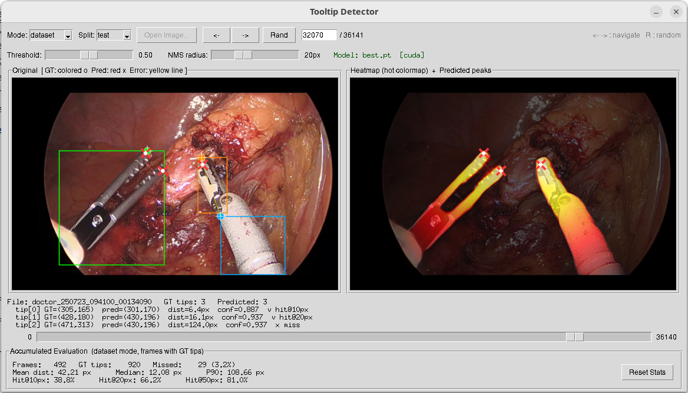

# tooltip-detector

복강경(laparoscope) 수술 영상에서 수술도구의 끝부분(팁)을 탐지하는 딥러닝 모델 기반 실험 도구이다.
EfficientNet-B2 인코더와 U-Net 디코더를 결합한 모델이 각 프레임에서 도구 팁의 위치를 거리 기반 히트맵으로 출력한다.
현재는 `monai`와 `monai_mini` 두 가지 모델 변형을 지원하며, 학습·평가·GUI 추론 모두 멀티 모델 선택이 가능하다.
정지 이미지/데이터셋 기반 탐지 시각화(`tooltip-detector`) 외에, 동영상을 실시간으로 처리하며 내시경 카메라가 이동해야 할 방향을 화살표로 안내하는 `tooltip-tracker` GUI도 제공한다.

## 모델 구조

```text
입력 이미지 (3, 480, 736)
    │
    ▼
EfficientNet-B2 Encoder   ← ImageNet 사전학습 구조 (스크래치 학습)
    │  스킵 연결 (5개 스테이지)
    ▼
U-Net Decoder             ← 5단계 업샘플링
    │
    ▼
Segmentation Head         ← Conv2d → 2채널 출력
    │
    ├─ 채널 0: 배경
    └─ 채널 1: 도구 영역 (sigmoid → 거리 기반 히트맵)
```

- 출력 채널 1에 sigmoid를 적용한 값이 팁까지의 거리 기반 히트맵이다.
- 히트맵에서 임계값 이상의 피크를 추출하여 팁 위치를 예측한다.

## 지원 모델

| 모델         | 설명                                                   |
| ------------ | ------------------------------------------------------ |
| `monai`      | EfficientNet-B2 + U-Net 풀 모델, MONAI 호환 구조       |
| `monai_mini` | EfficientNet-B2 + U-Net 경량 모델, 인코더 블록 수 절반 |

## 학습 타겟 생성 방식

모델은 아키텍처(모델 타입)와 무관하게, 학습 타겟(목표 히트맵)을 만드는 방식도 두 가지 중에서 선택할 수 있다 (`--target-mode`).

| 방식 (`--target-mode`) | 설명                                                                       | 필요한 레이블               |
| ---------------------- | -------------------------------------------------------------------------- | --------------------------- |
| `gradient-seg` (기본)  | segmentation mask 내에서 팁까지의 거리에 반비례하는 gradient 히트맵        | 팁 좌표 + segmentation mask |
| `gaussian-tip`         | 팁 좌표를 중심으로 한 gaussian 히트맵 (`--gaussian-sigma`로 표준편차 조절) | 팁 좌표만                   |

`gradient-seg`는 도구 영역 전체(segmentation)를 활용해 더 넓은 학습 신호를 주지만, segmentation 마스크의 레이블링 비용이 높고 mask가 잘못된 경우 수정 비용도 크다. `gaussian-tip`은 팁 좌표만으로 학습하므로 레이블링 비용이 훨씬 싸지만, segmentation 정보를 사용하지 않는다. 두 방식의 정확도 비교는 [평가 결과](#평가-결과)를 참고한다.

체크포인트와 평가 결과는 어떤 데이터셋으로 학습·평가했는지, 모델 타입, 타겟 생성 방식 세 축으로 분리되어 저장된다: `data/models/<dataset>/<target-mode>/<model-type>/`, `data/results/<dataset>/<target-mode>/<model-type>/`. `--dataset`은 학습/평가/GUI 모두에서 필수 인자이며(예: `erop`, `cholec80`), `--model-type`·`--target-mode`의 기본값은 각각 `monai`·`gradient-seg`이다. 예를 들어 `--dataset cholec80`으로 실행하면 기본적으로 `data/models/cholec80/gradient-seg/monai/best.pt`를 사용한다.

## 요구 사항

- Python 3.12 이상
- [uv](https://docs.astral.sh/uv/) 패키지 매니저
- CUDA 12.8 호환 GPU (CPU 추론도 가능하나 학습 시 GPU 권장)

## 설치

```bash
uv sync
```

## 디렉터리 구조

```text
tooltip-detector/
├── ttd/
│   ├── model/
│   │   ├── monai.py               # EfficientNet-B2 + U-Net (풀 모델, MONAI 호환)
│   │   └── monai_mini.py          # EfficientNet-B2 + U-Net (경량 모델, 인코더 블록 수 절반)
│   ├── dataset.py                 # SurgicalToolDataset (gradient-seg/gaussian-tip 타겟 생성), DATASETS 목록
│   ├── checkpoints.py             # data/models·data/results 경로 규칙 (dataset-name/target-mode/model-type)
│   ├── transforms.py              # 평가/추론용 albumentations 전처리 파이프라인
│   ├── peaks.py                   # 히트맵 피크 탐지 (find_peaks)
│   ├── camera_motion_vector.py    # tooltip-tracker의 화살표(카메라 이동 방향) 스무딩 구현
│   └── tip_source.py              # 체크포인트 경로 → 팁 좌표 (히트맵 모델 / 베이스라인 탐지기)
├── scripts/
│   ├── dashboard.py               # 학습·평가 진행 상태 표 + 실행 명령 안내 GUI
│   ├── train-model.py             # 학습 스크립트
│   ├── eval-model.py              # 평가 스크립트
│   ├── compare-speed.py           # 모델 속도 비교 스크립트
│   ├── generate-summary.py        # data/models·data/results → docs/results-summary.md 생성
│   ├── tooltip-detector.py        # 탐지 결과 시각화 GUI (이미지/데이터셋)
│   ├── tooltip-tracker.py         # 동영상 실시간 탐지·추적 GUI
│   └── dataset-browser.py         # 데이터셋 시각화 GUI
├── run(.bat)                      # `run <script> [args...]` → scripts/<script>.py 실행
├── docs/
│   ├── dataset-guide.md          # 데이터셋 구조 및 포맷
│   ├── train-guide.md            # 학습 절차 및 설정
│   ├── eval-guide.md             # 평가 방법 및 지표
│   ├── results-summary.md        # 실험 수치 요약 (generate-summary.py 자동 생성)
│   ├── tooltip-detector.md       # 탐지 GUI 상세설계서 및 사용자설명서
│   ├── tooltip-tracker.md        # 동영상 추적 GUI 상세설계서 및 사용자설명서
│   └── dataset-browser-guide.md  # GUI 브라우저 사용법
├── images/
│   └── tooltip-detector.png      # Tooltip Detector GUI 스크린샷
├── data/
│   ├── dataset/<dataset-name>/            # 학습 데이터 (annotation / images / segmentation), 외부 마운트·read-only
│   ├── models/<dataset-name>/<target-mode>/<model-type>/   # 학습된 모델 가중치 (best.pt, last.pt)
│   └── results/<dataset-name>/<target-mode>/<model-type>/  # 평가 결과
└── temp/
    └── monai.pt                  # 참조 모델 (구조 확인용)
```

## 데이터셋

여러 데이터셋을 `data/dataset/<dataset-name>/`로 구분해 지원한다 (`--dataset` 인자로 선택, 필수). 현재:

| 데이터셋 (`--dataset`) | 상태      | 설명                                                                         |
| ---------------------- | --------- | ---------------------------------------------------------------------------- |
| `erop`                 | 학습 가능 | 자체 구축. 5개 복강경 수술 세션에서 추출한 **180,706 프레임** (736 × 480 px) |
| `cholec80`             | 학습 가능 | 공개 Cholec80(담낭절제술 80편)을 변환한 **184,578 프레임** (736 × 480 px)    |

스플릿 구성:

| 데이터셋   | train          | val           | test          | 팁 어노테이션 |
| ---------- | -------------- | ------------- | ------------- | ------------: |
| `erop`     | 108,424 (60 %) | 36,140 (20 %) | 36,142 (20 %) |       252,977 |
| `cholec80` | 110,747 (60 %) | 36,901 (20 %) | 36,930 (20 %) |       315,204 |

두 데이터셋 모두 영상(세션)마다 독립적으로 60:20:20으로 나누되, 영상 내부는 프레임 단위 무작위 셔플로 분할된다. 따라서 같은 영상의 인접 프레임이 train과 test에 동시에 존재할 수 있다(시간적 누수). 각 프레임마다 RGB 이미지, 이진 분할 마스크, 도구 팁 좌표 어노테이션이 제공된다.

데이터셋 포맷 상세 및 데이터셋별 통계: [docs/dataset-guide.md](docs/dataset-guide.md)

## 작업 순서

### 1. 실험 현황 확인 (선택)

```bash
run dashboard          # Linux / macOS
run.bat dashboard      # Windows
```

학습·평가가 어디까지 진행됐는지를 탭 두 개의 표로 보여준다. `This project` 탭은 데이터셋 × 타겟 생성 방식 × 모델 타입의 모든 조합(8행)을, `Baselines` 탭은 `baseline/` 아래 재구현·원본 베이스라인 5종(`yolov8s`·`yolov8sclone`·`yolo26`·`yolo26clone`·`cladnet`) × 데이터셋(10행)을 각각 한 행으로 놓는다. 베이스라인은 타겟 생성 방식이라는 축이 없고 서브 프로젝트마다 자기 러너를 쓰므로 표를 나눴다.
표에서 `Train`/`Eval` 칸을 선택하면 그 작업을 수행하는 명령(예: `run train-model --dataset erop --target-mode gaussian-tip --model-type monai`, 베이스라인이면 `./baseline/cladnet/run eval-model --dataset erop --split test`)과, 현재 상태에서 그 명령을 실행하면 어떻게 되는지에 대한 안내가 표시되고 `Copy` 버튼으로 복사할 수 있다.
상태는 `data/models/`·`data/results/`·`baseline/<name>/data/` 아래 파일만 보고 판정하므로 모델이나 데이터셋을 로드하지 않으며, 5초마다 자동으로 갱신된다.
다른 스크립트와 달리 `--dataset`은 선택 인자이고, 지정하면 두 탭 모두 해당 데이터셋의 첫 행이 선택된 채로 열린다.

사용법 상세: [docs/dashboard-guide.md](docs/dashboard-guide.md)

### 2. 데이터셋 확인 (선택)

```bash
run dataset-browser --dataset cholec80          # Linux / macOS
run.bat dataset-browser --dataset cholec80      # Windows
```

원본 이미지, 바운딩 박스, 팁 마커, 거리 기반 히트맵을 시각적으로 탐색한다. `--dataset`은 필수 인자이며, GUI 상단의 `Dataset` 드롭다운으로 실행 중에도 전환할 수 있다.

### 3. 학습

```bash
run train-model --dataset cholec80          # Linux / macOS
run.bat train-model --dataset cholec80      # Windows
```

- `--dataset`은 필수 인자이며 `data/dataset/<dataset-name>/`의 서브디렉터리 이름을 지정한다 (예: `cholec80`)
- 기본 모델 타입: `monai`, 기본 타겟 생성 방식: `gradient-seg`
- 다른 모델을 학습하려면 `--model-type monai_mini`를 지정
- 다른 타겟 생성 방식을 쓰려면 `--target-mode gaussian-tip` (`--gaussian-sigma`로 표준편차 조절, 기본 15px)
- 에포크마다 validation 실행
- `data/models/<dataset>/<target-mode>/<model-type>/best.pt` — 검증 손실 최저 모델 자동 저장
- `data/models/<dataset>/<target-mode>/<model-type>/last.pt` — 최종 에포크 모델 자동 저장
- `data/models/<dataset>/<target-mode>/<model-type>/train-status.json` — 매 에포크 기록되는 재개용 진행 상황(완료 에포크 수·best val loss 등)
- `data/models/<dataset>/<target-mode>/<model-type>/metric.csv` — 에포크별 학습 곡선(train/val loss, mae, me, std, lr 등), 재개해도 이어서 기록됨
- 학습 재개가 기본 동작이다. 외부 요인으로 학습이 중단돼도 같은 명령을 다시 실행하면 `train-status.json`을 읽어 마지막으로 완료한 에포크 다음부터, 학습률 스케줄과 best val loss를 그대로 이어간다 (optimizer momentum은 재초기화됨). `--no-resume`을 지정하면 기존 체크포인트를 무시하고 처음부터 새로 학습한다. 자세한 동작은 [docs/train-guide.md](docs/train-guide.md)의 "학습 재개" 항목을 참고한다.

#### 학습 타겟 생성 (`--target-mode`)

원본 어노테이션은 도구 팁 좌표(x, y)와 이진 분할 마스크(segmentation mask)로 구성된다. 이를 그대로 학습 타겟으로 사용하는 대신, 아래 두 방식 중 하나로 변환한 히트맵을 학습 타겟으로 삼는다.

**`gradient-seg`** (기본) — 분할 마스크 내 각 픽셀에 팁까지의 거리에 반비례하는 gradient 값(0~1)을 부여한다.

```text
이진 분할 마스크  +  팁 좌표 (x, y)
        │
        ▼
  연결요소별 팁 거리 계산
        │
        ▼
  팁 픽셀         → 1.0
  마스크 내 픽셀  → 1 - (팁까지 거리 / 컴포넌트 내 최대 거리)
  배경 픽셀       → 0.0
        │
        ▼
  거리 기반 히트맵 (float32, H × W)
```

**`gaussian-tip`** — segmentation mask 없이 팁 좌표만으로, 팁을 중심으로 한 gaussian을 그린다. 두 도구의 gaussian이 겹치면 픽셀별 최댓값을 취한다.

```text
팁 좌표 (x, y)만
        │
        ▼
  target(p) = max over tips of exp(-‖p - tip‖² / (2·σ²))   (σ = --gaussian-sigma, 기본 15px)
        │
        ▼
  gaussian 히트맵 (float32, H × W)
```

두 방식 모두 `MSE(sigmoid(pred[:, 1]), target)` 손실로 학습하므로 모델 구조·손실 함수는 동일하고, 학습 타겟을 만드는 데 필요한 레이블만 다르다. 상세 수식은 [docs/dataset-guide.md](docs/dataset-guide.md)를 참고한다.

#### 전이 학습 (Transfer Learning)

MONAI 프레임워크 기반으로 동일한 아키텍처(EfficientNet-B2 인코더 + U-Net 디코더)를 사전학습한 가중치(`temp/monai.pt`)를 초기값으로 사용한다. `model.py`의 모듈 명칭(ADN, conv, adn.N 등)을 MONAI 호환 구조로 설계하여 state_dict를 직접 로드할 수 있게 했다.

```text
ttd.model.build(model_type)
       │
       ▼
TooltipDetector  (선택한 모델 타입의 인코더 + 디코더 + 분할 헤드)
       │
       ▼  파인튜닝
data/models/<dataset>/<target-mode>/<model-type>/best.pt
```

현재 학습 스크립트는 선택한 `model_type`에 해당하는 아키텍처를 생성해 복강경 수술 데이터셋으로 전체 네트워크를 파인튜닝한다.

### 4. 평가

```bash
run eval-model --dataset cholec80          # Linux / macOS
run.bat eval-model --dataset cholec80      # Windows
```

- `--dataset`은 필수 인자이며 학습 때와 동일한 데이터셋을 지정해야 한다 (예: `cholec80`)
- 기본 모델 타입: `monai`, 기본 타겟 모드: `gradient-seg`
- 다른 모델을 평가하려면 `--model-type monai_mini`, 다른 타겟 모드로 학습한 모델을 평가하려면 `--target-mode gaussian-tip`을 지정
- 테스트 세트에서 팁 탐지 정확도를 측정하고 결과를 `data/results/<dataset>/<target-mode>/<model-type>/`에 저장한다.
- GT 팁 좌표는 어노테이션에서 직접 읽으므로, `--target-mode gaussian-tip`으로 평가할 때는 segmentation mask가 없는 테스트 세트도 사용할 수 있다.

| 저장 파일      | 내용                                                 |
| -------------- | ---------------------------------------------------- |
| `summary.json` | 전체 지표 + 세션별 지표 + 실행 파라미터              |
| `per_tip.csv`  | GT 팁 1개당 1행 (좌표, 예측값, 거리, 탐지 성공 여부) |

### 4-1. 속도 비교

```bash
run compare-speed --dataset cholec80          # Linux / macOS
run.bat compare-speed --dataset cholec80      # Windows
```

- `--dataset`은 필수 인자이다
- 기본 설정은 test 셋에서 임의 샘플 1,000건을 골라 `monai`와 `monai_mini`의 추론 속도를 비교한다.
- 결과는 `data/results/<dataset>/<target-mode>/speed-comparison.json`에 저장된다 (기본 `--target-mode gradient-seg`).

### 4-2. 실험 수치 요약 문서 생성

```bash
run generate-summary          # Linux / macOS
run.bat generate-summary      # Windows
```

`data/models/`·`data/results/`의 파일만 읽어 모든 조합의 학습·평가 수치를 한 문서
`docs/results-summary.md`로 모은다. 학습 기록·수렴 곡선·전체 지표·축별 차이 외에,
`summary.json`에 없는 오차 거리 분포·프레임 단위 탐지 실패율·팁 수별 성능·공유 피크(과소 탐지)
분석·예측 좌표의 계통 편차를 `per_tip.csv`에서 다시 계산해 포함한다.
[docs/final-report.md](docs/final-report.md)에 인용하는 수치의 기초 자료이므로, 재학습이나
재평가 뒤에는 이 스크립트를 다시 실행해 갱신한다. 모델이나 데이터셋을 로드하지 않는다.

### 5. 탐지 결과 시각화

```bash
run tooltip-detector --dataset cholec80          # Linux / macOS
run.bat tooltip-detector --dataset cholec80      # Windows
```

학습된 모델로 데이터셋 프레임 또는 임의 이미지를 추론하고 결과를 인터랙티브하게 시각화한다.
GUI 상단의 `Dataset` 드롭다운으로 `erop`/`cholec80`을, `Target` 드롭다운으로 `gradient-seg`와 `gaussian-tip`을, `Model` 드롭다운으로 `monai`와 `monai_mini`를 전환할 수 있으며, 선택한 조합의 `data/models/<dataset>/<target-mode>/<model-type>/best.pt`를 다시 로드한다 (`Dataset` 전환 시에는 탐색 중인 데이터셋 프레임도 함께 바뀐다). `--dataset`은 필수 인자이며, 실행 시 `--dataset`/`--target-mode`는 초기 선택값만 지정한다.



- **왼쪽 패널**: 원본 이미지 + segmentation mask overlay + GT 어노테이션(색상 원·바운딩 박스) + 예측 팁(빨간 X) + 오차 선(노랑)
- **오른쪽 패널**: 모델 출력 히트맵 (hot 컬러맵) + 예측 피크 마커
- **Threshold / NMS radius 슬라이더**: 실시간으로 파라미터를 조정하며 결과 확인
- **Inference time 표시**: 현재 프레임의 모델 forward 시간을 ms 단위로 표시
- **누적 통계 패널**: 탐색한 프레임의 hit-rate, 평균 거리 등 평가 지표를 실시간 집계

### 6. 동영상 실시간 추적

```bash
run tooltip-tracker                                                   # 가용한 모델 목록 출력
run tooltip-tracker data/models/cholec80/gaussian-tip/monai/best.pt   # Linux / macOS
run.bat tooltip-tracker data\models\cholec80\gaussian-tip\monai\best.pt   # Windows
```

사용자가 선택한 동영상 파일을 프레임 단위로 순차 처리하며, 화면 중앙에서 탐지된 수술도구 팁 방향으로 화살표를 그려 내시경 카메라가 이동해야 할 방향을 안내한다. 화살표의 방향·길이는 프레임 간 급격히 바뀌지 않도록 스무딩되며, 오탐지(팁 미탐지·개수 이상·방향 모순)는 별도의 색상·경고 도형으로 표시된다.

**인자는 체크포인트 경로 하나뿐이다.** 경로가 놓인 디렉터리 규칙이 데이터셋·타겟 방식·모델 종류를 이미 말해 주므로 따로 지정할 것이 없다. 인자 없이 실행하면 디스크에 있는 모델 목록을 출력하고 종료한다.

| 경로 규칙                                                | 모델 종류                                                          |
| -------------------------------------------------------- | ------------------------------------------------------------------ |
| `data/models/<dataset>/<target-mode>/<model-type>/best.pt` | 이 프로젝트의 히트맵 모델. 히트맵의 피크가 팁이다                  |
| `baseline/<name>/data/model/<dataset>/model.pt`            | 재구현 베이스라인 탐지기. 예측한 `tip` 박스의 중심이 팁이다        |

지원하는 베이스라인은 `yolov8sclone`·`cladnet`·`yolo26clone` 셋이다. `yolov8s`와 `yolo26`은 `ultralytics`가 필요하고 그것이 요구하는 `opencv-python`이 루트 환경의 `opencv-python-headless`를 깨뜨리므로 이 GUI에서는 열 수 없다. 두 모델의 아키텍처는 위 재구현 3종이 의존성 없이 그대로 커버한다.

모델은 프로세스가 사는 동안 고정된다. 다른 모델을 보려면 tracker를 다시 실행한다. 세 베이스라인이 모두 패키지 이름으로 `common`을 쓰기 때문에, 한 프로세스에 하나만 올리는 이 방식이 이름 충돌도 함께 막는다.

- **`Method` 드롭다운**: 화살표 스무딩 구현 전환 (`CameraMotionVectorMagnitudeBlend` 기본값 / `CameraMotionVectorBlend` / `CameraMotionVectorKalman`)
- **Play / Pause, 탐색 바**: 벽시계 기준 재생(필요 시 프레임 드롭) 및 임의 프레임 이동
- **Threshold 슬라이더**: 히트맵 모델에서는 피크 임계값, 탐지기에서는 신뢰도 임계값
- **NMS radius 슬라이더**: 히트맵 모델 전용. 탐지기는 이미 객체당 박스 하나로 줄여 놓았고, 반경으로 다시 병합하면 가위·집게 한 자루가 정당하게 보이는 팁 2개를 뭉갤 수 있어 비활성화된다

상세 설계와 스무딩 로직, 오탐지 판정 규칙: [docs/tooltip-tracker.md](docs/tooltip-tracker.md)

## 스크립트 요약

| 스크립트               | 설명                     | 주요 인수                                                                                                                             |
| ---------------------- | ------------------------ | ------------------------------------------------------------------------------------------------------------------------------------- |
| `run dashboard`        | 학습·평가 현황 표 GUI    | `--dataset`(선택), `--models-root`, `--results-root`, `--baseline-root`                                                               |
| `run train-model`      | 모델 학습                | `--dataset`(필수), `--model-type`, `--target-mode`, `--gaussian-sigma`, `--epochs`, `--batch-size`, `--lr`, `--device`, `--no-resume` |
| `run eval-model`       | 팁 탐지 정확도 평가      | `--dataset`(필수), `--model-type`, `--target-mode`, `--threshold`, `--nms-radius`, `--model`, `--device`                              |
| `run compare-speed`    | 모델 추론 속도 비교      | `--dataset`(필수), `--model-types`, `--target-mode`, `--num-samples`, `--batch-size`, `--workers`                                     |
| `run generate-summary` | 실험 수치 요약 문서 생성 | `--models-root`, `--results-root`, `--output`                                                                                         |
| `run tooltip-detector` | 탐지 결과 시각화 GUI     | `--dataset`(필수), `--model-type`, `--target-mode`, `--model`, `--data-root`                                                          |
| `run tooltip-tracker`  | 동영상 실시간 추적 GUI   | `<model-path>`(생략 시 목록 출력)                                                                                                     |
| `run dataset-browser`  | 데이터셋 시각화 GUI      | `--dataset`(필수), `--split`, `--data-root`                                                                                           |

Windows에서는 `run` 대신 `run.bat`을 사용한다. 인자 없이 `run`(`run.bat`)만 실행하면 사용법과 사용 가능한 스크립트 목록이 출력된다.

실행 예시:

```bash
# 경량 모델을 에포크 60회, 배치 8로 학습 (gradient-seg, 기본값)
run train-model --dataset cholec80 --model-type monai_mini --epochs 60 --batch-size 8

# gaussian-tip 방식으로 학습 (segmentation mask 불필요, sigma=15px)
run train-model --dataset cholec80 --target-mode gaussian-tip --gaussian-sigma 15

# 경량 모델 평가
run eval-model --dataset cholec80 --model-type monai_mini --threshold 0.3 --nms-radius 15

# gaussian-tip으로 학습한 모델 평가
run eval-model --dataset cholec80 --target-mode gaussian-tip

# 두 모델의 속도 비교
run compare-speed --dataset cholec80 --num-samples 1000

# GPU가 여러 개인 장비에서 사용할 장치 지정 (학습/평가 모두 지원)
run train-model --dataset cholec80 --device cuda:1
run eval-model  --dataset cholec80 --device cuda:1
```

## 평가 지표

| 지표               | 설명                                   |
| ------------------ | -------------------------------------- |
| Hit-rate @ 10 px   | 예측 팁이 GT 팁 10 px 이내에 있는 비율 |
| Hit-rate @ 20 px   | 예측 팁이 GT 팁 20 px 이내에 있는 비율 |
| Hit-rate @ 50 px   | 예측 팁이 GT 팁 50 px 이내에 있는 비율 |
| Mean / Median dist | 매칭된 팁의 평균·중앙값 픽셀 거리      |
| P90 dist           | 픽셀 거리 90 백분위수                  |
| Miss rate          | 탐지 후보 없음으로 실패한 팁 비율      |

## 평가 결과

데이터셋 × 타겟 생성 방식 × 모델 타입 8개 조합 전체의 테스트 세트 성능이다. 전 조합 공통으로 30 에포크·배치 16으로 학습하고 `threshold=0.5`, `NMS radius=20 px`로 평가했다.

| 데이터셋   | 타겟 방식      | 모델         | Miss rate | Hit@10 px | Hit@20 px | Hit@50 px | Median dist | Mean dist |  P90 dist |
| ---------- | -------------- | ------------ | --------: | --------: | --------: | --------: | ----------: | --------: | --------: |
| `erop`     | `gradient-seg` | `monai`      |    3.09 % |   44.98 % |   70.17 % |   82.95 % |    10.77 px |  34.94 px |  88.68 px |
| `erop`     | `gradient-seg` | `monai_mini` |    3.47 % |   40.99 % |   68.28 % |   82.48 % |    11.40 px |  35.78 px |  93.36 px |
| `erop`     | `gaussian-tip` | `monai`      |    5.03 % |   69.52 % |   79.36 % |   83.82 % |     7.81 px |  29.85 px |  74.28 px |
| `erop`     | `gaussian-tip` | `monai_mini` |    5.85 % |   73.44 % |   78.00 % |   82.41 % |     3.16 px |  28.58 px |  87.66 px |
| `cholec80` | `gradient-seg` | `monai`      |    2.13 % |   29.55 % |   58.52 % |   79.54 % |    15.26 px |  43.82 px | 128.32 px |
| `cholec80` | `gradient-seg` | `monai_mini` |    2.15 % |   31.47 % |   57.16 % |   78.83 % |    15.65 px |  44.58 px | 131.93 px |
| `cholec80` | `gaussian-tip` | `monai`      |    5.42 % |   65.38 % |   72.44 % |   79.15 % |     4.24 px |  36.37 px | 134.17 px |
| `cholec80` | `gaussian-tip` | `monai_mini` |    5.89 % |   64.68 % |   71.60 % |   78.40 % |     4.47 px |  36.98 px | 138.00 px |

- **타겟 생성 방식이 성능을 지배한다.** `gaussian-tip`은 Hit@10 px 65–73 %, 중앙값 오차 3–8 px로 정밀하지만 탐지 실패율이 높고(5.0–5.9 %), `gradient-seg`는 정밀도는 낮아도 탐지 실패율이 안정적이다(2.1–3.5 %). 임계값 0.5에서 두 타겟이 만드는 초과-임계 영역의 크기 차이 때문이다.
- **분할 마스크 레이블링 비용이 정확도로 회수되지 않는다.** 팁 좌표만 필요한 `gaussian-tip`이 Hit@10 px에서 평균 31.5 %p 앞선다.
- **모델 크기의 영향은 미미하다.** 4개 비교쌍 전부에서 지표 차이가 ±4 %p 이내이고 방향도 일관되지 않는다.
- 평균 거리가 중앙값의 2.9–9.0배인 긴 꼬리는 대부분 다중 도구 프레임의 과소 탐지에서 발생한다 — 전체 GT 팁의 18.6–29.9 %가 같은 프레임의 다른 팁과 예측 피크를 공유한다.
- 8개 조합 중 5개는 예측 좌표에 4.5–5.7 px의 계통 편차가 있어, 이 상수만 차감해도 정밀도가 크게 회복된다 (한 조합에서 중앙값 7.28 px → 3.61 px).

속도 비교 결과 (`data/results/erop/gradient-seg/speed-comparison.json`, CPU, test 샘플 1,000건, batch=16, workers=0):

| 모델         | 파라미터 수 | Forward / frame | Wall / frame | Forward FPS | Wall FPS |
| ------------ | ----------: | --------------: | -----------: | ----------: | -------: |
| `monai`      |  11,450,828 |       277.00 ms |    287.49 ms |        3.61 |     3.48 |
| `monai_mini` |   5,502,870 |       204.57 ms |    215.06 ms |        4.89 |     4.65 |

- `monai_mini`가 `monai`보다 forward 기준 **1.35배**, wall-clock 기준 **1.34배** 빠르다.
- 파라미터 수는 `monai_mini`가 `monai`의 약 48 % 수준으로 줄어든다.
- 정확도 손실이 거의 없으므로, 자원 제약이 있는 환경에서는 `monai_mini`가 합리적인 기본 선택이다.

상세 분석·실험 설계·한계: [docs/final-report.md](docs/final-report.md)

## 문서 목록

| 문서                                                             | 내용                                                                      |
| ---------------------------------------------------------------- | ------------------------------------------------------------------------- |
| [docs/final-report.md](docs/final-report.md)                     | 실험결과보고서 — 8개 조합 전수 실험의 설계·결과·분석·한계                 |
| [docs/baseline-report.md](docs/baseline-report.md)               | 베이스라인 실험결과보고서 — CLAD-Net·YOLOv8s·YOLO26 비교와 참조 구현 대조 |
| [docs/results-summary.md](docs/results-summary.md)               | 실험 수치 요약 — 보고서 작성용 기초 자료 (자동 생성)                      |
| [docs/parameter-optimization.md](docs/parameter-optimization.md) | 후처리 파라미터 최적화(2단계) — threshold × NMS 격자 탐색, watershed 비교 |
| [docs/model-monai.md](docs/model-monai.md)                       | EfficientNet-B2 + U-Net 풀 모델 아키텍처 상세 설명                        |
| [docs/model-monai_mini.md](docs/model-monai_mini.md)             | EfficientNet-B2 + U-Net 경량 모델 아키텍처 상세 설명                      |
| [docs/dataset-guide.md](docs/dataset-guide.md)                   | 데이터셋 디렉터리 구조, 파일 포맷, 어노테이션 스펙, 히트맵 타겟 수식      |
| [docs/commands.md](docs/commands.md)                             | 실험 재현용 실행 명령 모음                                                |
| [docs/dashboard-guide.md](docs/dashboard-guide.md)               | 학습·평가 현황 표 GUI 화면 구성, 상태 판정 기준, 조작 방법                |
| [docs/train-guide.md](docs/train-guide.md)                       | 학습 실행 방법, 인수 설명, 증강 파이프라인, 체크포인트, 출력 예시         |
| [docs/eval-guide.md](docs/eval-guide.md)                         | 평가 실행 방법, 피크 탐지 알고리즘, 지표 정의, 결과 파일 구조             |
| [docs/tooltip-detector.md](docs/tooltip-detector.md)             | 탐지 GUI 화면 구성, 추론 흐름, 조작 방법, 설계 상세                       |
| [docs/tooltip-tracker.md](docs/tooltip-tracker.md)               | 추적 GUI 화면 구성, 화살표 스무딩 로직, 오탐지 판정 규칙, 설계 상세       |
| [docs/dataset-browser-guide.md](docs/dataset-browser-guide.md)   | GUI 화면 구성, 조작 방법, 키보드 단축키                                   |
