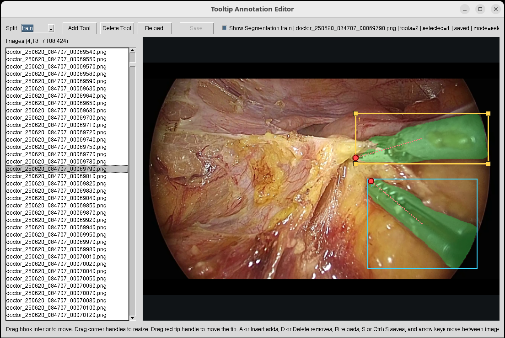

# tooltip-annotator

수술 영상에서 프레임 데이터를 만들고, semantic segmentation과 tip annotation을 생성 및 수정하는 도구 모음이다.

현재 파이프라인은 다음 단계로 구성된다.

1. 원본 비디오를 progressive 형태로 변환
2. 비디오 프레임을 이미지 데이터셋으로 추출
3. MONAI segmentation 모델 다운로드
4. 이미지별 binary segmentation mask 생성
5. segmentation mask 기반 bbox/tip annotation JSON 생성
6. GUI 편집기로 annotation 수동 보정

## 요구 사항

- Python `3.12` 이상
- 프로젝트 의존성 설치
- `ffmpeg`
- GUI 편집기를 사용할 경우 `tkinter`
- GPU 추론을 사용할 경우 CUDA가 동작하는 PyTorch 환경

의존성 설치 예시:

```bash
uv sync
```

또는 가상환경에서 직접 설치 후 사용한다.

## 데이터 구조

기본 디렉터리 구조는 다음과 같다.

```text
./data/
├── video/
├── progressive/
└── dataset/
    ├── images/
    │   ├── train/
    │   ├── val/
    │   └── test/
    ├── segmentation/
    │   ├── train/
    │   ├── val/
    │   └── test/
    └── annotation/
        ├── train/
        ├── val/
        └── test/
```

모델 파일 기본 위치는 다음과 같다.

```text
./temp/models/model.pt
```

## 작업 순서

### 1. 비디오를 progressive로 변환

```bash
python scripts/generate_progressive.py
```

문서: [docs/generate_progressive.md](./docs/generate_progressive.md)

### 2. 데이터셋 이미지 생성

```bash
python scripts/generate_dataset.py
```

기본 출력은 `./data/dataset/images/{train,val,test}`이다.

문서: [docs/generate_dataset.md](./docs/generate_dataset.md)

### 3. segmentation 모델 다운로드

```bash
python scripts/download_model.py
```

문서: [docs/download_model.md](./docs/download_model.md)

### 4. GPU 환경 점검

GPU를 사용할 예정이면 먼저 환경 점검을 권장한다.

```bash
python -m scripts.check_gpu --device cuda:0
```

이 스크립트는 다음을 확인한다.

- PyTorch CUDA 인식 상태
- cuDNN 버전 정합성
- `nvidia-smi`, `nvcc`
- `libtorch_cuda.so`가 실제로 물고 있는 CUDA/cuDNN 라이브러리
- 최소 CUDA Conv2D smoke test
- cuDNN enabled/disabled 비교

### 5. segmentation mask 생성

```bash
python -m scripts.generate_segmentation
```

기본 입력은 `./data/dataset/images/{train,val,test}`이고, 기본 출력은 `./data/dataset/segmentation/{train,val,test}`이다.

주요 옵션 예시:

```bash
python -m scripts.generate_segmentation --device cuda:0
python -m scripts.generate_segmentation --device cpu
python -m scripts.generate_segmentation --overwrite
```

### 6. annotation JSON 자동 생성

```bash
python -m scripts.generate_annotation
```

이 스크립트는 segmentation mask에서 contour를 찾고, 각 contour의 bounding box와 tool tip 좌표를 계산해 JSON으로 저장한다.

기본 출력은 `./data/dataset/annotation/{train,val,test}`이다.

### 7. GUI 편집기로 annotation 수정

```bash
python -m scripts.annotation_editor
```

편집기에서 가능한 작업:

- split 전환
- 이미지 선택
- segmentation overlay 표시
- bbox 이동
- bbox 리사이즈
- tip 드래그 수정
- annotation 추가
- annotation 삭제
- `Save` 또는 `Ctrl+S`로 저장

문서: [docs/annotation_editor.md](./docs/annotation_editor.md)



## scripts 요약

- `scripts/download_model.py`
  - Hugging Face Hub에서 MONAI segmentation 모델 다운로드
- `scripts/generate_progressive.py`
  - 원본 비디오를 ffmpeg로 디인터레이스 및 재인코딩
- `scripts/generate_dataset.py`
  - 비디오 프레임 추출 후 `train/val/test` 분할 이미지 생성
- `scripts/check_gpu.py`
  - PyTorch CUDA/cuDNN 런타임 점검 및 문제 분석
- `scripts/generate_segmentation.py`
  - 모델을 이용해 이미지별 binary segmentation mask 생성
- `scripts/generate_annotation.py`
  - segmentation mask로부터 bbox/tip annotation JSON 생성
- `scripts/annotation_editor.py`
  - annotation 수동 보정을 위한 GUI 편집기

## 문서 목록

- [docs/download_model.md](./docs/download_model.md)
- [docs/generate_progressive.md](./docs/generate_progressive.md)
- [docs/generate_dataset.md](./docs/generate_dataset.md)
- [docs/annotation_editor.md](./docs/annotation_editor.md)
