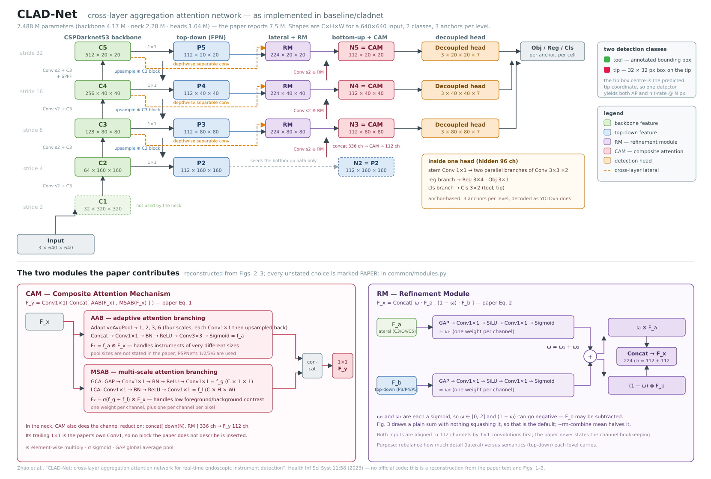

# CLAD-Net — 수술도구 탐지 베이스라인

> Zhao X, Guo J, He Z, Jiang X, Lou H, Li D.
> **CLAD-Net: cross-layer aggregation attention network for real-time endoscopic instrument detection.**
> *Health Information Science and Systems* 11:58 (2023). [doi:10.1007/s13755-023-00260-9](https://doi.org/10.1007/s13755-023-00260-9) ·
> [PMC10678866](https://pmc.ncbi.nlm.nih.gov/articles/PMC10678866/)

`baseline/`은 기존 수술도구 탐지 방법론을 모아 이 프로젝트의 tooltip-detector와 비교하기 위한
서브 프로젝트다. 이 폴더는 그중 CLAD-Net을 담당한다.

**저자가 코드도 가중치도 공개하지 않았으므로**(논문이 링크한
[github.com/A0268/video-demo](https://github.com/A0268/video-demo)에는 데모 영상 2개뿐이다),
논문 본문과 Fig. 1–3만 보고 **순수 PyTorch로 직접 구현하고 이 저장소의 데이터로 직접 학습**한다.
`ultralytics`를 비롯한 어떤 탐지 프레임워크에도 의존하지 않는다 — 백본·넥·헤드는 물론
라벨 할당, CIoU 손실, mosaic 증강, NMS, mAP 계산까지 `common/` 안에 있다.

## 무엇을 탐지하는가

이 저장소의 어노테이션은 도구마다 `bbox`(사각영역)와 `tip`(끝점 좌표)을 갖고 있고,
도구 종류(클래스) 레이블은 없다. 그래서 **두 클래스**로 학습한다.

| 클래스 | 정의                                                | 출처                 |
| ------ | --------------------------------------------------- | -------------------- |
| `tool` | 어노테이션의 바운딩 박스 그대로                     | `annotations[].bbox` |
| `tip`  | 팁 좌표를 중심으로 한 **32 × 32 px 박스** (`--tip-box-size`) | `annotations[].tip`  |

팁을 박스로 바꾸면 **하나의 탐지 모델이 도구 박스와 팁 좌표를 동시에 낸다.** 예측된 `tip` 박스의
중심이 팁 좌표이므로, 논문의 지표(AP)와 이 프로젝트의 지표(Hit-rate @ N px)를 **같은 모델에서
함께 측정**할 수 있다. `scripts/eval-model.py`가 둘 다 보고한다.

## CLAD-Net 구조

논문 Fig. 1–3과 본문에서 재구성한 것이다.



*텐서 모양은 이 구현에서 실제로 뽑은 값이다 (640 × 640 입력, 2클래스, 레벨당 앵커 3개).
원본 벡터 파일: [docs/model-architecture.svg](docs/model-architecture.svg)*

```text
입력 640 × 640
    │
    ▼
CSPDarknet53 백본 ──► C1 C2 C3 C4 C5        (stride 2 / 4 / 8 / 16 / 32)
    │
    ▼  Cross-Layer Aggregated Attention Module (넥)
    │
    ├─ top-down :  P5 ← C5,  P4 ← concat[up(P5), C4],  P3 ← …,  P2 ← …
    ├─ lateral  :  DWSepConv(C3, C4, C5) ──► RM(·, P3/P4/P5)     ← 논문의 "cross-layer" 연결
    └─ bottom-up:  N2 ← P2,  N{k+1} ← CAM( concat[ down(N_k), RM_k ] )
    │
    ▼
Detection Head (N3, N4, N5) ──► Obj / Reg / Cls  (분리형 헤드)
```

기여는 전부 **넥**에 있다. 백본은 CSPDarknet53(YOLO 계열), 헤드는 Obj/Reg/Cls 분리형이다.

### CAM — Composite Attention Mechanism ([common/modules.py](common/modules.py))

```text
AAB  F_x ─► Adaptive pooling ×4 ─► 각각 Conv1×1 ─► upsample ─► Concat
         ─► Conv1×1 ─► BN ─► ReLU ─► Conv3×3 ─► Sigmoid ─► f_a ;  F_1 = f_a · F_x
MSAB GCA: F_x ─► GAP ─► Conv1×1 ─► BN ─► ReLU ─► Conv1×1 ─► f_g   (C × 1 × 1)
     LCA: F_x ─►       Conv1×1 ─► BN ─► ReLU ─► Conv1×1 ─► f_l   (C × H × W)
     f_m = Sigmoid(f_g + f_l) ;  F_2 = f_m · F_x
F_y = Conv1×1( Concat[F_1, F_2] )                                        … 논문 식 (1)
```

### RM — Refinement Module ([common/modules.py](common/modules.py))

```text
ω1 = Sigmoid(Conv1×1(NonLinear(Conv1×1(GAP(F_a)))))
ω2 = Sigmoid(Conv1×1(NonLinear(Conv1×1(GAP(F_b)))))
ω  = ω1 + ω2
F_x = Concat[ ω · F_a , (1 - ω) · F_b ]                                  … 논문 식 (2)
```

## 논문의 모호한 부분과 채택한 해석

구현하려면 논문에 없거나 서로 어긋나는 부분을 결정해야 했다. 각 항목은 코드에도 `PAPER:`
주석으로 남아 있으므로, 재현 결과가 논문에 못 미치면 여기부터 다시 본다.

| #   | 쟁점                    | 논문 내용                                                                                                           | 채택한 해석                                                                                                                       | 코드                            |
| --- | ----------------------- | ------------------------------------------------------------------------------------------------------------------- | --------------------------------------------------------------------------------------------------------------------------------- | ------------------------------- |
| 1   | bottom-up 경로 방향     | 본문은 "N2, N3, N4를 **upsampling**하여 C3, C4, C5 크기에 맞춘다"고 쓰지만 그 방향은 해상도가 **줄어드는** 방향이다 | Fig. 1 범례(파란 화살표 = Downsample)를 따라 다운샘플                                                                             | [neck.py](common/neck.py)       |
| 2   | AAB 레이어 순서         | 본문 "Conv1×1 → ReLU → BN → Conv3×3 → Sigmoid" vs Fig. 2 "Conv1×1 → BN → ReLU → Conv3×3 → Sigmoid"                  | Fig. 2를 따름                                                                                                                     | [modules.py](common/modules.py) |
| 3   | AAB 적응 풀링 출력 크기 | "4개의 서로 다른 스케일"이라고만 기술                                                                               | PSPNet 관례인 1, 2, 3, 6                                                                                                          | [modules.py](common/modules.py) |
| 4   | RM의 ω 범위             | ω = ω1 + ω2 이고 각각 sigmoid이므로 ω ∈ [0, 2] → (1 − ω)가 음수가 될 수 있다                                        | 그림 그대로 **단순 합**이 기본. `--rm-combine mean`으로 (ω1+ω2)/2 전환 가능                                                       | [modules.py](common/modules.py) |
| 5   | 헤드 방식               | Fig. 1은 Obj/Reg/Cls 분리형, 손실 가중치는 YOLOv5 기본값과 일치                                                     | YOLOv5 앵커 기반 + 분리형 헤드                                                                                                    | [model.py](common/model.py)     |
| 6   | 채널 폭 / 백본 깊이     | "lightweight CSPDarknet53"이라고만 기술                                                                             | 넥 112채널·헤드 96채널로 두면 총 **7.488 M** — 논문의 7.5 M과 일치한다. 구조 해석이 맞다는 가장 강한 방증이다                     | [model.py](common/model.py)     |
| 7   | N2 / P2의 용도          | Fig. 1에서 헤드로 가는 화살표는 N3, N4, N5 3개뿐                                                                    | P2·N2는 N3를 만들기 위해서만 존재                                                                                                 | [neck.py](common/neck.py)       |
| 8   | RM 두 입력의 채널 수    | 명시 없음                                                                                                           | 1 × 1 conv로 양쪽을 같은 폭으로 맞춘 뒤 RM에 넣는다                                                                               | [neck.py](common/neck.py)       |
| 9   | Obj/Cls 손실            | "cross-entropy"                                                                                                     | Obj는 로짓 1개, 클래스는 서로 독립이므로 **BCE**(이진 형태의 같은 손실)                                                           | [loss.py](common/loss.py)       |
| 10  | 앵커                    | 앵커 기반인데 앵커 값이 없다                                                                                        | cholec80 train 스플릿에서 k-means로 뽑고 손으로 반올림. 두 데이터셋 전 스플릿에서 비율 매칭 recall ≥ 99.5 %, 평균 최대 IoU ≥ 0.79 | [model.py](common/model.py)     |

논문에 없지만 이 학습 레시피에 실무적으로 필요해 추가한 것 세 가지다. 전부 끌 수 있다.

- **선형 warmup 3 에포크** + **cosine 감쇠** (논문은 "SGD, 초기 lr 0.01"만 기술)
- **가중치 EMA** (`--no-ema`로 비활성화)

## 디렉터리 구조

```text
baseline/cladnet/
├── pyproject.toml            # 독립 uv 프로젝트
├── common/
│   ├── modules.py            # AAB, MSAB, CAM, RM, DWSepConv — 논문의 기여 부분
│   ├── backbone.py           # CSPDarknet53 (C3 블록 + SPPF)
│   ├── neck.py               # Cross-Layer Aggregated Attention Module
│   ├── model.py              # 조립 + 분리형 헤드 + 앵커 + 디코딩
│   ├── boxes.py              # xywh/xyxy, CIoU, letterbox, NMS
│   ├── dataset.py            # 저장소 어노테이션 → 2클래스 라벨, mosaic 증강
│   ├── loss.py               # 라벨 할당 + 논문 식 (3) 손실
│   ├── metrics.py            # AP@0.5, AP@0.5:0.95, precision, recall
│   ├── tipmetrics.py         # Hit-rate @ N px (루트 프로젝트와 동일한 매칭 규칙)
│   ├── inference.py          # 체크포인트 포맷 + 프레임 1장 추론
│   ├── sources.py            # 영상 / 추출 프레임 디렉터리 읽기 (데모용)
│   └── draw.py               # 예측·GT 오버레이
├── run(.bat)                 # `run <script> [args...]` → scripts/<script>.py 실행
├── scripts/
│   ├── train-model.py        # 학습
│   ├── eval-model.py         # 평가 (탐지 AP + 팁 hit-rate)
│   └── demo.py               # 탐지 결과 시각화 GUI
├── docs/
│   └── commands.md           # 데이터셋별 학습·평가 재현 명령 모음
└── data/                     # 체크포인트·평가 결과 (git 추적 제외)
    ├── model/<dataset>/      #   학습 산출물
    │   ├── model.pt          #     최고 성능 체크포인트
    │   ├── model-last.pt     #     마지막 에포크 (+ 재개용 optimizer/EMA 상태)
    │   ├── train-status.json #     진행 상황
    │   └── metric.csv        #     에포크별 학습 곡선
    └── results/<dataset>/<split>/
        ├── summary.json      #     전체 지표 + 실행 파라미터
        └── per_tip.csv       #     GT 팁 1개당 1행
```

## 설치

이 서브 프로젝트는 저장소 루트와 **별개의 uv 프로젝트**다. 데모의 영상 디코딩에 `opencv-python`이
필요한데 루트 환경에는 `albumentations`가 끌어온 `opencv-python-headless`가 있고, 둘은 같은
`cv2` 패키지에 파일을 쓰기 때문에 한 환경에 섞으면 기존 학습·평가 환경이 깨진다.

```bash
uv sync --project baseline/cladnet
```

## 사용법

세 스크립트 모두 `run`으로 실행한다. 루트 프로젝트의 `run`과 같은 방식이며, 이 서브 프로젝트의
`.venv`에서 스크립트를 돌린다. 어느 디렉터리에서 실행해도 된다. Windows에서는 `run.bat`을 쓴다.
인자 없이 `run`만 실행하면 사용 가능한 스크립트 목록이 나온다.

### 1. 학습

```bash
./baseline/cladnet/run train-model --dataset cholec80
```

| 인수                       | 기본값 | 설명                                                                                      |
| -------------------------- | ------ | ----------------------------------------------------------------------------------------- |
| `--dataset`                | (필수) | `data/dataset/` 아래 디렉터리 이름 (`cholec80` / `erop`)                                  |
| `--epochs`                 | 150    | 논문과 동일한 학습 길이                                                                   |
| `--batch-size`             | 16     | 논문과 동일. MSAB/RM이 1 × 1로 풀링한 뒤 BatchNorm을 타므로 2 이상이어야 한다             |
| `--lr`                     | 0.01   | 논문과 동일 (SGD, momentum 0.937)                                                         |
| `--image-size`             | 640    | 논문과 동일                                                                               |
| `--frame-stride`           | 1      | N프레임마다 1장만 학습에 쓴다. 영상 프레임은 서로 거의 같으므로 에포크 시간을 크게 줄인다 |
| `--val-frames`             | 2000   | 에포크마다 평가할 val 프레임 수 상한 (0이면 전체)                                         |
| `--tip-box-size`          | 32     | 팁 좌표를 감싸는 정사각 박스의 한 변 (원본 프레임 px). 체크포인트에 기록된다             |
| `--rm-combine`             | `sum`  | 쟁점 #4                                                                                   |
| `--no-ema` / `--no-resume` |        | EMA 끄기 / 처음부터 다시 학습                                                             |

`model-last.pt`가 있으면 **기본 동작이 재개**다. optimizer·스케줄러·EMA 상태까지 저장하므로
중단 지점에서 그대로 이어진다. `model.pt`는 val mAP@0.5:0.95가 갱신될 때마다 저장된다.

체크포인트는 `data/model/<dataset>/`에, 평가 결과는 `data/results/<dataset>/<split>/`에
데이터셋별로 나뉘어 저장되므로 cholec80과 erop 학습을
동시에 돌려도 서로 덮어쓰지 않는다. 같은 데이터셋으로 설정만 바꿔 여러 번 돌릴 때만
`--output-dir`를 따로 준다.

데이터셋별 전체 재현 명령은 [docs/commands.md](docs/commands.md)에 있다.

### 2. 평가

```bash
./baseline/cladnet/run eval-model --dataset cholec80
```

두 종류의 수치를 함께 낸다.

- **탐지 지표** — `tool`·`tip` 각각의 AP@0.5, AP@0.5:0.95, precision, recall (논문의 지표)
- **팁 지표** — miss rate, Hit-rate @ 10/20/50 px, 오차 거리 중앙값·평균·P90.
  예측된 `tip` 박스의 중심을 팁 좌표로 삼고, 루트 프로젝트 `scripts/eval-model.py`와
  **같은 매칭 규칙**(최근접 매칭 + Hungarian 1:1 매칭)을 쓴다 — 그래서 tooltip-detector의
  수치와 직접 비교할 수 있다.

거리는 모두 letterbox된 640 × 640이 아니라 **원본 프레임 좌표계(736 × 480)** 에서 잰다.
결과는 `data/results/<dataset>/<split>/`에 `summary.json`과 `per_tip.csv`로 저장된다.
평가할 체크포인트도 `--dataset`에서 정해진다 (`data/model/<dataset>/model.pt`, `--model`로 변경).

### 3. 데모 GUI

```bash
./baseline/cladnet/run demo
```

`data/model/<dataset>/model.pt` 중 사전순 첫 번째를 읽어 영상을 프레임 단위로 처리하며 `tool` 박스와
`tip` 박스(중심에 십자 마커)를 그린다. 다른 데이터셋의 모델을 쓰려면 `--weights`를 지정한다.

```bash
./baseline/cladnet/run demo --weights baseline/cladnet/data/model/erop/model.pt
```

| 조작                      | 동작                                                                 |
| ------------------------- | -------------------------------------------------------------------- |
| `Source` / `Open File...` | 재생할 영상 선택                                                     |
| `Play` / `Pause`          | 벽시계 기준 재생 (추론이 못 따라가면 프레임을 건너뛴다, 역행은 없다) |
| `←` `→`                   | 한 프레임 이동                                                       |
| 탐색 바                   | 임의 프레임으로 점프                                                 |
| `Conf` / `IoU`            | 탐지 신뢰도 임계값 / NMS IoU 임계값                                  |
| `Show GT`                 | 어노테이션 오버레이 (추출 프레임 소스에서만 의미가 있다)             |

#### 영상 소스

`Source` 드롭다운은 이 저장소가 영상을 두는 두 곳을 훑어 채운다.

| 위치                                                   | 내용                                | 어노테이션 |
| ------------------------------------------------------ | ----------------------------------- | ---------- |
| `<tooltip-annotator>/data/dataset-src/<dataset>/*.mp4` | 원본 영상 (cholec80 80편, erop 5편) | 없음       |
| `data/dataset/<dataset>/images/<split>/`               | 736 × 480 추출 프레임               | 있음       |

`data/dataset`은 tooltip-annotator 프로젝트로 향하는 심볼릭 링크이므로, `dataset-src`는 그
링크를 실제 경로로 푼 뒤 형제 디렉터리를 찾는다. 경로가 다르면 `--videos-root` /
`--frames-root`로 덮어쓸 수 있고, `Open File...`로 임의의 영상도 열 수 있다.

## 논문이 보고한 성능

| 데이터셋     | AP@0.5 | AP@0.5:0.95 |  FPS | 파라미터 |
| ------------ | -----: | ----------: | ---: | -------: |
| Cholec80-sub | 98.9 % |      70.2 % | 68.5 |    7.5 M |
| Sun21        | 98.6 % |      67.0 % | 58.7 |          |
| ATLAS Dione  | 99.5 % |      88.2 % | 71.2 |          |

**이 수치와 직접 비교하면 안 된다.** 논문의 Cholec80-sub는 Cholec80 앞 15편을 25/30 FPS로
연속 어노테이션한 5,199장을 8:1:1로 **무작위 분할**한 것이라, 인접 프레임이 train과 test에
함께 들어간다(시간적 누수). AP@0.5가 98 %대인 것은 상당 부분 이 분할 방식 때문으로 보인다.
게다가 클래스 구성(7종 vs 우리 2종)도, 데이터도 다르다.

## 한계

- **저자 구현과의 동치성을 보장할 수 없다.** 코드가 없으므로 위 쟁점 표의 해석이 맞는지 확인할
  방법은 파라미터 수(7.488 M vs 7.5 M)와 학습 결과뿐이다.
- **논문과 같은 데이터로는 비교할 수 없다.** Cholec80-sub(저자들이 직접 붙인 어노테이션)와
  Sun21(비공개)은 공개되지 않았다.
- **클래스 정확도를 확인할 수 없다.** 이 저장소의 어노테이션에는 도구 종류가 없다.
- **`tip` 클래스는 논문에 없다.** 팁을 32 × 32 박스로 바꾸는 것은 tooltip-detector와 비교하기
  위해 이 프로젝트가 도입한 확장이며, 논문의 CLAD-Net은 도구 박스만 낸다.
- 논문의 FPS는 GTX 3070 Ti 기준이므로 다른 GPU의 측정치와 직접 비교할 수 없다.

## 인용

```bibtex
@article{zhao2023cladnet,
  title   = {CLAD-Net: cross-layer aggregation attention network for real-time endoscopic instrument detection},
  author  = {Zhao, Xiushun and Guo, Jing and He, Zhaoshui and Jiang, Xiaobing and Lou, Haifang and Li, Depei},
  journal = {Health Information Science and Systems},
  volume  = {11},
  number  = {1},
  pages   = {58},
  year    = {2023},
  doi     = {10.1007/s13755-023-00260-9}
}
```
