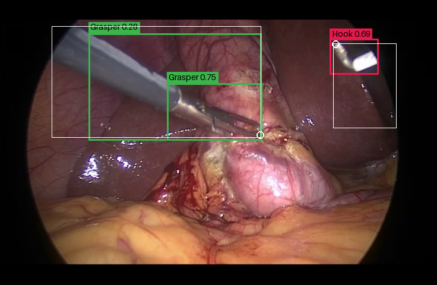

# YOLOv8s — 수술도구 탐지 베이스라인

[cesaraha/yolov8s-surgical-instrument-detection-cholec80](https://huggingface.co/cesaraha/yolov8s-surgical-instrument-detection-cholec80)
모델을 이 저장소의 복강경 영상에 적용해 보기 위한 서브 프로젝트다.
`baseline/` 아래에 기존 수술도구 탐지 방법론들을 모으는 것이 목적이며, 이 폴더는 그 첫 항목이다.

## tooltip-detector와 무엇이 다른가

|           | tooltip-detector (본 프로젝트)             | yolov8s (이 베이스라인)                                         |
| --------- | ------------------------------------------ | --------------------------------------------------------------- |
| 출력      | 도구 **팁 좌표** (거리 기반 히트맵의 피크) | 도구 **바운딩 박스 + 클래스**                                   |
| 아키텍처  | EfficientNet-B2 인코더 + U-Net 디코더      | YOLOv8s (COCO 사전학습 파인튜닝)                                |
| 클래스    | 없음 (도구/배경 2채널)                     | 7종 (Bag, Bipolar, Clipper, Grasper, Hook, Irrigator, Scissors) |
| 입력 크기 | 736 × 480                                  | 640 × 640 (letterbox)                                           |
| 지표      | Hit-rate @ N px, 팁 거리                   | mAP@50, mAP@50-95                                               |

두 모델은 **같은 지표로 직접 비교할 수 없다.** 팁 좌표와 바운딩 박스는 다른 출력이고,
이 저장소의 어노테이션에는 도구 클래스 레이블이 없다. 이 베이스라인은 "동일 영상에서 기존
객체 탐지 방법론이 어떻게 동작하는가"를 눈으로 확인하는 용도이며, 정량 비교를 하려면 별도의
매칭 규칙(예: 박스 → 팁 좌표 변환)을 먼저 정의해야 한다.

## 모델 정보

원본 모델 카드에 기재된 내용이다.

| 항목            | 값                                                                                                        |
| --------------- | --------------------------------------------------------------------------------------------------------- |
| 학습 데이터     | [Cholec80-Boxes](https://zenodo.org/records/13170928) 중 **video41–45** (14,195 프레임)                   |
| 학습 설정       | 640 × 640, 30 에포크(best 20), batch 16, lr 0.005                                                         |
| 프레임워크      | Ultralytics 8.4.21                                                                                        |
| 테스트 성능     | mAP@50 0.685 / mAP@50-95 0.392 / P 0.743 / R 0.658                                                        |
| 클래스별 mAP@50 | Hook 0.986 › Irrigator 0.834 › Bipolar 0.788 › Grasper 0.766 › Bag 0.611 › Scissors 0.468 › Clipper 0.342 |
| 라이선스        | CC BY-NC-SA 4.0 — **비상업적 용도만 허용**                                                                |

## 디렉터리 구조

```text
baseline/yolov8s/
├── pyproject.toml            # 독립 uv 프로젝트 (아래 "설치" 참고)
├── common/                   # 서브 프로젝트 공용 모듈
│   ├── detector.py           #   체크포인트 로드 + 프레임 1장 추론 (YoloDetector)
│   ├── sources.py            #   영상 / 추출 프레임 디렉터리를 같은 인터페이스로 읽기
│   └── draw.py               #   예측 박스·GT 오버레이 그리기
├── scripts/                  # 사용자가 실행하는 스크립트
│   ├── download-model.py     #   HF에서 가중치 다운로드
│   └── demo.py               #   탐지 결과 시각화 GUI
├── data/
│   └── yolov8s_cholec80.pt   # 다운로드한 가중치 (git 추적 제외, 22.5 MB)
└── images/
    └── demo-overlay.png      # 데모 오버레이 예시
```

## 설치

이 서브 프로젝트는 **저장소 루트와 별개의 uv 프로젝트**다.
`ultralytics`가 `opencv-python`을 요구하는데 루트 환경에는 `albumentations`가 끌어온
`opencv-python-headless`가 이미 있고, 둘은 같은 `cv2` 패키지에 파일을 쓰기 때문에 한
환경에 섞으면 기존 학습·평가 환경이 깨진다. 별도 `.venv`로 격리하면 그 위험이 없고,
앞으로 `baseline/`에 추가할 다른 방법론들도 각자의 의존성을 가질 수 있다.

```bash
uv sync --project baseline/yolov8s
```

## 사용법

두 스크립트 모두 저장소 루트에서 실행한다. `--project`가 이 서브 프로젝트의 `.venv`를 지정한다.

### 1. 모델 다운로드

```bash
uv run --project baseline/yolov8s python baseline/yolov8s/scripts/download-model.py
```

`yolov8s_cholec80.pt`(22.5 MB)를 `baseline/yolov8s/data/`에 내려받는다.
크기와 SHA-256을 Hugging Face 모델 API에서 읽어와 검증하고, `.part` 파일로 받은 뒤 검증에
성공해야 최종 파일명으로 바꾼다. 이미 받아 둔 파일이 검증을 통과하면 다시 받지 않는다.

| 인수              | 설명                                                         |
| ----------------- | ------------------------------------------------------------ |
| `--output <path>` | 저장 경로 (기본 `baseline/yolov8s/data/yolov8s_cholec80.pt`) |
| `--force`         | 검증을 통과한 파일이 있어도 다시 받는다                      |

### 2. 데모 GUI

```bash
uv run --project baseline/yolov8s python baseline/yolov8s/scripts/demo.py
```



*초록·빨강 박스와 태그가 모델 예측(클래스별 색상), 흰색 박스와 원이 데이터셋 어노테이션의
바운딩 박스와 도구 팁이다.*

| 인수                  | 설명                                         |
| --------------------- | -------------------------------------------- |
| `--weights <path>`    | 체크포인트 경로                              |
| `--device <dev>`      | `cuda:0` / `cpu` (기본: CUDA가 있으면 CUDA)  |
| `--videos-root <dir>` | `<dataset>/<video>.mp4` 가 있는 디렉터리     |
| `--frames-root <dir>` | `<dataset>/images/<split>/` 가 있는 디렉터리 |

#### 영상 소스

`Source` 드롭다운은 이 저장소가 영상을 두는 두 곳을 훑어 채운다.

| 위치                                                   | 내용                                | 어노테이션                         |
| ------------------------------------------------------ | ----------------------------------- | ---------------------------------- |
| `<tooltip-annotator>/data/dataset-src/<dataset>/*.mp4` | 원본 영상 (cholec80 80편, erop 5편) | 없음                               |
| `data/dataset/<dataset>/images/<split>/`               | 736 × 480 추출 프레임               | 있음 (`annotation/<split>/*.json`) |

`data/dataset`은 tooltip-annotator 프로젝트로 향하는 심볼릭 링크이므로, `dataset-src`는
그 링크를 실제 경로로 푼 뒤 형제 디렉터리를 찾는 방식으로 위치를 잡는다. 경로가 다르면
`--videos-root` / `--frames-root`로 덮어쓸 수 있고, `Open File...`로 임의의 영상 파일도 열 수 있다.

모든 소스는 프레임을 736 × 480 RGB로 맞춰 돌려주므로 영상 프레임과 데이터셋 프레임이 같은
좌표계에서 그려진다. 추출 프레임은 원본에서 일정 간격으로 뽑은 것이라 순서대로 재생해도
실시간 영상은 아니며, 재생 속도만 25 fps로 취급한다.

#### 화면 조작

| 조작                      | 동작                                                                 |
| ------------------------- | -------------------------------------------------------------------- |
| `Source` / `Open File...` | 재생할 영상 선택                                                     |
| `Play` / `Pause`          | 벽시계 기준 재생 (추론이 못 따라가면 프레임을 건너뛴다, 역행은 없다) |
| `←` `→`                   | 한 프레임 이동                                                       |
| 탐색 바                   | 임의 프레임으로 점프                                                 |
| `Conf`                    | 탐지 신뢰도 임계값 (기본 0.25)                                       |
| `IoU`                     | NMS IoU 임계값 (기본 0.70)                                           |
| `Show GT`                 | 어노테이션 오버레이 (추출 프레임 소스에서만 의미가 있다)             |

하단 정보 패널에는 프레임 이름, 추론 시간(ms/FPS), 탐지된 박스 목록과 신뢰도, GT 도구 수가 표시된다.

## 한계와 주의사항

**이 데모는 평가가 아니다.** mAP를 계산하지 않으며, 정보 패널의 수치는 해당 프레임 하나에
대한 관측값이다.

**학습 데이터가 이 프로젝트의 test 스플릿 안에 있다.** 모델은 Cholec80 video41–45로
학습됐고, 이 저장소의 cholec80 스플릿은 `video01–32 train / video33–40 val / video41–80 test`다.
즉 **video41–45 프레임에 대한 예측은 학습 데이터에 대한 예측**이며, 이 모델을 tooltip-detector와
같은 test 세트에서 비교하려면 video41–45를 제외해야 한다.

**erop에는 사실상 동작하지 않는다.** Cholec80(담낭절제술)만으로 학습된 모델이고, erop는 다른
시술·다른 내시경 장비다.

**GT에는 클래스 레이블이 없다.** 이 저장소의 어노테이션은 바운딩 박스와 팁 좌표만 담고 있어
클래스 정확도는 확인할 수 없다.

### 참고 관측치

위 한계를 수치로 확인하기 위해 test 스플릿에서 그룹별로 300 프레임씩 무작위 추출해
`conf=0.25`, `iou=0.70`으로 돌린 결과다. **mAP가 아니라 탐지 발생 빈도일 뿐이며**, 정식
평가가 아니다.

| 프레임 그룹                            | 박스가 1개 이상 나온 프레임 | GT 도구가 있는 프레임 | 프레임당 예측 박스 | 프레임당 GT 도구 |
| -------------------------------------- | --------------------------: | --------------------: | -----------------: | ---------------: |
| cholec80 video41–45 (모델의 학습 영상) |                      80.0 % |                92.0 % |               1.26 |             1.60 |
| cholec80 video46–80 (미학습 영상)      |                      72.0 % |                91.3 % |               1.07 |             1.64 |
| erop (다른 시술)                       |                      16.3 % |                75.7 % |               0.26 |             1.28 |

예측 클래스는 세 그룹 모두 Grasper와 Hook가 대부분을 차지했다. 모델 카드가 지적한 클래스
불균형(Grasper·Hook가 학습 인스턴스의 대부분)과 일치한다.

추론 속도는 RTX GPU(CUDA) 기준 프레임당 약 **5.9 ms (169 FPS)** 로, 영상 재생 속도(25 fps)보다
충분히 빠르다. 영상 디코딩까지 포함한 순차 재생 기준이다.

## 라이선스

모델 가중치는 원저자가 **CC BY-NC-SA 4.0**으로 배포한다. 비상업적 용도로만 사용할 수 있고,
파생물도 같은 조건으로 공유해야 한다. 원본 Cholec80 및 Cholec80-Boxes 데이터셋 인용 요구사항은
[모델 카드](https://huggingface.co/cesaraha/yolov8s-surgical-instrument-detection-cholec80)를 참고한다.
