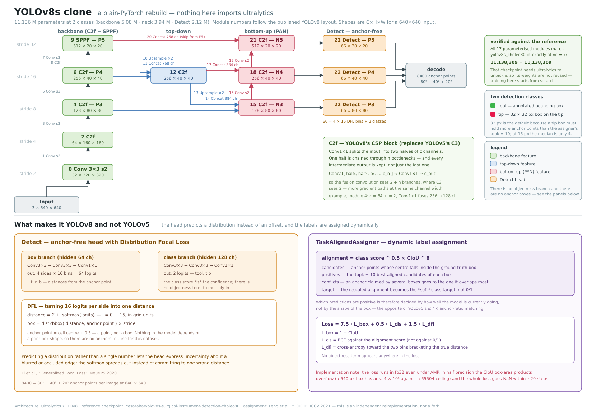

# YOLOv8s clone — 수술도구 탐지 베이스라인

[baseline/yolov8s](../yolov8s/)가 쓰는 `yolov8s_cholec80.pt`는 Ultralytics 피클이라
**`ultralytics` 패키지 없이는 언피클조차 되지 않는다.** 이 서브 프로젝트는 같은 아키텍처를
**순수 PyTorch로 다시 구현**해, 학습·평가·데모 어디서도 `ultralytics`에 의존하지 않는다.

**추가 의존성이 하나도 없다.** 루트 프로젝트가 이미 쓰는 패키지(torch, torchvision, numpy,
opencv, pillow, scipy, tqdm)만으로 구현했다.

## 구현이 맞다는 증거

`ultralytics` 없이 아키텍처를 재현했다는 것을 어떻게 확인하는가. 참조 체크포인트
`yolov8s_cholec80.pt`의 state_dict를 모듈 단위로 세어 대조했다 (`nc=7` 기준, BatchNorm 버퍼 제외).

| 모듈           | 구성                                 |           참조 |           클론 |
| -------------- | ------------------------------------ | -------------: | -------------: |
| 0–9            | 백본 (Conv, C2f ×4, SPPF)            |      5,079,712 |      5,079,712 |
| 12, 15         | top-down (C2f ×2)                    |        739,584 |        739,584 |
| 16, 18, 19, 21 | bottom-up (Conv·C2f ×2)              |      3,200,256 |      3,200,256 |
| 22             | Detect (DFL 박스 분기 + 클래스 분기) |      2,118,757 |      2,118,757 |
| **합계**       |                                      | **11,138,309** | **11,138,309** |

17개 모듈 전부가 파라미터 하나까지 일치한다. 채널 폭·깊이 스케일링·헤드 구성이 모두 맞다는 뜻이다.
(2클래스로 쓰면 11,136,xxx개가 된다 — 분류 마지막 conv만 줄어든다.)

## 무엇을 탐지하는가

이 저장소의 어노테이션은 도구마다 `bbox`와 `tip`을 갖고 클래스 레이블은 없다. 그래서 두 클래스로 학습한다.

| 클래스 | 정의                                                         | 출처                 |
| ------ | ------------------------------------------------------------ | -------------------- |
| `tool` | 어노테이션의 바운딩 박스 그대로                              | `annotations[].bbox` |
| `tip`  | 팁 좌표를 중심으로 한 **32 × 32 px 박스** (`--tip-box-size`) | `annotations[].tip`  |

예측된 `tip` 박스의 중심이 팁 좌표이므로, 탐지 지표(AP)와 이 프로젝트의 팁 지표(Hit-rate @ N px)를
같은 모델에서 함께 잴 수 있다.

**팁 박스 크기는 형식이 아니라 실제 하이퍼파라미터다.** YOLOv8은 앵커프리라서 라벨 할당이
"박스 **안에** 들어오는 앵커 포인트" 중에서 이뤄진다. 후보 앵커가 assigner의 `topk`(기본 10)보다
적으면 팁은 애초에 할당 정원을 채울 수 없다. cholec80 val 400프레임(팁 740개)에서 실제로 세어 본
결과다 — 736 × 480 프레임을 640 × 640으로 letterbox하면 변 길이가 0.87배가 되고, 가장 촘촘한
P3의 격자 간격이 8 px이다.

|                            박스 한 변 | letterbox 후 | 박스 안 앵커 수 (최소 / 중앙값 / 최대) | `topk=10` 충족 |
| ------------------------------------: | -----------: | -------------------------------------: | -------------- |
| 10 px ([cladnet](../cladnet/) 기본값) |       8.7 px |                              1 / 1 / 5 | ✗              |
|                                 16 px |      13.9 px |                              2 / 4 / 6 | ✗              |
|        **32 px (이 프로젝트 기본값)** |      27.8 px |                       **11 / 15 / 21** | ✓              |
|                                 48 px |      41.7 px |                           30 / 35 / 46 | ✓              |

32 px에서 처음으로 중앙값이 `topk`를 넘긴다. 대신 박스를 키울수록 팁 위치의 "정답 영역"이 넓어져
좌표 정밀도는 떨어질 수 있으므로, 정밀도와 학습 신호량의 맞교환이다.

**그래서 두 베이스라인의 팁 성능을 비교할 때는 박스 크기를 반드시 함께 명시해야 한다.**

### 학습 모드 (`--label-set`)

무엇을 레이블로 쓰는지에 따라 두 모드가 있다. 값은 그대로 산출물 디렉터리 이름이 된다.

| 모드               | 학습 클래스   | 산출물 디렉터리                 |
| ------------------ | ------------- | ------------------------------- |
| `tooltip` (기본값) | `tool`, `tip` | `data/model/<dataset>/tooltip/` |
| `tiponly`          | `tip`         | `data/model/<dataset>/tiponly/` |

`tiponly`는 `tool` 상자를 라벨 생성 단계에서 아예 만들지 않고 탐지 헤드의 클래스 채널도
1개로 줄인다(위 표에서 `tool` 행이 빠진다). **수술도구 상자 어노테이션 없이 팁 상자만으로
학습했을 때 팁 탐지가 어떻게 되는지**를 재는 조건이며, 설계와 판정 기준은
[tip-only 학습 실험 계획](../../docs/tip-only-experiment-plan.md)에, 결과는
[실험결과 보고서](docs/experimental-results.md)에 있다.
체크포인트에 `tip_box_size`가 기록되고, 평가 시 그 값으로 라벨을 다시 만든다 — 학습 때 못 본
크기의 라벨로 채점하는 일이 없도록.

## CLAD-Net 베이스라인과 무엇이 다른가

[cladnet](../cladnet/)은 YOLOv5 계열 레시피(앵커 기반 + objectness + CIoU)에 논문 고유의
넥(CAM·RM)을 얹은 것이다. YOLOv8은 그 레시피에서 네 가지가 바뀌었고, 두 베이스라인을 같은
데이터로 학습하면 그 차이의 효과를 직접 볼 수 있다.

|             | CLAD-Net (YOLOv5 계열)                    | YOLOv8s 클론                                          |
| ----------- | ----------------------------------------- | ----------------------------------------------------- |
| 박스 표현   | 앵커 상대 offset                          | **앵커프리** — 앵커 포인트 기준 4방향 거리            |
| 박스 회귀   | 값 1개                                    | **DFL** — 변마다 16개 빈에 대한 분포                  |
| Objectness  | 있음                                      | **없음** (클래스 점수가 곧 신뢰도)                    |
| 라벨 할당   | 앵커 **모양** 비율 매칭 (≤ 4배) + 이웃 셀 | **TaskAlignedAssigner** — 점수^0.5 × CIoU^6 상위 topk |
| CSP 블록    | C3                                        | **C2f** (모든 병목 출력을 concat)                     |
| 손실 가중치 | box 0.05 / obj 1.0 / cls 0.5              | **box 7.5 / cls 0.5 / dfl 1.5**                       |
| 파라미터    | 7.49 M                                    | 11.14 M                                               |

## 구조



벡터 원본은 [docs/model-architecture.svg](docs/model-architecture.svg)에 있다.

```text
입력 640 × 640
    │
    ▼  백본 (CSPDarknet + C2f)
  0 Conv 3→32 s2                        P1/2
  1 Conv 32→64 s2 ─ 2 C2f               P2/4
  3 Conv 64→128 s2 ─ 4 C2f  ──────────► P3/8   (80×80)
  5 Conv 128→256 s2 ─ 6 C2f ──────────► P4/16  (40×40)
  7 Conv 256→512 s2 ─ 8 C2f ─ 9 SPPF ─► P5/32  (20×20)
    │
    ▼  넥 (PAN-FPN)
  top-down : up(P5) ⊕ P4 → 12 C2f ;  up(·) ⊕ P3 → 15 C2f  ──► N3
  bottom-up: 16 Conv s2 ⊕ 12 → 18 C2f                      ──► N4
             19 Conv s2 ⊕ P5 → 21 C2f                      ──► N5
    │
    ▼  22 Detect (분리형, 앵커프리)
  박스 분기: Conv → Conv → Conv1×1 → 4 × 16 로짓 → DFL 적분 → l,t,r,b 거리
  클래스 분기: Conv → Conv → Conv1×1 → nc 로짓
```

### 손실

```text
Loss = 7.5 · L_box + 0.5 · L_cls + 1.5 · L_dfl
```

- `L_box` = 1 − CIoU
- `L_cls` = BCE. 타깃이 0/1이 아니라 **TaskAlignedAssigner가 계산한 정렬 점수**다.
  잘 맞힌 예측일수록 높은 클래스 점수를 요구한다.
- `L_dfl` = 참 거리를 사이에 둔 두 빈에 대한 교차 엔트로피. 앵커 없이 셀 이하 해상도의
  거리를 회귀할 수 있게 하는 항이다.

## 디렉터리 구조

```text
baseline/yolov8sclone/
├── run(.bat)                 # `run <script> [args...]` → scripts/<script>.py 실행
├── common/
│   ├── model.py              # YOLOv8s 아키텍처, 앵커 생성, DFL 디코딩
│   ├── assigner.py           # TaskAlignedAssigner
│   ├── loss.py               # BCE(cls) + CIoU(box) + DFL
│   ├── boxes.py              # xywh/xyxy, CIoU, letterbox, NMS
│   ├── dataset.py            # 저장소 어노테이션 → 2클래스 라벨, mosaic 증강
│   ├── metrics.py            # AP@0.5, AP@0.5:0.95, precision, recall
│   ├── tipmetrics.py         # Hit-rate @ N px (루트 프로젝트와 동일한 매칭 규칙)
│   ├── inference.py          # 체크포인트 포맷 + 프레임 1장 추론
│   ├── sources.py            # 영상 / 추출 프레임 디렉터리 읽기 (데모용)
│   └── draw.py               # 예측·GT 오버레이
├── scripts/
│   ├── train-model.py        # 학습
│   ├── eval-model.py         # 평가 (탐지 AP + 팁 hit-rate)
│   └── demo.py               # 탐지 결과 시각화 GUI
└── data/                     # 체크포인트·평가 결과 (git 추적 제외)
    ├── model/<dataset>/      #   학습 산출물
    │   ├── model.pt          #     최고 성능 체크포인트
    │   ├── model-last.pt     #     마지막 에포크 (+ 재개용 optimizer/EMA 상태)
    │   ├── train-status.json #     진행 상황
    │   └── metric.csv        #     에포크별 학습 곡선
    └── results/<dataset>/<split>/
        ├── summary.json      #     전체 지표 + 실행 파라미터
        └── per_tip.csv       #     GT 팁 1개당 1행
```

## 설치

**없다.** 다른 베이스라인과 달리 이 서브 프로젝트는 자체 `.venv`가 없다. 루트 프로젝트가 이미
쓰는 패키지만 필요하므로 루트 환경을 그대로 쓴다.

```bash
uv sync        # 루트에서 한 번 (이미 했다면 불필요)
```

`run` 스크립트가 `uv run --project <저장소 루트>`를 호출하므로, 다른 베이스라인과 사용법은 같다.

## 사용법

세 스크립트 모두 `run`으로 실행한다. 어느 디렉터리에서 실행해도 되고, Windows에서는 `run.bat`을
쓴다. 인자 없이 `run`만 실행하면 스크립트 목록이 나온다.

### 1. 학습

```bash
./baseline/yolov8sclone/run train-model --dataset cholec80
```

| 인수                       | 기본값 | 설명                                                                                      |
| -------------------------- | ------ | ----------------------------------------------------------------------------------------- |
| `--dataset`                | (필수) | `data/dataset/` 아래 디렉터리 이름 (`cholec80` / `erop`)                                  |
| `--tip-box-size`           | 32     | 팁 박스 한 변의 길이 (원본 프레임 px). 체크포인트에 기록된다                              |
| `--scale`                  | `s`    | YOLOv8 깊이·폭 스케일 (`n`/`s`/`m`/`l`/`x`). `s`가 참조 크기                              |
| `--epochs`                 | 150    |                                                                                           |
| `--batch-size`             | 16     |                                                                                           |
| `--lr`                     | 0.01   | SGD, momentum 0.937, nesterov                                                             |
| `--image-size`             | 640    |                                                                                           |
| `--frame-stride`           | 1      | N프레임마다 1장만 학습에 쓴다. 영상 프레임은 서로 거의 같으므로 에포크 시간을 크게 줄인다 |
| `--val-frames`             | 2000   | 에포크마다 평가할 val 프레임 수 상한 (0이면 전체)                                         |
| `--no-ema` / `--no-resume` |        | EMA 끄기 / 처음부터 다시 학습                                                             |

체크포인트는 `data/model/<dataset>/<label-set>/`에, 평가 결과는 `data/results/<dataset>/<label-set>/<split>/`에
들어가므로 데이터셋마다 따로 쌓인다. `model-last.pt`가 있으면
**기본 동작이 재개**이며 optimizer·스케줄러·EMA 상태까지 복원된다.

팁 박스 크기를 바꿔 비교하려면 출력을 분리한다.

```bash
./baseline/yolov8sclone/run train-model --dataset cholec80 --tip-box-size 16 \
    --output-dir baseline/yolov8sclone/data/model/cholec80-tip16
```

데이터셋별 전체 재현 명령은 [docs/commands.md](docs/commands.md)에 있다.

### 2. 평가

```bash
./baseline/yolov8sclone/run eval-model --dataset cholec80
```

두 종류의 수치를 함께 낸다.

- **탐지 지표** — `tool`·`tip` 각각의 AP@0.5, AP@0.5:0.95, precision, recall
- **팁 지표** — miss rate, Hit-rate @ 10/20/50 px, 오차 거리 중앙값·평균·P90.
  예측된 `tip` 박스의 중심을 팁 좌표로 삼고, 루트 프로젝트 `scripts/eval-model.py`와
  **같은 매칭 규칙**(최근접 매칭 + Hungarian 1:1 매칭)을 쓴다 — 그래서 tooltip-detector와
  직접 비교할 수 있다.

거리는 letterbox된 640 × 640이 아니라 **원본 프레임 좌표계(736 × 480)** 에서 잰다.
결과는 `data/results/<dataset>/<label-set>/<split>/`에 `summary.json`과 `per_tip.csv`로 저장된다.

### 3. 데모 GUI

```bash
./baseline/yolov8sclone/run demo
```

`data/model/<dataset>/<label-set>/model.pt` 중 사전순 첫 번째를 읽어 영상을 프레임 단위로 처리하며 `tool` 박스와
`tip` 박스(중심에 십자 마커)를 그린다. 조작은 [yolov8s 데모](../yolov8s/README.md)와 같다.

다른 데이터셋의 모델을 쓰려면 `--dataset`을 지정하면 `data/model/<dataset>/<label-set>/model.pt`를 알아서
찾는다. `data/model/` 밖의 체크포인트나 `model-last.pt`를 열려면 `--weights`로 경로를 직접 준다
(`--dataset`보다 우선한다).

```bash
./baseline/yolov8sclone/run demo --dataset erop
./baseline/yolov8sclone/run demo --weights baseline/yolov8sclone/data/model/erop/tooltip/model-last.pt
```

| 조작                      | 동작                                                                 |
| ------------------------- | -------------------------------------------------------------------- |
| `Source` / `Open File...` | 재생할 영상 선택                                                     |
| `Play` / `Pause`          | 벽시계 기준 재생 (추론이 못 따라가면 프레임을 건너뛴다, 역행은 없다) |
| `←` `→`                   | 한 프레임 이동                                                       |
| 탐색 바                   | 임의 프레임으로 점프                                                 |
| `Conf` / `IoU`            | 탐지 신뢰도 임계값 / NMS IoU 임계값                                  |
| `Show GT`                 | 어노테이션 오버레이 (추출 프레임 소스에서만 의미가 있다)             |

영상 소스는 `<tooltip-annotator>/data/dataset-src/<dataset>/*.mp4`(원본 영상, 어노테이션 없음)와
`data/dataset/<dataset>/images/<split>/`(736 × 480 추출 프레임, 어노테이션 있음) 두 곳을 훑어 채운다.

## 구현 메모

- **AMP를 써도 손실은 fp32로 계산한다.** fp16에서는 CIoU의 박스 넓이 곱(640 px 박스면 약
  4 × 10⁵)이 half의 표현 범위(65504)를 넘어 `inf - inf = NaN`이 되고, 약 20스텝 만에 손실
  전체가 NaN이 된다. 합성곱이 대부분인 forward는 autocast 아래 그대로 두고 헤드 출력만
  `.float()`으로 올린다.
- 그래디언트는 참조 구현과 같이 norm 10으로 클리핑한다.
- 학습률은 3에포크 선형 warmup 뒤 cosine 감쇠, 가중치 EMA를 쓴다 (`--no-ema`로 끌 수 있다).

## 한계

- **사전학습 가중치를 쓰지 않는다.** 참조 체크포인트는 7클래스로 학습됐고 언피클에
  `ultralytics`가 필요하다. 이 클론은 무작위 초기화에서 시작하므로, HF 모델이 Cholec80에서
  이미 학습한 특징의 이점을 받지 못한다.
- **HF 모델과 직접 비교할 수 없다.** 저쪽은 도구 7종을 구분하고 이쪽은 `tool`/`tip` 2종이다.
  클래스 정의가 달라 AP가 같은 뜻이 아니다.
- **라이선스는 걸리지 않는다.** 원본 가중치(CC BY-NC-SA 4.0)를 쓰지 않으므로 이 구현과 그
  학습 결과는 원본의 비상업 조건을 승계하지 않는다.
- `tip` 클래스는 YOLOv8에 없는 이 프로젝트의 확장이다. 팁을 박스로 바꾸는 방식과 그 크기가
  결과를 좌우하므로, 수치를 인용할 때는 항상 박스 크기를 함께 적는다.

## 참고

- 아키텍처: Ultralytics YOLOv8, <https://github.com/ultralytics/ultralytics>
- 참조 체크포인트: <https://huggingface.co/cesaraha/yolov8s-surgical-instrument-detection-cholec80>
- DFL: Li et al., *Generalized Focal Loss*, NeurIPS 2020
- TaskAlignedAssigner: Feng et al., *TOOD: Task-aligned One-stage Object Detection*, ICCV 2021
