# 복강경 수술 영상에서의 히트맵 회귀를 이용한 수술도구 팁 탐지

## 실험결과보고서 (최종본)

- **저자(Author):** Doosik Kim
- **소속(Affiliation):** 한국전자통신연구원 (ETRI)
- **작성일(Date):** 2026-08-24
- **문서 버전(Version):** 3.0 (`cholec80` 영상 단위 스플릿 재구축·재학습·재평가 반영)

## 초록 (Abstract)

복강경(laparoscopy) 수술 중 수술도구 끝부분(팁, tip)의 위치를 실시간으로 파악하는 일은 수술 항법(navigation), 자동 카메라 추종, 술기 분석 등 컴퓨터 보조 수술(computer-assisted surgery) 응용의 기초가 된다. 본 연구는 단일 RGB 프레임에서 도구 팁 위치를 추정하는 문제를 **히트맵 회귀(heatmap regression)** 로 정식화하고, **데이터셋 2종 × 학습 타겟 생성 방식 2종 × 모델 크기 2종 = 8개 조합**의 전수 실험을 수행하여 각 축이 성능에 미치는 영향을 분리하였다.

데이터셋은 자체 구축한 `erop`(5개 세션, 180,706 프레임)과 공개 데이터셋을 변환한 `cholec80`(80편 영상, 184,578 프레임)이며, 두 데이터셋 모두 프레임당 RGB 이미지·이진 분할 마스크·도구별 팁 좌표를 반자동(semi-automatic) 파이프라인으로 생성한 어노테이션을 갖는다. **두 데이터셋의 스플릿 분할 단위는 다르다** — `erop`은 프레임 단위(60:20:20, 시간적 누수 있음), `cholec80`은 영상 단위(`video01–32` / `33–40` / `41–80`, 누수 없음)다. 학습 타겟은 분할 마스크의 형태 정보를 쓰는 `gradient-seg`(거리 기반 히트맵)와 팁 좌표만 쓰는 `gaussian-tip`(가우시안 히트맵) 두 가지로, 모델은 EfficientNet-B2 + U-Net 풀 모델(`monai`, 11.45 M 파라미터)과 인코더 블록 수를 절반으로 줄인 경량 모델(`monai_mini`, 5.50 M 파라미터) 두 가지로 구성했다. 8개 조합 모두 동일한 손실·증강·최적화 설정(30 에포크, Adam lr=1e-4, CosineAnnealingLR)으로 학습하고, 동일한 후처리 설정(`threshold=0.5`, `NMS radius=20 px`)으로 테스트 세트 전체를 평가하였다.

핵심 결과는 네 가지다. **첫째, 성능을 지배하는 요인은 모델 크기가 아니라 학습 타겟 생성 방식이었다.** `gaussian-tip`은 Hit@10 px 58.2–73.4 %, 중앙값 오차 3.2–7.8 px로 정밀도가 압도적이지만 탐지 실패율이 5.0–8.2 %로 높고, `gradient-seg`는 Hit@10 px 25.1–45.0 %, 중앙값 10.8–18.4 px로 정밀도는 낮지만 탐지 실패율이 2.9–3.5 %로 안정적이다. 타겟 방식이 Hit@10 px에 미치는 영향은 평균 29.9 %p로 모델 크기(1.6 %p)를 한 자릿수 이상 압도한다. 이는 임계값 0.5에서 두 타겟이 만드는 초과-임계 영역의 크기 차이(가우시안: 반경 17.7 px의 좁은 원판 / gradient: 도구별 최대 팁 거리의 절반 안에 있는 마스크 화소)로 기계적으로 설명된다. 실무적 함의는 **분할 마스크 레이블링 비용이 팁 탐지 정확도로 회수되지 않는다**는 것이며, 이 결론은 누수 없는 평가에서도 유지된다.

**둘째, 오차 분포의 긴 꼬리는 거의 전적으로 다중 도구 프레임의 과소 탐지에서 발생한다.** 전체 GT 팁의 18.7–32.2 %가 같은 프레임의 다른 GT 팁과 동일한 예측 피크에 매칭되며(모델이 도구 수보다 적은 피크를 생성), 이 집단의 평균 오차는 99–106 px인 반면 단독 매칭된 팁의 평균 오차는 `gaussian-tip` 기준 7.5–12.5 px에 불과하다. 헝가리안 일대일 배정으로 다시 재면 이 실패가 도구 수에 따라 급증한다 — 도구 1–2개 프레임의 FN율 13.5–23.3 %가 도구 4개 이상에서 **39.2–56.2 %** 가 된다. 즉 현행 지표가 보여주는 낮은 정밀도의 본질은 "위치를 못 짚는 것"이 아니라 "도구 개수를 못 맞추는 것"이다.

**셋째, 경량화 비용은 작지만 그 크기를 확정할 수 없다.** 파라미터를 52 % 줄이고 CPU 추론을 1.35배 가속했음에도 4개 비교쌍 전부에서 지표 차이가 ±5 %p 이내였다. 다만 `cholec80`을 영상 단위로 재학습하는 과정에서 모델 크기 효과의 부호가 뒤집혔고(Hit@10 px −1.92 → +4.94 %p), 이 6.86 %p 이동은 측정하려는 효과와 같은 자릿수다. 한편 8개 조합 중 5개의 예측 좌표에 4.5–5.7 px의 **계통 편차(systematic offset)** 가 있고, 한 조합에서 이 상수만 제거하면 중앙값 오차가 7.28 px에서 3.61 px로 줄어 다른 조합과 대등해진다 — 정밀도 지표의 일부는 모델의 위치 추정 능력이 아니라 보정되지 않은 좌표 편차를 재고 있었다. 이 편차는 `cholec80` 재구축·재학습 후에도 동일한 값으로 재현되었다.

**넷째, 시간적 누수가 보고 수치를 실제로 부풀리고 있었다.** `cholec80`을 같은 프레임 집합·같은 학습 설정에서 프레임 단위와 영상 단위 두 방식으로 학습·평가한 결과, 영상 단위(누수 없음)에서 네 조합 전부의 모든 지표가 나빠졌다 — Hit@50 px −3.4~−4.7 %p, 헝가리안 F1@50 −0.025~−0.034, 평균 오차 +4.6~+6.0 px, P90 +24~+33 px. 이 격차에는 학습 데이터 35.9 % 감소가 함께 작용하므로 누수만의 크기는 아니지만, **프레임 단위 분할로 보고된 수치를 일반화 성능으로 읽으면 안 된다**는 결론에는 영향이 없다. 본 보고서의 `erop` 4개 조합이 여전히 이 조건에 있다.

**키워드:** 복강경 수술, 수술도구 팁 탐지, 히트맵 회귀, EfficientNet, U-Net, 전이 학습, 모델 경량화, 다중 인스턴스 매칭

## 1. 서론 (Introduction)

### 1.1 연구 배경

최소 침습 수술(minimally invasive surgery)의 대표 형태인 복강경 수술은 작은 절개창으로 삽입한 내시경 카메라와 가늘고 긴 수술도구를 이용해 시행된다. 집도의는 체내를 직접 보지 못하고 모니터의 2차원 영상에만 의존하므로, 영상 내 도구의 위치 — 특히 조직과 직접 상호작용하는 **팁(tip)** 의 위치 — 를 정확히 파악하는 일이 술기의 정밀도와 안전성에 직결된다.

수술도구 팁 위치를 자동으로 추정할 수 있다면 다음 응용이 가능해진다.

- **자동 카메라 추종**: 도구 팁을 화면 중심에 유지하도록 카메라(또는 로봇 암)를 제어
- **술기 분석 및 평가**: 도구 궤적·움직임 정량화를 통한 수술 술기 학습·평가
- **증강 현실 항법**: 도구–해부 구조 간 상대 위치를 시각적으로 보조
- **이상 상황 감지**: 도구의 비정상적 움직임이나 위험 구역 접근 경고

### 1.2 문제 정의와 접근

수술도구 팁 탐지는 일반적으로 세 가지로 접근할 수 있다.

1. **직접 좌표 회귀(coordinate regression)**: 네트워크가 (x, y) 좌표를 직접 출력. 도구 개수가 가변적이고 다중 인스턴스 매칭이 어렵다.
2. **객체 검출(object detection)**: 바운딩 박스 기반. 팁은 점(point) 객체이므로 박스 표현이 부자연스럽다.
3. **히트맵 회귀(heatmap regression)**: 팁 위치를 공간 히트맵의 피크로 인코딩. 인체 자세 추정(pose estimation) 등에서 널리 쓰이며, 가변 개수의 점을 자연스럽게 다룬다.

본 프로젝트는 세 번째 접근을 채택하되, **히트맵 타겟을 만드는 방식 자체를 실험 변수로 삼았다**. 팁 좌표만으로 만드는 표준적인 가우시안 히트맵(`gaussian-tip`)과, 도구 분할 마스크의 형태 정보를 결합한 거리 기반 히트맵(`gradient-seg`)을 같은 조건에서 비교한다. 후자는 도구가 길쭉한 형태라는 사전 지식을 활용해 팁에서 멀어질수록(도구 몸통 쪽으로 갈수록) 값이 선형으로 감소하는 그래디언트를 마스크 전체에 부여하며, (i) 학습 신호를 도구 영역 전반에 분포시켜 학습을 안정화하고 (ii) 팁 부근에 최댓값을 집중시키는 것을 의도한 설계다.

이 비교는 학술적 관심을 넘어 **실무적 의미**를 갖는다. `gradient-seg`는 픽셀 단위 분할 마스크를 요구하지만 `gaussian-tip`은 팁 좌표 하나만 요구하므로, 레이블링 비용 차이가 매우 크다. 만약 두 방식의 성능이 대등하다면 향후 데이터 구축에서 분할 마스크 레이블링을 생략할 수 있다.

### 1.3 연구 목표 및 기여

- **(G1)** 두 가지 히트맵 타겟 생성 방법(`gradient-seg` / `gaussian-tip`)을 정식화하고, 동일한 모델·손실·증강 파이프라인에서 학습·평가할 수 있는 실험 프레임워크를 구축한다.
- **(G2)** MONAI 사전학습 가중치와 state_dict 수준에서 호환되는 EfficientNet-B2 + U-Net 분할 네트워크를 구현하고, 인코더 깊이를 절반으로 줄인 경량 변형을 함께 설계한다.
- **(G3)** 데이터셋 2종 × 타겟 2종 × 모델 2종의 **8개 조합을 빠짐없이 학습·평가**하여, 각 축이 성능에 미치는 영향을 독립적으로 분리한다.
- **(G4)** 피크 탐지 기반 평가 프로토콜을 정의하고, GT 팁 단위 기록(`per_tip.csv`)을 이용한 사후 분석으로 오차 구조 — 특히 오차 분포의 긴 꼬리의 발생 원인 — 을 규명한다.
- **(G5)** 스플릿 분할 단위(프레임 대 영상)를 실험 변수로 삼아, 시간적 누수가 보고 성능에 미치는 영향을 같은 데이터셋·같은 학습 설정에서 정량화한다.

## 2. 데이터셋 (Dataset)

### 2.1 두 데이터셋 개요

본 실험은 두 개의 복강경 수술 데이터셋을 사용한다. 두 데이터셋은 동일한 디렉터리 구조·파일 포맷·어노테이션 스키마를 따르므로, `--dataset` 인자만 바꾸면 같은 코드로 학습·평가된다.

**표 1. 데이터셋 개요**

| 항목                       | `erop`                   | `cholec80`                         |
| -------------------------- | ------------------------ | ---------------------------------- |
| 출처                       | 자체 구축 (비공개)       | 공개 Cholec80 담낭절제술 영상 변환 |
| 영상(세션) 수              | 5                        | 80                                 |
| 총 프레임 수               | 180,706                  | 184,578                            |
| 총 팁 어노테이션 수        | 252,977                  | 315,204                            |
| 해상도                     | 736 × 480 px (letterbox) | 736 × 480 px (letterbox)           |
| 프레임 샘플링 간격         | 10 프레임 (약 3 fps)     | 25 프레임 (1 fps)                  |
| **스플릿 분할 단위**       | **프레임** (60:20:20)    | **영상** (편수 40:10:50)           |
| **시간적 누수**            | **있음**                 | **없음**                           |
| 도구 없는 프레임 (train)   | 21.4 %                   | 7.8 %                              |
| 도구 보유 프레임당 도구 수 | 1.78개                   | 1.95개                             |

두 데이터셋의 프레임은 원본 종횡비를 유지한 letterbox 방식으로 736 × 480 px 캔버스에 맞춰졌으며, 16:9 원본의 경우 상·하단에 각각 약 33 px의 검은 패딩이 생긴다.

**표 2. 스플릿 구성**

| 데이터셋   | 스플릿 | 분할 단위 |  영상 수 | 프레임 수 |   비율 |   팁 수 |
| ---------- | ------ | --------- | -------: | --------: | -----: | ------: |
| `erop`     | train  | 프레임    | 5 (전부) |   108,424 | 60.0 % | 151,329 |
| `erop`     | val    | 프레임    | 5 (전부) |    36,140 | 20.0 % |  50,930 |
| `erop`     | test   | 프레임    | 5 (전부) |    36,142 | 20.0 % |  50,718 |
| `cholec80` | train  | 영상      |       32 |    71,032 | 38.5 % | 127,662 |
| `cholec80` | val    | 영상      |        8 |    15,312 |  8.3 % |  25,573 |
| `cholec80` | test   | 영상      |       40 |    98,234 | 53.2 % | 161,969 |

`cholec80`은 `video01–32` train, `video33–40` val, `video41–80` test로, **한 영상의 모든 프레임이 하나의 스플릿에만** 들어간다. 편수 비율 40:10:50이 영상 길이 편차 때문에 프레임 비율 38.5 : 8.3 : 53.2로 나타난다. `erop`은 5개 세션 전부가 세 스플릿 모두에 60:20:20으로 기여한다.

### 2.2 분할 방식과 시간적 누수 (Temporal Leakage)

**두 데이터셋의 분할 단위가 다르다.** 이 차이는 본 보고서의 모든 데이터셋 간 비교를 해석하는 전제이므로 먼저 정리한다.

| 분할 단위        | 배정 방식                                                      | 시간적 누수 | test 성능의 의미                      | 데이터셋   |
| ---------------- | -------------------------------------------------------------- | ----------- | ------------------------------------- | ---------- |
| 프레임 (`frame`) | 영상마다 독립적으로 그 영상의 프레임을 세 스플릿에 무작위 배분 | **있음**    | 낙관적 편향 (본 영상의 이웃 프레임)   | `erop`     |
| 영상 (`video`)   | 영상 단위로 하나의 스플릿에만 배정                             | 없음        | **미지의 새 영상에 대한 일반화 성능** | `cholec80` |

**`erop` — 프레임 단위 분할 (누수 있음).** 5개 세션 전부가 세 스플릿 모두에 60:20:20으로 기여하며, 세션 *내부*의 분할이 시간 순서가 아니라 프레임 단위 무작위 셔플이다.

```text
doctor_250620_084707 세션의 프레임 번호 (erop)
  train : 30  40  50  60  80  90 100 120 130 140 150 ...
  val   : 10  20  70 110 190 300 310 450 530 540 560 ...
  test  : 260 280 330 360 400 430 460 470 550 570 660 ...
```

따라서 **같은 영상의 시간적으로 인접한 프레임이 train과 test에 동시에 존재한다.** 10프레임(약 0.3초) 간격에서 인접 프레임의 장면은 거의 동일하므로, `erop`의 test 성능은 미지의 새 영상에 대한 일반화 성능보다 **낙관적**이다. `erop`은 세션이 5개뿐이어서 영상 단위로 나누면 test가 단일 세션에 의존하게 되고 그 세션의 특성이 전체 지표를 지배하므로, 프레임 단위 분할을 유지한다.

**`cholec80` — 영상 단위 분할 (누수 없음).** 2026-08-21에 재구축되었다. `video01–32`가 train, `video33–40`이 val, `video41–80`이 test이며, 어떤 영상도 두 스플릿에 걸치지 않는다. 파일명 정렬 순서 그대로 편수 비율(40:10:50)을 적용하므로 난수를 전혀 쓰지 않고, 이는 문헌에서 널리 쓰이는 Cholec80 분할 규약과 같다. 따라서 **`cholec80`의 test 성능은 미지의 새 영상에 대한 일반화 성능이다.**

재구축은 프레임을 다시 추출하지 않고 스플릿 배정만 바꾼 것으로, 이미지·마스크·어노테이션 자체는 동일하다. 분할 규칙은 병합된 tooltip-annotator 하위 프로젝트의 [scripts/generate_dataset.py](../tooltip-annotator/scripts/generate_dataset.py)에 있으며 `--split-unit {frame,video}`으로 선택한다. 재현 명령은 다음과 같다.

```bash
python scripts/generate_dataset.py --dataset cholec80 --split-unit video --train 40 --val 10 --test 50
```

**재구축이 함께 바꾼 것 — 해석의 교란 요인.** 편수 40:10:50이 프레임 수로는 38.5 : 8.3 : 53.2가 되므로, train이 110,747 프레임(60 %)에서 **71,032 프레임(38.5 %)으로 35.9 % 줄었고** test는 36,930에서 98,234로 늘었다. 즉 구 분할과 신 분할의 성능 차이는 **(i) 시간적 누수 제거, (ii) 학습 데이터 35.9 % 감소, (iii) test 세트 구성 변화**가 함께 작용한 결과이며, 세 효과는 분리 측정되지 않았다. §11.3이 이 비교를 정량화하되 이 한계를 명시한다.

**데이터셋 간 비교(§6.5)의 전제 변경.** 2.2판까지는 두 데이터셋이 동일한 분할 규칙을 써서 데이터셋 간 상대 비교에서 누수가 어느 정도 상쇄된다고 보았다. **이제는 그렇지 않다.** `erop`은 누수 있는 분할, `cholec80`은 누수 없는 분할이므로, `erop` − `cholec80` 격차에는 데이터셋 자체의 난이도 차이와 분할 방식의 차이가 뒤섞여 있다. §6.5는 이 전제 위에서 읽어야 한다.

### 2.3 어노테이션 생성 방식과 그 한계

두 데이터셋의 분할 마스크와 팁·바운딩 박스 어노테이션은 사람이 수작업으로 라벨링한 것이 아니라 **반자동(semi-automatic) 파이프라인**으로 생성되었다. 병합 후 탐지 프로젝트의 `data/dataset`은 `../tooltip-annotator/data/dataset`을 가리키는 심볼릭 링크이므로, 어노테이션 편집기의 저장 결과가 학습 데이터와 평가 기준값에 즉시 반영된다. 데이터셋 구축 파이프라인, 생성 규칙, 수동 보정 도구와 당시의 구축 결과는 별도 문서인 [데이터셋 구축 보고서](../tooltip-annotator/docs/final-report.md)에 기록되어 있다.

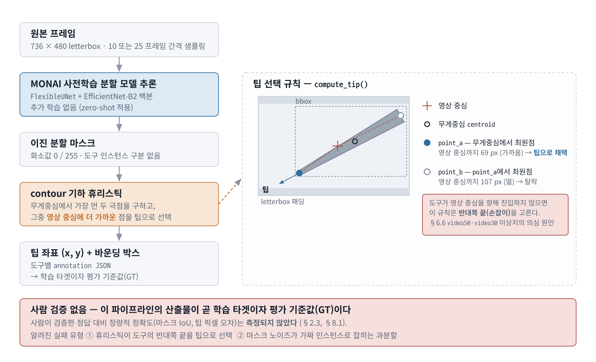

**그림 1. MONAI 사전학습 분할 모델을 이용한 반자동 어노테이션 파이프라인.** 원본 프레임에 추가 학습 없이 MONAI `FlexibleUNet`(EfficientNet-B2 백본)을 적용해 이진 분할 마스크를 얻고, contour 기하 휴리스틱으로 도구별 팁 좌표와 바운딩 박스를 산출한다. 우측 패널은 팁 선택 규칙을 확대한 것으로, 무게중심에서 가장 먼 두 극점 중 영상 중심에 더 가까운 점이 팁으로 채택된다. 이 산출물이 곧 학습 타겟이자 평가 기준값(GT)이며, 사람의 검증을 거치지 않았다.

`cholec80` 원본은 픽셀 단위 도구 분할 마스크도, 팁 좌표도 제공하지 않으므로 두 데이터셋 모두 이 파이프라인 산출물을 기준값으로 쓴다. 이 어노테이션은 사람의 검수·보정을 전제로 한 **초안**이며, 사람이 검증한 정답 대비 정량적 정확도(IoU, 팁 픽셀 오차 등)는 측정되지 않았다.

따라서 본 보고서에서 'GT(ground truth)'로 지칭하는 팁 좌표는 엄밀한 의미의 검증된 정답이 아니라 자동 생성 어노테이션을 기준값으로 사용한 것이다. 이는 두 방향으로 결과에 영향을 준다.

- **평가 기준값의 오차**: 휴리스틱이 도구의 반대쪽 끝을 팁으로 잘못 고르거나, 마스크 노이즈가 가짜 인스턴스로 잡히는 과분할(over-segmentation) 사례가 존재한다. 이런 프레임에서는 모델이 옳아도 오차로 집계된다.
- **`gradient-seg`의 이중 의존**: `gradient-seg` 타겟은 마스크와 팁 좌표를 **모두** 쓰므로 마스크 품질에도 직접 영향을 받는 반면, `gaussian-tip`은 팁 좌표에만 의존한다. 두 타겟 방식의 비교는 이 비대칭을 감안해 읽어야 한다.

또한 소수의 프레임에서 PNG 파일이 손상되어 있어, `SurgicalToolDataset`은 로드에 실패한 샘플을 무작위 다른 샘플로 대체하고 경고만 출력한다(학습 중단 방지). annotation ↔ segmentation 불일치는 `erop` 기준 1 % 미만이다.

### 2.4 세션 구성

**표 3. `erop` 세션별 프레임 수와 test 팁 수**

| 세션 ID                |  train |    val |   test | test 팁 수 | test 팁 비중 |
| ---------------------- | -----: | -----: | -----: | ---------: | -----------: |
| `doctor_250620_084707` | 14,406 |  4,802 |  4,802 |      6,735 |       13.3 % |
| `doctor_250620_131843` | 16,249 |  5,416 |  5,416 |      4,287 |        8.5 % |
| `doctor_250702_084355` | 11,165 |  3,721 |  3,722 |      5,483 |       10.8 % |
| `doctor_250702_101536` | 46,193 | 15,397 | 15,398 |     25,137 |       49.6 % |
| `doctor_250723_094100` | 20,411 |  6,804 |  6,804 |      9,076 |       17.9 % |

세션 `doctor_250702_101536`이 전체 프레임의 43 %, test 팁의 **49.6 %** 를 차지하는 지배적 세션이다. `erop`의 전체 평균 지표는 사실상 이 한 세션의 성능에 좌우된다.

`cholec80`은 영상 단위 분할이므로 각 영상이 **한 스플릿에만** 등장한다. 영상 길이 편차가 커서 영상당 프레임 수도 크게 다르다.

**표 3-1. `cholec80` 스플릿별 영상당 통계**

| 스플릿 | 영상 수 | 영상 ID        | 프레임 / 영상 (최소 · 중앙값 · 최대) | 팁 수 / 영상 (최소 · 중앙값 · 최대) |
| ------ | ------: | -------------- | -----------------------------------: | ----------------------------------: |
| train  |      32 | `video01`–`32` |                  982 · 2,018 · 5,829 |              1,708 · 3,460 · 12,001 |
| val    |       8 | `video33`–`40` |                1,233 · 1,878 · 3,081 |               2,056 · 3,112 · 4,892 |
| test   |      40 | `video41`–`80` |                  740 · 2,358 · 5,994 |               1,281 · 3,710 · 9,293 |

평가 스크립트는 파일명에서 마지막 `_` 앞부분을 세션 ID로 쓰므로, `cholec80`에서는 **영상 1편이 곧 1개 세션**이 되어 **세션별 지표가 40개** 산출된다(구 프레임 분할에서는 80편 전부가 test에 등장해 80개였다). 이는 세션 간 편차를 통계적으로 관찰하기에 `erop`(5개)보다 훨씬 유리한 조건이다(§6.6).

test 팁이 가장 많은 세 영상(`video69` 9,293 · `video58` 8,623 · `video61` 6,783)이 전체 test 팁의 15.2 %를 차지하나, `erop`의 지배적 세션(49.6 %)과 달리 한 영상이 전체 평균을 좌우하지는 않는다. 이 점에서 `cholec80`의 전체 지표가 `erop`의 전체 지표보다 대표성이 높다.

### 2.5 프레임당 도구 수 분포

**표 4. 프레임당 도구 수 분포 (train 스플릿)**

| 도구 수       | `erop` 프레임 |   비율 | `cholec80` 프레임 |   비율 |
| ------------- | ------------: | -----: | ----------------: | -----: |
| 0 (도구 없음) |        23,159 | 21.4 % |             5,549 |  7.8 % |
| 1             |        37,121 | 34.2 % |            23,438 | 33.0 % |
| 2             |        34,237 | 31.6 % |            27,316 | 38.5 % |
| 3             |        10,768 |  9.9 % |            10,766 | 15.2 % |
| 4             |         2,502 |  2.3 % |             2,943 |  4.1 % |
| 5+            |           637 |  0.6 % |             1,020 |  1.4 % |
| **합계**      |   **108,424** |  100 % |        **71,032** |  100 % |

`cholec80`은 도구 없는 프레임이 훨씬 적고(7.8 % 대 21.4 %) 도구 2개 이상 동시 등장 비율이 높다(**59.2 %** 대 44.4 %). 이 차이는 §6.7의 다중 도구 분석에서 두 데이터셋의 성능 격차를 설명하는 핵심 변수가 된다. 영상 단위 재분할로 `cholec80` train의 다중 도구 비율이 구 분할(55.5 %)보다 더 올라갔다 — 어느 영상이 train에 배정되는지가 도구 수 분포까지 바꾼다.

도구가 없는 프레임은 타겟 히트맵 전체가 0이 되어, 모델이 "도구가 없을 때 피크를 만들지 않는" 능력을 학습하는 음성(negative) 샘플로 기능한다.

### 2.6 학습 타겟 생성 방식

원본 어노테이션의 팁 좌표·bbox와 이진 분할 마스크를 그대로 학습 타겟으로 쓰는 대신, 두 방식 중 하나로 변환한 연속 히트맵을 타겟으로 삼는다(`--target-mode`). 여기서 bbox·tip 어노테이션은 타겟 생성 전에 이미 주어진 입력이다.

#### `gradient-seg` — 분할 마스크 필요

`generate_annotation.py`는 contour마다 bbox·tip 어노테이션을 하나씩 생성하며, 분절된 연결요소를 자동으로 병합하지 않는다. 학습 시 `gradient-seg`는 이 기존 어노테이션을 수정하지 않고, 분할 마스크의 연결요소(connected component)를 각 bbox와 겹치는 화소 수 기준으로 매칭한 뒤 어노테이션별로 독립 정규화한다.

$$
\text{target}(p) = 1 - \frac{\lVert p - t_{a(p)} \rVert}{\max_{q \in M_{a(p)}} \lVert q - t_{a(p)} \rVert}
$$

여기서 $a(p)$는 화소 $p$가 속한 연결요소에 매칭된 어노테이션, $t_a$는 그 어노테이션의 팁 좌표, $M_a$는 어노테이션 $a$에 매칭된 모든 연결요소의 화소 집합이다. 팁 화소는 1.0, 해당 도구 영역 내에서 팁으로부터 가장 먼 화소는 0.0, 그 사이는 선형 보간된다. 마스크 외부 배경은 0.0이며, 도구가 없는 프레임은 전체가 0.0이다.

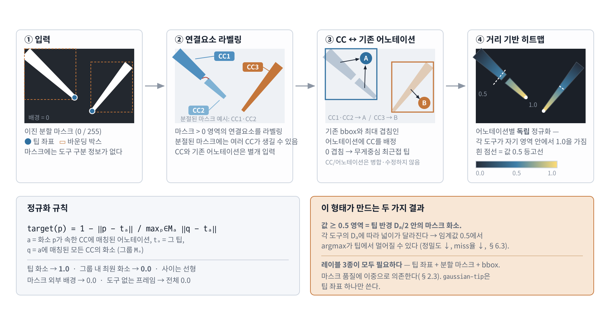

**그림 2. `gradient-seg` 타겟 생성 과정 — 이진 분할 마스크에서 거리 기반 히트맵까지.** 마스크의 연결요소를 라벨링하고(②), bbox와 겹치는 화소 수가 최대인 어노테이션에 각 연결요소를 배정한 뒤(③), 어노테이션별로 독립 정규화하여 거리 기반 히트맵을 만든다(④). 한 어노테이션에 여러 연결요소가 배정되는 경우에만 정규화는 개별 CC가 아니라 그 그룹 단위로 수행된다. 이 매칭은 히트맵 값을 계산하기 위한 것이며, 어노테이션을 병합하거나 수정하는 단계가 아니다. ④의 흰 점선(값 0.5 등고선)은 해당 그룹에서 팁까지의 최대 유클리드 거리의 절반을 나타낸다. 이는 도구 축을 따른 정확한 중간점이 아니라, 마스크 형상에 따라 달라지는 반경 경계다.

#### `gaussian-tip` — 팁 좌표만 필요

분할 마스크를 전혀 쓰지 않고, 각 도구의 팁을 중심으로 한 2차원 가우시안을 그린다. 여러 도구의 가우시안이 겹치는 화소는 픽셀별 최댓값을 취한다.

$$
\text{target}(p) = \max_{t \in \text{tips}} \exp\left(-\frac{\lVert p - t \rVert^2}{2\sigma^2}\right)
$$

본 실험은 전부 $\sigma = 15$ px(기본값)로 수행하였다.

#### 두 방식의 구조적 차이

두 방식 모두 동일한 손실 `MSE(sigmoid(pred[:, 1]), target)`로 학습하므로 모델 구조·손실 함수·최적화 설정은 완전히 같고, **타겟 히트맵의 공간적 형태와 필요한 레이블 종류만 다르다**.

| 항목                 | `gradient-seg`                   | `gaussian-tip`            |
| -------------------- | -------------------------------- | ------------------------- |
| 필요한 레이블        | 팁 좌표 + 분할 마스크 + bbox     | 팁 좌표만                 |
| 레이블링 비용        | 높음 (픽셀 단위 마스크)          | 낮음 (점 하나)            |
| 타겟값 ≥ 0.5 인 영역 | 팁 반경 $D_a/2$ 안의 마스크 화소 | 팁 중심 반경 17.7 px 원판 |
| 학습 신호 분포       | 도구 영역 전체 (넓음)            | 팁 근방 (좁음)            |
| 어노테이션 품질 의존 | 마스크 + 팁 (이중)               | 팁만                      |

"타겟값 ≥ 0.5 인 영역"은 §6.3에서 두 방식의 성능 특성을 기계적으로 설명하는 핵심이다. 가우시안의 경우 $\exp(-d^2/2\sigma^2) = 0.5$를 풀면 $d = \sigma\sqrt{2\ln 2} \approx 1.177\sigma = 17.7$ px로, 임계값 0.5를 넘는 영역이 팁 주변 반경 17.7 px의 좁은 원판에 한정된다. 반면 `gradient-seg`에서 $D_a = \max_{q \in M_a}\lVert q-t_a\rVert$라 두면, 이 영역은 $M_a$ 중 $\lVert p-t_a\rVert \le D_a/2$인 화소다. 즉 값은 도구 축 길이가 아니라 팁으로부터의 유클리드 거리에 대해 선형으로 감소하며, 영역의 모양과 크기는 마스크 형상 및 그룹별 $D_a$에 따라 달라진다.

## 3. 방법 (Methods)

### 3.1 모델 아키텍처: EfficientNet-B2 + U-Net

기본 모델 `TooltipDetector`(`monai`)는 EfficientNet-B2 인코더와 U-Net 디코더, 2채널 분할 헤드로 구성된 인코더–디코더 분할 네트워크다. 입력은 (B, 3, 480, 736), 출력은 (B, 2, 480, 736)이며, 채널 0은 배경 로짓, 채널 1은 도구 영역 로짓이다. 채널 1에 sigmoid를 적용한 값이 히트맵 예측에 해당한다.

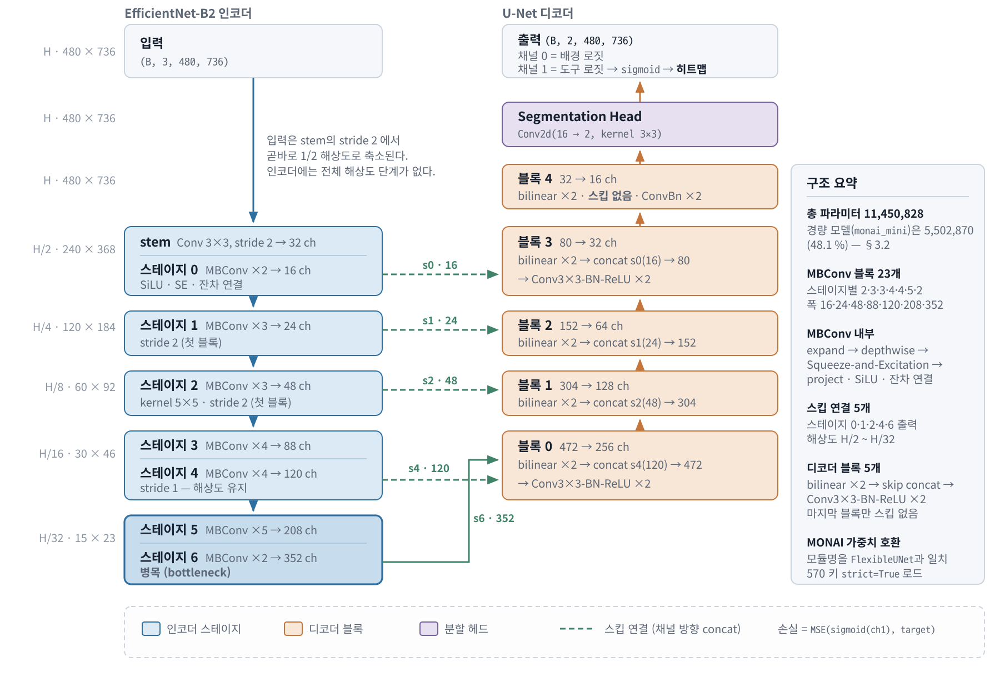

**그림 3. `TooltipDetector`(`monai`)의 신경망 구조 및 처리 흐름.** EfficientNet-B2 인코더가 7개 스테이지 23개 MBConv 블록을 거쳐 H/32까지 축소하고, 스테이지 0·1·2·4·6의 출력 5개가 스킵 연결로 U-Net 디코더에 전달된다. 디코더 5개 블록이 bilinear ×2 업샘플링과 스킵 concat, Conv-BN-ReLU 쌍을 반복해 원본 해상도를 복원하며 마지막 블록만 스킵 없이 동작한다. 분할 헤드가 16채널을 2채널로 매핑하고, 채널 1에 sigmoid를 적용한 값이 히트맵 예측이 된다.

**인코더:** EfficientNet-B2(width_coeff=1.1, depth_coeff=1.2)를 재현한다. 3×3 stride-2 스템 이후 7개 스테이지에 걸쳐 총 23개의 MBConv(Mobile Inverted Bottleneck Conv) 블록이 배치된다. 각 블록은 expand → depthwise → Squeeze-and-Excitation(SE) → project 구조에 SiLU 활성화와 잔차 연결을 포함한다. 디코더로의 스킵 연결은 스테이지 0·1·2·4·6의 출력(채널 16/24/48/120/352, 공간 해상도 H/2 ~ H/32) 5곳에서 추출된다.

**디코더:** 5개의 디코더 블록으로 구성되며, 각 블록은 bilinear ×2 업샘플링 후 대응 스킵 텐서와 채널 방향 concat하고 3×3 Conv-BN-ReLU 쌍을 2회 적용한다. 마지막 블록은 스킵 없이 원본 해상도(H×W)로 복원한다. 분할 헤드는 16채널을 2채널로 매핑하는 3×3 Conv2d다.

**MONAI 호환성:** 모든 모듈 명칭(`encoder._conv_stem`, `encoder._blocks.i.j.*`, `decoder.blocks.k.convs.conv_0.conv`, `...adn.N` 등)을 MONAI `FlexibleUNet(backbone="efficientnet-b2")`의 state_dict 키와 일치시켜, 570개 키의 사전학습 가중치(`temp/monai.pt`)를 `load_state_dict(strict=True)`로 직접 로드할 수 있도록 설계하였다. 풀 모델의 총 파라미터 수는 **11,450,828개**다.

### 3.2 경량 모델: 인코더 깊이 축소

경량 모델 `monai_mini`는 풀 모델과 동일한 전체 구조·채널 폭·디코더를 유지하면서 **인코더의 MBConv 블록 수만 절반으로 축소**한 버전이다. 각 스테이지의 블록 수를 `ceil(n/2)`로 줄여 총 블록 수를 23개에서 13개로 감소시켰다(축소율 56.5 %).

**표 5. 스테이지별 블록 수: 풀 모델 vs 경량 모델**

| 스테이지 | 출력 채널 | 공간 해상도 | 풀 블록 수 | 경량 블록 수 |
| -------- | --------: | ----------- | ---------: | -----------: |
| 0        |        16 | H/2         |          2 |            1 |
| 1        |        24 | H/4         |          3 |            2 |
| 2        |        48 | H/8         |          3 |            2 |
| 3        |        88 | H/16        |          4 |            2 |
| 4        |       120 | H/16        |          4 |            2 |
| 5        |       208 | H/32        |          5 |            3 |
| 6        |       352 | H/32        |          2 |            1 |
| **합계** |           |             |     **23** |       **13** |

**설계 근거:** 채널 폭(width)을 유지한 이유는, 폭을 줄이면 스킵 연결 채널 수가 변해 디코더 구조 전체를 재설계해야 하기 때문이다. 블록 수만 줄이면 스킵 연결 채널(16/24/48/120/352)이 그대로 유지되어 디코더와 분할 헤드를 전혀 수정하지 않아도 된다. 또한 디코더를 줄이면 고주파 공간 정보 복원 능력이 저하되어 팁 위치 정밀도에 직접적인 악영향을 준다. 경량 모델의 총 파라미터 수는 **5,502,870개**로 풀 모델의 48.1 %다. 블록을 56.5 % 줄였음에도 절감률이 48 %에 그치는 이유는 디코더·분할 헤드가 전체 파라미터의 상당 부분을 차지하기 때문이다.

### 3.3 학습 (Training)

**손실 함수:** 모델 출력 채널 1에 sigmoid를 적용한 값과 히트맵 타겟 사이의 평균제곱오차(MSE)를 최소화한다.

```text
loss = MSE(sigmoid(pred[:, 1]), target)
```

채널 0(배경 로짓)은 손실에 사용되지 않으며, MONAI 사전학습 가중치와의 구조 호환을 위해 유지된다.

**전이 학습:** §3.1의 MONAI 호환 설계를 통해 EfficientNet-B2 + U-Net 사전학습 가중치를 초기값으로 사용한 뒤, 복강경 수술 데이터셋으로 전체 네트워크를 파인튜닝한다.

**데이터 증강:** 학습 시 다음 무작위 증강을 순차 적용하며, 공간 변환은 이미지와 타겟 히트맵에 동시 적용된다. 검증·평가 시에는 Resize와 Normalize만 적용한다.

**표 6. 학습 데이터 증강 파이프라인**

| 변환              | 확률 | 파라미터                               |
| ----------------- | ---- | -------------------------------------- |
| HorizontalFlip    | 0.5  | —                                      |
| VerticalFlip      | 0.2  | —                                      |
| Affine            | 0.6  | 이동 ±5 %, 스케일 0.85–1.15, 회전 ±20° |
| RandomResizedCrop | 0.5  | scale 0.7–1.0, 종횡비 ±10 %            |
| Resize            | 항상 | 480 × 736 px                           |
| ColorJitter       | 0.6  | 밝기·대비 ±0.3, 채도 ±0.2, 색상 ±0.05  |
| GaussianBlur      | 0.3  | kernel 3–7                             |
| GaussNoise        | 0.3  | —                                      |
| Normalize         | 항상 | ImageNet mean/std                      |

**최적화 설정:** 옵티마이저는 Adam(lr=1e-4), 학습률 스케줄러는 CosineAnnealingLR(T_max=epochs)을 에포크 종료 시 step한다. 전 실험 공통으로 **30 에포크, 배치 크기 16**을 사용하였다. 매 에포크 종료 시 검증 손실이 개선되면 `best.pt`, 항상 `last.pt`를 조합별 디렉터리 `data/models/<dataset>/<target-mode>/<model-type>/`에 저장하며, 재개용 상태(`train-status.json`)와 에포크별 학습 곡선(`metric.csv`)도 함께 기록한다.

**8개 조합의 학습 설정은 완전히 동일하다.** 데이터셋·타겟 생성 방식·모델 타입 외의 모든 하이퍼파라미터가 같으므로, 관측된 성능 차이는 이 세 축에만 귀속된다(§4의 단서 하나 제외 — `erop`/`gaussian-tip`/`monai`).

### 3.4 추론 및 피크 탐지

추론 시 모델 출력 채널 1의 sigmoid 히트맵에서 다음 알고리즘으로 팁 위치 후보(피크)를 추출한다.

1. **임계값 적용**: 히트맵 값 ≥ `threshold`인 화소만 남긴다.
2. **연결요소 분석**: `scipy.ndimage.label`로 이진 마스크의 연결요소를 식별한다.
3. **피크 선택**: 각 연결요소에서 최댓값 화소를 피크 후보로 선택한다.
4. **비최대 억제(NMS)**: 값이 높은 피크부터 처리하며, 이미 선택된 피크로부터 `nms-radius` 이내의 낮은 피크를 제거한다.

결과는 `(x, y, confidence)` 목록을 값 내림차순으로 정렬하여 반환한다. 이 알고리즘은 **연결요소 하나당 최대 하나의 피크**를 만들므로, 두 도구의 히트맵 응답이 공간적으로 이어져 하나의 연결요소를 이루면 피크도 하나만 생성된다. 이 성질은 §6.7의 핵심 발견과 직결된다.

### 3.5 평가 프로토콜

**매칭:** 각 GT 팁에 대해 **프레임 내 전체 피크 후보 중 가장 가까운 후보**를 선택하여 유클리드 픽셀 거리를 기록한다. 후보가 하나도 없으면 해당 GT 팁은 **miss**로 처리된다.

이 매칭은 **일대일 배정(one-to-one assignment)이 아니다.** 한 프레임에 GT 팁이 여러 개 있고 피크가 그보다 적으면, 여러 GT 팁이 동일한 피크에 매칭된다. 이 설계는 구현이 단순하고 프레임당 도구 수를 모르는 상황에서도 항상 값을 산출한다는 장점이 있으나, **과소 탐지(under-detection)를 miss로 세지 않고 큰 거리 오차로 전가**하는 부작용을 갖는다. §6.7은 이 부작용이 실제 결과에서 얼마나 큰 비중을 차지하는지 정량화한다.

**표 7. 평가 지표 정의**

| 지표               | 설명                                           |
| ------------------ | ---------------------------------------------- |
| Miss rate          | 예측 후보 없음으로 탐지 실패한 GT 팁 비율      |
| Hit@10/20/50 px    | 매칭 거리가 각각 10/20/50 px 이내인 GT 팁 비율 |
| Mean / Median dist | 매칭된 팁의 평균·중앙값 픽셀 거리              |
| P90 dist           | 매칭된 팁의 픽셀 거리 90 백분위수              |

Hit-rate의 분모는 **미탐지 팁을 포함한 전체 GT 팁 수**이고, 거리 통계(mean/median/P90)의 모집단은 **매칭에 성공한 팁만**이다. 따라서 miss율이 높은 조합은 거리 통계가 실제보다 좋게 보일 수 있으며, 두 계열의 지표를 항상 함께 읽어야 한다.

**평가 설정:** 전 실험 공통으로 테스트 세트 전체에 대해 `threshold=0.5`, `nms-radius=20 px`로 평가하였다. 결과는 전체 지표·세션별 지표·실행 파라미터를 담은 `summary.json`과 GT 팁 1개당 1행을 기록한 `per_tip.csv`로 저장된다.

## 4. 실험 설계 (Experimental Design)

### 4.1 실험 매트릭스

**데이터셋 2종 × 타겟 생성 방식 2종 × 모델 타입 2종 = 8개 조합**을 전수 실험하였다. 8개 조합 각각에 대해 독립적인 학습과 평가를 수행했으며, 체크포인트와 결과는 세 축으로 분리된 경로에 저장된다.

```text
data/models/<dataset>/<target-mode>/<model-type>/    ← best.pt, last.pt, metric.csv, train-status.json
data/results/<dataset>/<target-mode>/<model-type>/   ← summary.json, per_tip.csv
```

**표 8. 실험 매트릭스와 학습 비용**

| #   | 데이터셋   | 타겟 방식      | 모델         | 에포크 | best val loss | best 에포크 | 학습 시간 | 초/에포크 | 학습 완료 시각   |
| --- | ---------- | -------------- | ------------ | -----: | ------------: | ----------: | --------: | --------: | ---------------- |
| 1   | `erop`     | `gradient-seg` | `monai`      |     30 |      0.001379 |          29 |    24.0 h |     2,885 | 2026-08-13 07:51 |
| 2   | `erop`     | `gradient-seg` | `monai_mini` |     30 |      0.001393 |          30 |    19.0 h |     2,275 | 2026-08-13 02:33 |
| 3   | `erop`     | `gaussian-tip` | `monai`      |     30 |  **0.000658** |          30 |    23.2 h |     2,783 | 2026-08-15 15:34 |
| 4   | `erop`     | `gaussian-tip` | `monai_mini` |     30 |      0.000690 |          28 |    18.9 h |     2,270 | 2026-08-08 09:23 |
| 5   | `cholec80` | `gradient-seg` | `monai`      |     30 |      0.002386 |          25 |    15.9 h |     1,905 | 2026-08-22 05:16 |
| 6   | `cholec80` | `gradient-seg` | `monai_mini` |     30 |      0.002464 |          23 |    12.8 h |     1,541 | 2026-08-22 02:44 |
| 7   | `cholec80` | `gaussian-tip` | `monai`      |     30 |      0.001107 |          29 |    16.0 h |     1,925 | 2026-08-22 18:46 |
| 8   | `cholec80` | `gaussian-tip` | `monai_mini` |     30 |      0.001143 |          30 |    12.8 h |     1,535 | 2026-08-23 07:34 |

**조합 5–8의 재학습 (2026-08-21 ~ 08-23).** `cholec80`이 영상 단위 스플릿으로 재구축되었으므로(§2.2), 네 조합 전부를 새 train 스플릿(`video01–32`, 71,032 프레임)으로 **처음부터 다시 학습**했다. 학습 설정(30 에포크, 배치 16, Adam lr=1e-4, CosineAnnealingLR, 증강 파이프라인)은 조합 1–4와 완전히 동일하다. 에포크 시간이 구 분할의 2,890–2,894초(경량 2,316–2,317초)에서 1,905–1,925초(경량 1,535–1,541초)로 줄어든 것은 train 프레임이 35.9 % 적어진 직접적 결과다. 구 프레임 분할의 체크포인트와 결과는 `data/models/cholec80-frame-split/`·`data/results/cholec80-frame-split/`에 보존되어 있고, 두 분할의 비교는 §11.3에서 다룬다.

**조합 3의 재학습:** `erop`/`gaussian-tip`/`monai`는 원래 2026-08-07에 학습되었으나, 이는 에포크별 지표 로깅(`metric.csv`)과 재개용 상태 파일(`train-status.json`)이 도입되기 전이어서 학습 조건을 파일로 확인할 수 없었다. 하필 이 조합만 경량 모델에 전 지표에서 역전당하는 이상 결과를 보였기 때문에, 2026-08-15에 **기록이 남는 현재 스크립트로 재학습**하고 2026-08-19에 재평가하였다. 그 결과 **8개 조합 전부가 동일한 학습 설정으로 수행되었음이 파일로 확인된다.** 재학습된 모델은 best val loss 0.000658로 8개 조합 중 가장 낮으며(경량 모델 0.000690), 이상 결과도 해소되었다(§6.4). 이전 평가 결과는 `data/results/erop/gaussian-tip/monai.old/`에 보존되어 있다.

**손실 값의 비교 가능성:** best val loss는 **같은 타겟 생성 방식 안에서만** 비교할 수 있다. `gaussian-tip` 타겟은 대부분의 화소가 0에 가까운 희소한 히트맵이므로 MSE가 구조적으로 작게 나오며, `gradient-seg` 대비 낮은 손실이 더 나은 성능을 뜻하지 않는다.

### 4.2 총 실험 비용

현재 저장된 8개 조합의 학습 시간 합계는 **142.7 시간**(약 5.9일)이다. 데이터셋별로 나누면 `erop` 4개가 85.1 h(풀 23.2–24.0 h / 경량 18.9–19.0 h), `cholec80` 4개가 57.5 h(풀 15.9–16.0 h / 경량 12.8 h)다. 같은 모델·같은 에포크 수인데도 `cholec80`이 훨씬 짧은 것은 영상 단위 재분할로 train 프레임이 71,032개로 줄었기 때문이다(§2.2).

모델 타입은 두 데이터셋 모두에서 학습 비용을 약 20 % 좌우한다(`erop` 24.0 → 19.0 h, `cholec80` 15.9 → 12.8 h). 평가는 조합당 테스트 세트 전체(`erop` 36,142 / `cholec80` **98,234** 프레임)에 대해 수행되었다.

여기에 폐기하지 않고 보존한 `cholec80` 구 프레임 분할 4개 조합의 학습 시간 86.8 h(풀 24.1 h ×2, 경량 19.3 h ×2)를 더하면, 본 연구가 소비한 GPU 학습 시간 총계는 **229.5 시간**(약 9.6일)이다.

### 4.3 결과 재현성에 관한 주석

`erop`/`gradient-seg`의 두 조합(#1, #2)은 본 최종본 작성 시점(2026-08-14)에 **평가를 다시 실행하였다**. 기존에 저장돼 있던 결과가 2026-06-29·30에 산출된 것으로, 그 후 `erop` 어노테이션이 갱신되고(테스트 세트 GT 팁 52,489 → 50,718) 해당 모델도 2026-08-13에 재학습되었기 때문이다. 재실행하지 않았다면 8개 조합 중 2개만 다른 어노테이션·다른 체크포인트 기준이 되어 비교표가 성립하지 않는다. 본 보고서의 모든 수치는 **현재 `data/results/`에 저장된 결과와 일치**한다.

## 5. 학습 수렴 (Training Convergence)

**표 9. 에포크별 검증 손실 (val loss)**

| 조합                                   | 에포크 1 | 에포크 5 | 에포크 10 | 에포크 20 |    에포크 30 |         최저 | 최저 에포크 |
| -------------------------------------- | -------: | -------: | --------: | --------: | -----------: | -----------: | ----------: |
| `erop`/`gradient-seg`/`monai`          | 0.003837 | 0.002072 |  0.001761 |  0.001484 |     0.001379 |     0.001379 |          29 |
| `erop`/`gradient-seg`/`monai_mini`     | 0.003514 | 0.002039 |  0.001737 |  0.001467 |     0.001393 |     0.001393 |          30 |
| `erop`/`gaussian-tip`/`monai`          | 0.001427 | 0.000961 |  0.000798 |  0.000688 | **0.000658** | **0.000658** |          30 |
| `erop`/`gaussian-tip`/`monai_mini`     | 0.002293 | 0.000987 |  0.000832 |  0.000723 |     0.000690 |     0.000690 |          28 |
| `cholec80`/`gradient-seg`/`monai`      | 0.004580 | 0.003026 |  0.002694 |  0.002886 |     0.002402 |     0.002386 |          25 |
| `cholec80`/`gradient-seg`/`monai_mini` | 0.005083 | 0.003171 |  0.002682 |  0.002764 |     0.002473 |     0.002464 |          23 |
| `cholec80`/`gaussian-tip`/`monai`      | 0.001967 | 0.001339 |  0.001218 |  0.001127 |     0.001107 |     0.001107 |          29 |
| `cholec80`/`gaussian-tip`/`monai_mini` | 0.002246 | 0.001418 |  0.001245 |  0.001172 |     0.001143 |     0.001143 |          30 |

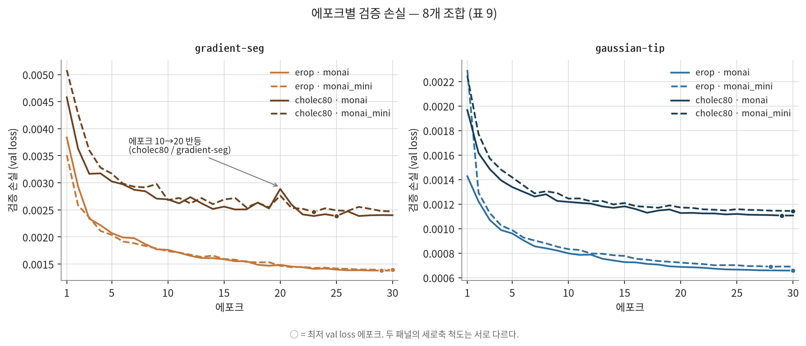

**그림 4. 8개 조합의 에포크별 검증 손실 (표 9).** `metric.csv`에 기록된 30개 에포크를 전부 그린 것으로, 표 9는 이 곡선에서 에포크 1·5·10·20·30과 최저값만 뽑은 발췌다. 왼쪽 `gradient-seg` 패널에서 `cholec80` 두 곡선만 에포크 10 → 20 구간에서 반등한 뒤 계속 요동치는 반면, `erop` 두 곡선과 오른쪽 `gaussian-tip` 네 곡선은 단조 감소한다. 어느 곡선도 30 에포크에서 평평해지지 않았다 — 말미의 완만함은 수렴이 아니라 CosineAnnealingLR의 학습률 소진에 가깝다. 두 패널의 세로축 척도가 다르므로 패널 사이의 손실값을 직접 비교해서는 안 된다(§4.1).

네 가지 관찰이 가능하다.

**(1) 어느 조합도 완전히 수렴하지 않았다.** 20 → 30 에포크 구간에서 손실이 계속 감소하며(감소폭 1.8–16.8 %), CosineAnnealingLR이 30 에포크에 맞춰 학습률을 2.7e-07까지 낮추므로 곡선이 평탄해 보이지만 이는 수렴이라기보다 **학습률 소진**에 가깝다. 더 긴 학습 일정에서 추가 개선의 여지가 있다.

최저 val loss가 나온 에포크는 `erop` 4개와 `cholec80`/`gaussian-tip` 2개에서 28–30이지만, **`cholec80`/`gradient-seg` 두 조합만 에포크 23·25에서 최저를 찍고 이후 반등**한다. 이 두 조합은 에포크 10 → 20 구간에서 val loss가 오히려 증가하며(0.002694 → 0.002886, 0.002682 → 0.002764) 말미 감소율도 10.5–16.8 %로 유독 크다. 즉 곡선이 단조롭지 않고 요동친다. 영상 단위 분할에서 train(32편)과 val(8편)의 시각적 도메인이 완전히 분리되어 val loss가 train 진행에 매끄럽게 따라오지 않는 것으로 보이며, train 프레임이 35.9 % 줄어든 것도 겹친다. `gaussian-tip`에서는 같은 현상이 나타나지 않는다 — 타겟이 팁 주변 좁은 영역에만 신호를 주므로 도메인 변화에 덜 민감한 것으로 해석된다.

**(2) 풀 모델과 경량 모델의 손실 격차가 작다.** 같은 데이터셋·타겟 조합에서 두 모델의 val loss 차이는 1.0–4.7 %다(`erop`/`gradient-seg` 1.0 %, `cholec80` 두 조합 3.2 %, `erop`/`gaussian-tip` 4.7 %). 파라미터가 2.08배인 풀 모델이 손실 관점에서 얻는 이득이 미미하다는 뜻이며, §6.4에서 확인되는 "경량화 비용이 거의 없다"는 결과와 일치한다. 4개 쌍 전부에서 풀 모델이 앞서지만 그 폭이 일관되게 작다.

**(3) 학습이 첫 5 에포크에 대부분 진행된다.** 전 조합에서 에포크 1 → 5 구간의 손실 감소가 전체 감소량의 61–82 %를 차지한다(`cholec80` 4개는 70.8–75.1 %로 더 좁은 범위에 모여 있다). 사전학습 가중치에서 출발한 파인튜닝의 전형적인 양상이다.

**(5) `cholec80`의 val loss가 영상 단위 재분할로 일제히 올라갔다.** 구 프레임 분할과 비교하면 `gradient-seg`는 0.001949 → 0.002386(**+22.4 %**), 0.001990 → 0.002464(+23.8 %), `gaussian-tip`은 0.001012 → 0.001107(+9.4 %), 0.001041 → 0.001143(+9.8 %)다. val 세트가 서로 다른 프레임 집합이므로 이 값들을 같은 척도의 성능 비교로 읽을 수는 없지만, **같은 영상을 train에서 본 적이 있는지 여부가 손실 수준을 20 % 넘게 바꾼다**는 사실 자체가 시간적 누수의 크기를 보여준다. `gradient-seg`의 상승폭이 `gaussian-tip`의 2배 이상인 것은, 도구 몸통 전체를 타겟으로 삼는 방식이 영상별 도구 외형·조명에 더 크게 의존함을 시사한다. 정확도 지표 기준의 비교는 §11.3에 있다.

**(4) 검증 손실이 가장 낮은 조합이 반드시 팁 탐지 정확도가 가장 높은 것은 아니다.** 재학습된 `erop`/`gaussian-tip`/`monai`는 8개 조합 중 최저 val loss(0.000658)를 기록했지만, Hit@10 px는 같은 조합의 경량 모델(val loss 0.000690)보다 3.92 %p 낮다(§6.4). 히트맵 MSE는 피크 위치의 정확도를 직접 측정하지 않으므로, 손실만으로 모델을 고르면 안 된다. §6.3.1이 그 구체적 사례를 보인다.

## 6. 실험 결과 (Results)

### 6.1 평가 기준 요약

**표 10. 테스트 세트 규모**

| 데이터셋   | 분할 단위 | test 영상 | test 프레임 | 도구 보유 프레임 | 도구 없는 프레임 | GT 팁 수 | 다중 도구 프레임의 팁 비중 |
| ---------- | --------- | --------: | ----------: | ---------------: | ---------------: | -------: | -------------------------: |
| `erop`     | 프레임    |  5 (전부) |      36,142 |           28,498 |   7,644 (21.1 %) |   50,718 |                     75.6 % |
| `cholec80` | 영상      |        40 |      98,234 |           89,624 |    8,610 (8.8 %) |  161,969 |                     76.6 % |

두 데이터셋 모두 GT 팁의 3/4 이상이 도구 2개 이상이 동시에 등장하는 프레임에 속한다. 이는 §6.7의 분석이 소수의 예외 사례가 아니라 **다수 사례**를 다룬다는 뜻이다.

`cholec80`의 test 세트는 영상 단위 재분할로 36,930 → **98,234 프레임**(GT 팁 63,182 → **161,969개**)이 되어, `erop`의 2.7배 규모다. 표본이 커진 만큼 `cholec80` 지표의 통계적 안정성은 높아졌지만, **구 분할의 test 세트와는 다른 프레임 집합이므로 두 결과를 같은 열에 놓고 비교할 수 없다**(§11.3).

### 6.2 전체 결과: 8개 조합

**표 11. 8개 조합 전체 성능 (threshold=0.5, NMS radius=20 px, 테스트 세트 전체)**

| 데이터셋   | 타겟 방식      | 모델         |   GT 팁 | Miss율 |  Hit@10 |  Hit@20 |  Hit@50 |   Median |     Mean |       P90 |
| ---------- | -------------- | ------------ | ------: | -----: | ------: | ------: | ------: | -------: | -------: | --------: |
| `erop`     | `gradient-seg` | `monai`      |  50,718 | 3.09 % | 44.98 % | 70.17 % | 82.95 % | 10.77 px | 34.94 px |  88.68 px |
| `erop`     | `gradient-seg` | `monai_mini` |  50,718 | 3.47 % | 40.99 % | 68.28 % | 82.48 % | 11.40 px | 35.78 px |  93.52 px |
| `erop`     | `gaussian-tip` | `monai`      |  50,718 | 5.03 % | 69.52 % | 79.36 % | 83.82 % |  7.81 px | 29.85 px |  74.28 px |
| `erop`     | `gaussian-tip` | `monai_mini` |  50,718 | 5.85 % | 73.44 % | 78.00 % | 82.41 % |  3.16 px | 28.58 px |  87.66 px |
| `cholec80` | `gradient-seg` | `monai`      | 161,969 | 2.90 % | 30.04 % | 55.58 % | 76.12 % | 16.12 px | 48.41 px | 156.66 px |
| `cholec80` | `gradient-seg` | `monai_mini` | 161,969 | 3.16 % | 25.10 % | 51.71 % | 75.29 % | 18.36 px | 49.52 px | 156.11 px |
| `cholec80` | `gaussian-tip` | `monai`      | 161,969 | 7.48 % | 59.55 % | 67.45 % | 74.72 % |  5.39 px | 42.37 px | 167.34 px |
| `cholec80` | `gaussian-tip` | `monai_mini` | 161,969 | 8.22 % | 58.22 % | 66.30 % | 73.70 % |  5.66 px | 43.00 px | 169.65 px |

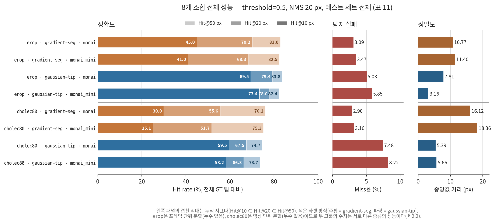

**그림 5. 8개 조합의 테스트 세트 성능 (표 11).** 왼쪽 패널의 겹친 막대는 누적 Hit-rate(Hit@10 ⊂ Hit@20 ⊂ Hit@50)이고, 오른쪽 두 패널은 성격이 다른 Miss율과 중앙값 거리다. 색이 같은(= 타겟 방식이 같은) 막대끼리 훨씬 비슷하다는 점에서 표 12의 "타겟 방식 ≫ 데이터셋 > 모델 크기"가 형태로 확인된다. `gaussian-tip`(파랑)은 Hit@10 막대가 길고 중앙값 거리가 짧지만 Miss율도 높고, `gradient-seg`(주황)는 그 반대다. 반면 Hit@50 px에서는 여덟 조합이 73.7–83.8 %로 모여 두 타겟의 차이가 거의 사라진다.

**중요 — `erop`과 `cholec80`의 수치는 서로 다른 종류의 성능이다.** `erop` 4개 행은 시간적 누수가 있는 프레임 단위 분할에서 측정된 값이므로 미지의 새 영상에 대한 성능보다 낙관적이고, `cholec80` 4개 행은 영상 단위 분할에서 측정된 **일반화 성능**이다(§2.2). 따라서 아래 표 12의 "데이터셋" 축은 데이터셋 난이도만이 아니라 분할 방식 차이까지 포함한다(§6.5).

굵은 패턴이 곧바로 눈에 띈다. **각 축이 성능에 미치는 영향의 크기는 타겟 방식 ≫ 데이터셋 > 모델 크기 순이다.** 이 순서는 2.2판과 동일하며, `cholec80`이 누수 없는 분할로 바뀐 뒤에도 유지된다.

**표 12. 축별 영향 크기 (Hit@10 px 기준, 다른 축을 고정한 4쌍의 차이 범위)**

| 축                                          | 차이 범위        | 평균 차이 |
| ------------------------------------------- | ---------------- | --------: |
| 타겟 방식 (`gaussian-tip` − `gradient-seg`) | +24.5 ~ +33.1 %p |  +29.9 %p |
| 데이터셋 (`erop` − `cholec80`)              | +10.0 ~ +15.9 %p |  +14.0 %p |
| 모델 크기 (`monai` − `monai_mini`)          | −3.9 ~ +4.9 %p   |   +1.6 %p |

타겟 방식 효과(+29.9 %p 평균)는 모델 크기 효과(+1.6 %p)보다 **한 자릿수 이상 크다** — 이 결론은 2.2판(+31.5 %p 대 −0.3 %p)과 사실상 동일하다. 데이터셋 축의 평균 격차는 +9.5 → +14.0 %p로 커졌는데, 이는 `cholec80`이 누수 없는 분할로 바뀌어 난이도가 올라간 결과다.

### 6.3 핵심 발견 1 — 타겟 생성 방식이 오차의 *종류*를 결정한다

`gaussian-tip`과 `gradient-seg`는 단순히 "어느 쪽이 더 좋다"로 정리되지 않는다. **두 방식은 서로 다른 종류의 실패를 한다.**

**표 13. 타겟 방식별 특성 요약 (데이터셋·모델 평균)**

| 지표        | `gradient-seg` | `gaussian-tip` | 우세           |
| ----------- | -------------: | -------------: | -------------- |
| Miss율      |         3.16 % |         6.65 % | `gradient-seg` |
| Hit@10 px   |        35.28 % |        65.18 % | `gaussian-tip` |
| Hit@20 px   |        61.44 % |        72.78 % | `gaussian-tip` |
| Hit@50 px   |        79.21 % |        78.66 % | `gradient-seg` |
| Median dist |       14.16 px |        5.50 px | `gaussian-tip` |
| Mean dist   |       42.16 px |       35.95 px | `gaussian-tip` |
| P90 dist    |      123.74 px |      124.73 px | `gradient-seg` |

Hit@50 px와 P90은 2.2판에서 "대등"이었으나 이제 `gradient-seg`가 소폭(0.55 %p, 0.99 px) 앞선다. 방향이 바뀐 것이 아니라 여전히 사실상 동률이며, `cholec80`이 누수 없는 분할로 바뀌어 `gaussian-tip`의 miss율이 5.42 → 7.48 %로 올라간 것이 Hit@50의 분자를 깎은 결과다.

**오차 거리 분포**를 보면 두 방식의 차이가 훨씬 선명해진다.

**표 14. 오차 거리 분포 (전체 GT 팁 대비 %, 구간은 [하한, 상한))**

| 조합                                   | Miss | 0–5 px | 5–10 px | 10–20 px | 20–50 px | 50–100 px | 100–200 px | 200 px+ |
| -------------------------------------- | ---: | -----: | ------: | -------: | -------: | --------: | ---------: | ------: |
| `erop`/`gradient-seg`/`monai`          | 3.09 |   8.71 |   35.22 |    26.10 |    12.89 |      4.98 |       4.47 |    4.53 |
| `erop`/`gradient-seg`/`monai_mini`     | 3.47 |   7.19 |   32.77 |    28.21 |    14.28 |      4.87 |       4.66 |    4.55 |
| `erop`/`gaussian-tip`/`monai`          | 5.03 |  14.22 |   54.07 |    11.03 |     4.49 |      2.88 |       3.87 |    4.40 |
| `erop`/`gaussian-tip`/`monai_mini`     | 5.85 |  59.38 |   13.84 |     4.76 |     4.42 |      2.95 |       3.98 |    4.83 |
| `cholec80`/`gradient-seg`/`monai`      | 2.90 |   4.39 |   24.81 |    26.22 |    20.68 |      7.41 |       6.63 |    6.97 |
| `cholec80`/`gradient-seg`/`monai_mini` | 3.16 |   3.69 |   20.63 |    27.23 |    23.73 |      7.81 |       6.88 |    6.88 |
| `cholec80`/`gaussian-tip`/`monai`      | 7.48 |  42.35 |   16.91 |     8.15 |     7.30 |      4.31 |       6.25 |    7.25 |
| `cholec80`/`gaussian-tip`/`monai_mini` | 8.22 |  40.80 |   17.14 |     8.32 |     7.43 |      4.45 |       6.33 |    7.32 |

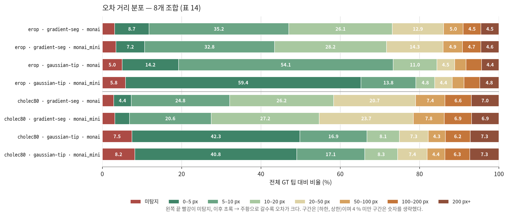

**그림 6. 8개 조합의 오차 거리 분포 (표 14).** 각 막대는 전체 GT 팁 100 %를 미탐지와 일곱 개 거리 구간으로 나눈 것이다. `gaussian-tip` 네 조합은 막대 왼쪽(0–10 px)이 두껍고, `gradient-seg` 네 조합은 봉우리가 5–20 px 구간으로 밀려 있다. 반면 오른쪽 끝(50 px 이상)의 두께는 같은 데이터셋 안에서 타겟 방식과 거의 무관하다 — 두 방식의 차이는 오차의 *크기*가 아니라 *종류*에 있다. 누수 없는 `cholec80` 네 조합은 `erop` 네 조합보다 오른쪽 꼬리가 일제히 두껍다.

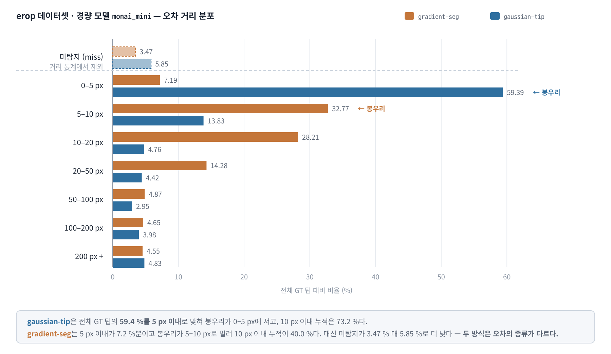

**그림 7. `erop` 데이터셋·경량 모델(`monai_mini`)의 오차 거리 분포 형태 비교 (표 14의 2·4행).** `gaussian-tip`은 봉우리가 0–5 px 구간에 서고 전체 GT 팁의 59.4 %를 5 px 이내로 맞히는 반면, `gradient-seg`는 5 px 이내가 7.2 %뿐이고 봉우리가 5–10 px로 밀려 있다. 대신 미탐지는 `gradient-seg`가 3.47 %로 `gaussian-tip`(5.85 %)보다 낮다. 50 px 이상 구간의 합은 14.1 % 대 11.8 %로 큰 차이가 없다 — 두 방식의 차이는 오차의 *크기*가 아니라 *종류*에 있다.

`gaussian-tip` 4개 조합 중 3개는 전체 GT 팁의 **41–59 %를 5 px 이내**로 맞힌다. 이는 어노테이션 자체의 오차 수준에 근접하는 정밀도다. 반면 `gradient-seg`는 5 px 이내가 3.7–8.7 %에 그치고 봉우리가 5–10 px 또는 10–20 px 구간에 형성된다.

누수 없는 분할로 바뀐 `cholec80`에서는 분포의 오른쪽 꼬리가 눈에 띄게 두꺼워졌다. 100 px 이상 구간의 합이 구 분할의 11.8–12.5 %에서 **13.5–13.7 %**로 늘고, 200 px 이상만 보면 5.9–6.2 %에서 6.9–7.3 %가 되었다. 처음 보는 영상에서는 프레임 내 도구를 개별 인스턴스로 분리하는 데 더 자주 실패한다는 뜻이며, §6.7의 공유 피크 분석이 이를 직접 확인한다.

예외는 재학습된 `erop`/`gaussian-tip`/`monai`다. 이 조합은 0–5 px 구간이 14.2 %뿐이고 봉우리가 5–10 px(54.1 %)에 형성된다. 10 px 이내 누적 비율은 68.3 %로 다른 `gaussian-tip` 조합과 같은 수준인데 5 px 이내만 유독 적은, **분포가 통째로 옆으로 밀린** 형태다. §6.3.1이 그 원인을 규명한다.

**기계적 설명.** 이 차이는 §2.6에서 계산한 "임계값 0.5를 넘는 영역"의 크기에서 직접 따라 나온다.

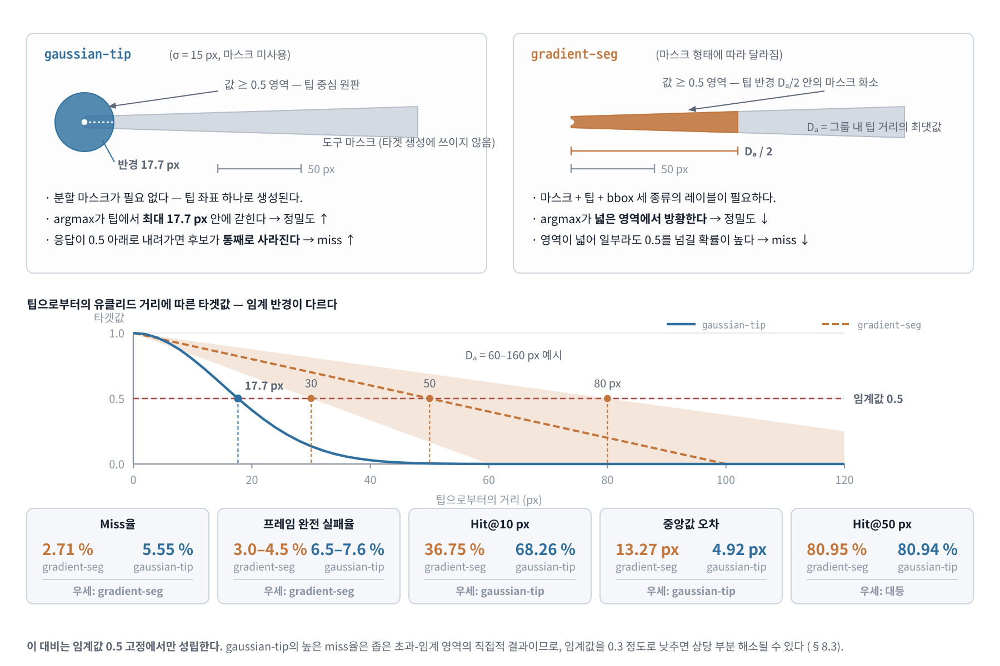

**그림 8. `gaussian-tip`과 `gradient-seg`의 오차 비교 — 초과-임계 영역의 크기가 만드는 트레이드오프.** 위: 값이 0.5를 넘는 영역이 `gaussian-tip`에서는 팁 중심 반경 17.7 px의 원판이지만, `gradient-seg`에서는 각 어노테이션 그룹의 마스크 화소 중 팁 반경 $D_a/2$ 안의 영역이다. 가운데: 팁으로부터의 유클리드 거리에 따른 타겟값 프로파일. `gaussian-tip`의 0.5 교차점은 σ에 의해 17.7 px로 고정되는 반면, `gradient-seg`의 교차점은 그룹별 최대 팁 거리 $D_a$의 절반으로 마스크 형상에 따라 변한다. 아래: 그 결과로 나타나는 실측 지표(표 13·표 15). 정밀도는 `gaussian-tip`이, 탐지 실패율은 `gradient-seg`가 우세하며 Hit@50 px는 대등하다.

- `gaussian-tip`: 초과-임계 영역이 팁 중심 반경 17.7 px의 좁은 원판이므로, 그 안의 최댓값 화소는 필연적으로 팁에 매우 가깝다 → **높은 정밀도**. 그러나 모델의 응답 강도가 조금만 약해져 최댓값이 0.5 아래로 내려가면 후보가 통째로 사라진다 → **높은 miss율**.
- `gradient-seg`: 초과-임계 영역이 마스크 형상과 그룹별 최대 팁 거리에 따라 넓어질 수 있으므로, 그 안의 최댓값 화소는 팁에서 수 픽셀에서 수십 픽셀까지 떨어질 수 있다 → **낮은 정밀도**. 대신 영역이 넓어 일부라도 0.5를 넘길 확률이 높다 → **낮은 miss율**.

**프레임 단위 탐지 실패율**로 보면 이 대비가 더 뚜렷하다. 도구가 있는데도 피크를 하나도 만들지 못한 프레임의 비율은 `gradient-seg`가 3.9–4.5 %, `gaussian-tip`이 6.5–9.9 %로 약 2배 차이가 난다.

**표 15. 프레임 단위 완전 탐지 실패율 (도구 보유 프레임 중 피크 0개)**

| 조합                                   | 실패 프레임 | 도구 보유 프레임 |   비율 |
| -------------------------------------- | ----------: | ---------------: | -----: |
| `erop`/`gradient-seg`/`monai`          |       1,187 |           28,498 | 4.17 % |
| `erop`/`gradient-seg`/`monai_mini`     |       1,291 |           28,498 | 4.53 % |
| `erop`/`gaussian-tip`/`monai`          |       1,850 |           28,498 | 6.49 % |
| `erop`/`gaussian-tip`/`monai_mini`     |       2,156 |           28,498 | 7.57 % |
| `cholec80`/`gradient-seg`/`monai`      |       3,448 |           89,624 | 3.85 % |
| `cholec80`/`gradient-seg`/`monai_mini` |       3,752 |           89,624 | 4.19 % |
| `cholec80`/`gaussian-tip`/`monai`      |       8,046 |           89,624 | 8.98 % |
| `cholec80`/`gaussian-tip`/`monai_mini` |       8,844 |           89,624 | 9.87 % |

누수 없는 `cholec80`에서 `gaussian-tip`의 프레임 단위 완전 실패율이 **8.98–9.87 %**까지 올라가, 같은 데이터셋의 `gradient-seg`(3.85–4.19 %)와 2.3배 차이가 난다. 처음 보는 영상에서 히트맵 응답이 약해지면 `gaussian-tip`의 좁은 초과-임계 영역이 임계값 0.5를 넘기지 못하고 통째로 사라지는 것으로, 아래 "기계적 설명"이 예측하는 그대로다. **`gaussian-tip`의 임계값 민감성은 일반화 상황에서 더 심각해진다.**

**중요한 단서:** 이 비교는 **임계값 0.5 고정**이라는 조건에서만 성립한다. `gaussian-tip`의 높은 miss율은 좁은 초과-임계 영역의 직접적 결과이므로, 임계값을 0.3 정도로 낮추면 상당 부분 해소될 가능성이 크다. 본 실험은 임계값 스윕을 수행하지 않았으므로(§8), **두 방식의 우열이 아니라 "동일 후처리 설정에서의 특성 차이"로 읽어야 한다.**

**레이블링 비용 관점의 결론.** 그럼에도 실무적 함의는 명확하다. `gaussian-tip`은 팁 좌표 하나만 필요해 레이블링 비용이 훨씬 낮은데도, Hit@10 px에서 `gradient-seg`를 평균 29.9 %p 앞서고 Hit@50 px에서도 사실상 대등하다(79.21 % 대 78.66 %). **분할 마스크 레이블링에 드는 비용이 팁 탐지 정확도로 회수되지 않는다**는 것이 본 실험의 가장 실용적인 결론이다.

### 6.3.1 계통 편차 — 정밀도 지표가 잴 수 있는 또 다른 것

재학습된 `erop`/`gaussian-tip`/`monai`의 "옆으로 밀린" 분포를 설명하기 위해, 예측 좌표와 GT 좌표의 **부호 있는 차이**(dx = pred_x − gt_x, dy = pred_y − gt_y)를 집계하였다. 근거리 매칭(20 px 이내)만 모아 보면 원인이 즉시 드러난다.

**표 16. 예측 좌표의 계통 편차 (근거리 매칭 20 px 이내, 중앙값)**

| 조합                                   | 편차 dx | 편차 dy | 편차 크기 |
| -------------------------------------- | ------: | ------: | --------: |
| `erop`/`gradient-seg`/`monai`          |   +4 px |   +2 px |    4.5 px |
| `erop`/`gradient-seg`/`monai_mini`     |   +4 px |   +2 px |    4.5 px |
| `erop`/`gaussian-tip`/`monai`          |   +4 px |   −4 px |    5.7 px |
| `erop`/`gaussian-tip`/`monai_mini`     |    0 px |    0 px |      0 px |
| `cholec80`/`gradient-seg`/`monai`      |   +4 px |   −2 px |    4.5 px |
| `cholec80`/`gradient-seg`/`monai_mini` |   +4 px |   −2 px |    4.5 px |
| `cholec80`/`gaussian-tip`/`monai`      |    0 px |    0 px |      0 px |
| `cholec80`/`gaussian-tip`/`monai_mini` |    0 px |    0 px |      0 px |

**재분할 이후에도 편차 패턴이 그대로다.** `cholec80` 네 조합은 영상 단위 스플릿으로 재구축·재학습되었는데도 편차가 구 분할과 동일하게 나왔다 — `gradient-seg` 두 조합 모두 (+4, −2) px, `gaussian-tip` 두 조합 모두 (0, 0) px. 학습 데이터와 test 세트가 모두 바뀌었음에도 편차의 부호·크기가 재현된다는 사실은, 이 편차가 특정 학습 실행의 우연이 아니라 **타겟 생성 방식과 데이터셋에 결부된 구조적 성질**임을 강하게 뒷받침한다(아래 함의 1).

문제의 조합은 예측이 GT 대비 일관되게 **오른쪽으로 4 px, 위로 4 px** 치우쳐 있다. 산포가 큰 것이 아니라 분포의 중심 자체가 이동한 것이다. dx 히스토그램의 최빈값이 +5 px(5,310건), dy가 −5 px(5,336건)로, 0 근방이 아니라 편차 위치에 봉우리가 서 있다. 같은 조합의 경량 모델은 dx·dy 최빈값이 모두 0이다.

이 상수 편차를 제거하면 정밀도가 달라진다. 단독 매칭된 팁(§6.7.2의 정의)에 한정해 편차 보정 전후를 비교하면 다음과 같다.

**표 17. 계통 편차 보정 효과 (`erop`/`gaussian-tip`, 단독 매칭 팁)**

| 지표            | `monai` 보정 전 | `monai` 보정 후 | `monai_mini` (편차 없음) |
| --------------- | --------------: | --------------: | -----------------------: |
| 중앙값 거리     |         7.28 px |     **3.61 px** |                  2.83 px |
| 평균 거리       |        10.74 px |     **8.25 px** |                  7.54 px |
| P90 거리        |        12.04 px |        12.53 px |                 10.05 px |
| 5 px 이내 비율  |          19.8 % |      **66.4 %** |                   75.7 % |
| 10 px 이내 비율 |          83.7 % |      **86.5 %** |                   89.9 % |

**중앙값 오차가 절반으로 줄고 5 px 이내 비율이 19.8 %에서 66.4 %로 3.4배가 된다.** 즉 이 모델의 위치 추정 능력 자체는 경량 모델과 크게 다르지 않았고, 관측된 정밀도 열위의 대부분이 **보정 가능한 상수 편차**였다.

세 가지 함의가 있다.

1. **`gradient-seg` 4개 조합 전부에도 4.5 px 크기의 편차가 있다.** 부호가 데이터셋별로 일정하고(`erop` +4/+2, `cholec80` +4/−2) 모델 타입과 무관하며, `cholec80`에서는 **스플릿 재구축과 재학습을 거쳐도 같은 값이 재현되었다.** 따라서 이는 학습 실행의 우연이 아니라 데이터·타겟 구성에서 오는 것이다. `gradient-seg`의 초과-임계 영역은 팁 기준 유클리드 거리와 마스크 형상으로 정해진다. 길쭉한 마스크에서는 도구 축을 따라 넓게 분포할 수 있으므로, 도구가 주로 특정 방향에서 진입한다면 그 방향의 편차가 일정한 부호를 가질 수 있다. 결국 `gradient-seg`의 중앙값 오차 10.8–15.7 px 중 4.5 px가량은 산포가 아니라 편향이다.
2. **`gaussian-tip`에서는 편차가 필연적이지 않다.** 4개 조합 중 3개가 편차 0이므로, 재학습된 `erop`/`gaussian-tip`/`monai`의 (+4, −4)는 그 학습 실행이 빠진 국소 최적해의 성질로 보인다. val loss는 8개 중 최저인데도(§5) 편차가 남아 있다는 점은, 히트맵 MSE가 피크 위치의 정확도를 직접 측정하지 않는다는 사실을 잘 보여준다 — 넓게 퍼진 히트맵을 몇 픽셀 밀어 놓아도 MSE는 거의 변하지 않는다.
3. **후처리에서 교정할 수 있는 오차다.** 검증 세트에서 편차 중앙값을 추정해 추론 시 예측 좌표에서 빼는 것만으로 정밀도를 회복할 수 있다. 학습 없이 적용 가능한 개선이므로 우선순위가 높다(§9).

#### 6.3.2 검증 세트 기반 편차 보정 재평가

1단계에서는 test 세트를 보지 않고 val 세트의 근거리(20 px 이내) 매칭만으로 편차를 추정해 각 체크포인트 옆 `bias.json`에 저장했다. test에서는 원본 좌표와 보정 좌표를 모두 평가했다. 표 17의 단독 매칭 분석과 달리 표 17-1은 전체 legacy 최근접 매칭 결과이므로, 보정이 인스턴스 분리 실패 자체를 해결하지는 않는다는 점에 유의해야 한다.

**표 17-1. val 편차 추정과 test 보정 효과 (전체 legacy 매칭)**

| 조합                               | val dx / dy | val 근거리 매칭 | test 중앙값 (전 → 후) | test Hit@10 (전 → 후) |
| ---------------------------------- | ----------: | --------------: | --------------------: | --------------------: |
| `erop`/`gradient-seg`/`monai`      |  +4 / +2 px |          35,616 |      10.77 → 10.05 px |       44.98 → 48.04 % |
| `erop`/`gradient-seg`/`monai_mini` |  +4 / +2 px |          34,492 |      11.40 → 11.05 px |       40.99 → 44.06 % |
| `erop`/`gaussian-tip`/`monai`      |  +4 / −4 px |          40,282 |    7.81 → **4.24 px** |   69.52 → **71.73 %** |
| `erop`/`gaussian-tip`/`monai_mini` |    0 / 0 px |          39,614 |        3.16 → 3.16 px |       73.44 → 73.44 % |
| `cholec80` 4개 조합                |           — |               — |            **미측정** |            **미측정** |

**`cholec80`의 val 기반 보정은 재측정되지 않았다.** 위 표의 `cholec80` 행은 1단계(2026-08-20)에 구 프레임 분할에서 산출된 것으로, 영상 단위 재구축으로 val 세트 자체가 `video33–40`으로 바뀌었으므로 그 추정값은 더 이상 유효하지 않다. 2026-08-24의 재평가는 `--estimate-bias`·`--apply-bias` 없이 실행되어 새 `bias.json`이 존재하지 않는다. 따라서 이 절의 `cholec80` 결론은 **test 세트에서 직접 측정한 편차**(표 16, 아래 표 17-2)에만 근거하며, val→test 일반화 여부는 열린 항목이다(§8.5, §9).

재측정하려면 조합별로 다음을 실행하면 된다.

```bash
run eval-model --dataset cholec80 --target-mode gradient-seg --model-type monai --estimate-bias --apply-bias
```

**표 17-2. test 세트 직접 측정 편차의 보정 효과 (`cholec80`, 단독 매칭 팁)**

| 조합                                   | 적용 편차 | 단독 매칭 팁 | 중앙값 (전 → 후) |   평균 (전 → 후) | ≤5 px % (전 → 후) | ≤10 px % (전 → 후) |
| -------------------------------------- | --------- | -----------: | ---------------: | ---------------: | ----------------: | -----------------: |
| `cholec80`/`gradient-seg`/`monai`      | (+4, −2)  |      111,334 | 12.81 → 12.73 px | 25.10 → 24.47 px |  7.2 → **14.1 %** |      37.6 → 37.0 % |
| `cholec80`/`gradient-seg`/`monai_mini` | (+4, −2)  |      110,824 | 14.76 → 14.14 px | 26.78 → 26.09 px |  5.9 → **10.2 %** |      31.5 → 30.6 % |
| `cholec80`/`gaussian-tip`/`monai`      | (0, 0)    |       98,213 |   4.00 → 4.00 px | 12.09 → 12.09 px |     60.7 → 60.7 % |      80.4 → 80.4 % |
| `cholec80`/`gaussian-tip`/`monai_mini` | (0, 0)    |       96,547 |   4.12 → 4.12 px | 12.52 → 12.52 px |     59.3 → 59.3 % |      79.5 → 79.5 % |

(이 표는 test 세트에서 추정한 편차를 같은 test 세트에 적용한 것이므로 낙관적 상한이다. 실사용 가능한 값은 val에서 추정한 표 17-1의 방식이다.)

`erop`에서 의미 있는 편차가 있었던 세 조합의 val 추정값은 기존 분석과 일치했다. `gradient-seg`의 영상별 중앙값 부호는 각 데이터셋 안에서 완전히 고정되지는 않았으므로, 도구 진입 방향이라는 가설은 지지되지만 확정되지는 않았다. **상수 보정이 모든 지표에 이득을 주지는 않는다**는 한계도 재확인된다 — `cholec80`/`gradient-seg`에서 ≤5 px 비율은 2배로 늘지만(7.2 → 14.1 %) ≤10 px 비율은 오히려 소폭 감소한다(37.6 → 37.0 %). 편차 차감은 분포를 원점 쪽으로 밀어 아주 정확한 예측을 늘리는 대신, 경계에 걸친 예측 일부를 밖으로 밀어낸다.

### 6.4 핵심 발견 2 — 경량화 비용이 거의 없다

**표 18. 모델 크기별 성능 차이 (풀 − 경량, %p 또는 px)**

| 데이터셋   | 타겟 방식      |   Miss율 |   Hit@10 |   Hit@20 |   Hit@50 |   Median | Mean dist |
| ---------- | -------------- | -------: | -------: | -------: | -------: | -------: | --------: |
| `erop`     | `gradient-seg` | −0.38 %p | +3.99 %p | +1.89 %p | +0.47 %p | −0.63 px |  −0.84 px |
| `erop`     | `gaussian-tip` | −0.82 %p | −3.92 %p | +1.36 %p | +1.41 %p | +4.65 px |  +1.27 px |
| `cholec80` | `gradient-seg` | −0.26 %p | +4.94 %p | +3.87 %p | +0.83 %p | −2.24 px |  −1.11 px |
| `cholec80` | `gaussian-tip` | −0.74 %p | +1.33 %p | +1.15 %p | +1.02 %p | −0.27 px |  −0.63 px |

(음수 Miss율·거리 = 풀 모델이 우세, 양수 Hit = 풀 모델이 우세)

**파라미터를 2.08배 쓴 대가가 모든 지표에서 5 %p 이내다.** 4개 비교쌍 전부에서 지표별 차이가 ±5 %p 이내이고, 3개는 ±4 %p 이내다. 다만 2.2판과 비교해 두 가지가 달라졌다.

**(a) 방향이 좀 더 일관되어졌다.** 2.2판에서는 `cholec80`/`gradient-seg`에서 경량 모델이 Hit@10 px를 1.92 %p 앞섰으나, 영상 단위 재학습 후에는 풀 모델이 **4.94 %p 앞선다** — 부호가 뒤집혔다. 이제 Hit@10 px에서 경량 모델이 앞서는 것은 `erop`/`gaussian-tip` 한 쌍뿐이고, 나머지 지표는 4개 쌍 전부에서 풀 모델이 우세하다. §5의 val loss 격차(4개 쌍 모두 풀 모델 우세, 1.0–4.7 %)와 정합한다.

**(b) 그럼에도 격차의 크기는 여전히 실행 간 분산과 같은 자릿수다.** 부호가 뒤집힌 이 사례 자체가 결정적인 증거다 — 같은 데이터셋·같은 타겟·같은 설정에서 스플릿과 학습 실행만 바뀌었는데 Hit@10 px 차이가 −1.92 %p에서 +4.94 %p로 **6.86 %p 이동**했다. 이는 §8.8에서 논하는 단일 시드 한계의 두 번째 실측 근거이며, "모델 크기 효과"라고 부를 수 있는 신호가 이 분산에 묻혀 있음을 보여준다.

**해소된 이상 결과 — `erop`/`gaussian-tip`:** 본 보고서 2.0판에서는 이 조합에서만 경량 모델이 **전 지표에서** 풀 모델을 앞섰고(Miss율 5.85 % 대 7.29 %, Hit@10 73.44 % 대 68.38 %, Mean 28.58 px 대 36.26 px, P90 87.66 px 대 143.77 px), 격차가 다른 조합보다 한 자릿수 컸다. 당시 이 조합의 풀 모델만 학습 기록이 없어 "모델 용량 차이가 아니라 학습 실행 자체의 차이일 가능성이 높다"고 판단하고 재학습을 향후 과제로 제시했다.

**재학습 결과 그 판단이 확인되었다.** 기록이 남는 현재 스크립트로 다시 학습한 풀 모델은 Miss율 5.03 %, Hit@20 79.36 %, Hit@50 83.82 %, P90 74.28 px로 경량 모델을 앞서고, Hit@10 px(69.52 % 대 73.44 %)와 중앙값(7.81 px 대 3.16 px)에서는 뒤진다. 전 지표 역전은 사라지고 다른 세 조합과 같은 "혼재" 양상이 되었다. 남은 Hit@10 px 열위조차 모델 용량 문제가 아니라 §6.3.1의 (+4, −4) px 계통 편차 때문으로, 편차를 제거하면 중앙값이 3.61 px로 줄어 경량 모델(2.83 px)에 근접한다.

**두 가지 교훈이 있다.** 첫째, **재현 가능한 학습 기록이 없는 결과는 결과가 아니다.** 이상값 하나가 "경량 모델이 더 낫다"는 잘못된 결론으로 이어질 수 있었고, 이를 걸러낸 것은 성능 수치가 아니라 파일의 부재였다. 둘째, **같은 설정으로 다시 학습해도 결과가 상당히 달라진다.** 두 학습 실행의 Hit@10 px 차이가 1.14 %p에 그친 반면 Miss율은 2.26 %p, P90은 69.5 px 달라졌다. 이 크기는 §6.4가 측정하려는 모델 크기 효과(±4 %p)와 같은 자릿수이므로, **단일 시드 실험으로 모델 크기 효과를 논하는 것 자체에 한계가 있다**(§8).

**경량화의 실질 이득:** 파라미터 48.1 %, CPU forward 시간 26 % 단축(§6.8), 학습 시간 약 20 % 단축(`erop` 24.0 → 19.0 h, `cholec80` 15.9 → 12.8 h). 정확도 손실이 4개 쌍 모두 5 %p 이내라는 점을 함께 보면 **경량 모델로 바꿔서 잃는 것은 거의 없다.** 다만 (a)에서 본 대로 이제 대부분의 지표에서 풀 모델이 일관되게 소폭 앞서므로, 2.2판의 "풀 모델을 쓸 근거가 약하다"는 표현은 **"자원 제약이 있으면 경량 모델을 택해도 손실이 미미하다"**로 완화하는 것이 정확하다.

### 6.5 데이터셋 간 비교 — 이제 분할 방식 차이를 포함한다

**표 19. 데이터셋별 성능 (`erop` − `cholec80`)**

| 타겟 방식      | 모델         | Miss율 차 | Hit@10 차 | Hit@20 차 | Hit@50 차 | Median 차 |   Mean 차 |    P90 차 |
| -------------- | ------------ | --------: | --------: | --------: | --------: | --------: | --------: | --------: |
| `gradient-seg` | `monai`      |  +0.19 %p | +14.94 %p | +14.59 %p |  +6.83 %p |  −5.35 px | −13.47 px | −67.98 px |
| `gradient-seg` | `monai_mini` |  +0.31 %p | +15.89 %p | +16.57 %p |  +7.19 %p |  −6.96 px | −13.74 px | −62.59 px |
| `gaussian-tip` | `monai`      |  −2.45 %p |  +9.97 %p | +11.91 %p |  +9.10 %p |  +2.42 px | −12.52 px | −93.06 px |
| `gaussian-tip` | `monai_mini` |  −2.37 %p | +15.22 %p | +11.70 %p |  +8.71 %p |  −2.50 px | −14.42 px | −81.99 px |

> **이 표는 순수한 데이터셋 난이도 비교가 아니다.** `erop`은 시간적 누수가 있는 프레임 단위 분할, `cholec80`은 누수가 없는 영상 단위 분할에서 측정되었다(§2.2). 따라서 위 격차는 **(i) 데이터셋 자체의 난이도 차이 + (ii) 분할 방식 차이(누수 유무)**의 합이며, 두 성분은 이 표만으로 분리되지 않는다. §11.3이 `cholec80` 안에서 (ii)의 크기를 따로 측정한다.

`erop`이 네 쌍 모두에서 Hit@10/20/50 px가 높고 평균·P90 거리가 낮다. 격차는 2.2판보다 **커졌다** — Hit@10 px 기준 +4.1~+15.4 %p(평균 +9.5)에서 **+10.0~+15.9 %p(평균 +14.0)**로, P90 거리 기준으로는 최대 93 px 차이가 난다. 이 확대분의 상당 부분이 `cholec80`에서 누수를 제거한 효과다.

두 가지 방향성 관찰이 남는다.

1. **`gradient-seg`에서는 miss율이 대등하다**(+0.19, +0.31 %p). 즉 이 타겟에서는 `erop`이 "찾는 빈도는 비슷하면서 위치가 더 정확하다". 2.2판에서 관찰된 "`erop`이 못 찾는 빈도가 높다"(+0.96, +1.32 %p)는 대비는 사라졌다 — 누수 없는 `cholec80`의 miss율이 2.13 → 2.90 %로 올라 `erop`(3.09 %)에 근접했기 때문이다.
2. **`gaussian-tip`에서는 `erop`의 miss율이 뚜렷하게 낮다**(−2.45, −2.37 %p). `cholec80`의 `gaussian-tip` miss율이 7.48–8.22 %까지 올라간 결과로, §6.3에서 지적한 "`gaussian-tip`의 좁은 초과-임계 영역이 일반화 상황에서 더 취약하다"는 패턴과 일치한다.

원인으로 세 가지가 관찰된다.

1. **분할 방식(누수 유무).** 위에서 말한 대로 가장 큰 성분으로 추정되며, §11.3이 `cholec80` 내부에서 Hit@50 px 3.4–4.7 %p, F1@50 0.025–0.034에 해당함을 보인다.
2. **다중 도구 비율의 차이.** `cholec80` train의 59.2 %가 도구 2개 이상인 반면 `erop`은 44.4 %다(표 4). §6.7이 보이듯 다중 도구 프레임은 과소 탐지로 인한 큰 오차의 온상이므로, 이 비율 차이가 정밀도 격차의 상당 부분을 설명한다. `cholec80`의 공유 피크 비율이 `erop`의 1.5배(28.4–32.2 % 대 18.7–21.6 %)인 것이 직접적 증거다.
3. **시각적 다양성의 차이.** `erop`은 5개 세션, `cholec80`은 test에만 40편이다. `erop`은 test 팁의 절반이 단일 세션에서 오므로 사실상 하나의 시각적 도메인에 대한 성능을 재는 반면, `cholec80`은 40가지 도메인의 평균이다.

세 요인 모두 같은 방향을 가리키므로 **"`erop`이 더 쉬운 데이터셋"이라는 결론은 성립하지 않는다.** 정확한 진술은 "`erop`의 평가 설정이 더 관대하다"이며, 두 데이터셋을 대등하게 비교하려면 `erop`도 영상 단위로 재분할해야 한다. 그러나 세션이 5개뿐이어서 test가 단일 세션에 의존하게 되므로(§2.2), 이 비교는 `erop`의 데이터를 늘리지 않는 한 수행할 수 없다.

### 6.6 세션 / 영상별 분석

**표 20. `erop` 세션별 성능 (Miss율 % / 평균 거리 px)**

| 세션                   | test 팁 | `gs`/`monai` | `gs`/`mini` | `gt`/`monai` | `gt`/`mini` |
| ---------------------- | ------: | -----------: | ----------: | -----------: | ----------: |
| `doctor_250620_084707` |   6,735 |  3.76 / 39.8 | 3.90 / 41.3 |  6.76 / 34.4 | 8.45 / 33.4 |
| `doctor_250620_131843` |   4,287 |  2.71 / 31.0 | 2.82 / 33.2 |  3.78 / 29.1 | 4.57 / 28.0 |
| `doctor_250702_084355` |   5,483 |  4.19 / 40.5 | 4.49 / 41.8 |  8.21 / 32.1 | 8.28 / 31.9 |
| `doctor_250702_101536` |  25,137 |  2.29 / 34.0 | 2.57 / 34.5 |  3.32 / 29.6 | 3.95 / 28.0 |
| `doctor_250723_094100` |   9,076 |  4.34 / 32.4 | 5.32 / 32.8 |  7.13 / 26.2 | 8.30 / 25.0 |
| **전체**               |  50,718 |  3.09 / 34.9 | 3.47 / 35.8 |  5.03 / 29.9 | 5.85 / 28.6 |

(`gs` = `gradient-seg`, `gt` = `gaussian-tip`, `mini` = `monai_mini`)

`erop`의 세션 간 편차는 **크지 않다.** 평균 거리 기준 최고–최저 격차가 `gradient-seg`/`monai`에서 31.0–40.5 px(1.31배)에 그친다. 미세하게 지배적 세션 `doctor_250702_101536`이 대체로 좋은 편이고(전체의 49.6 %를 차지하므로 전체 평균을 자기 쪽으로 끌어당긴다), 어느 세션도 뚜렷한 병목이 아니다.

> **이전 버전 대비 변화:** 본 보고서 1.0판은 세션 `doctor_250702_084355`를 "명백한 성능 병목"(miss율 5.11 %, 평균 거리 53.75 px, 최고 세션 대비 2배)으로 지목했다. 갱신된 어노테이션과 재학습된 모델 기준으로는 이 세션의 miss율이 4.19 %, 평균 거리 40.5 px로 개선되었고 최고 세션과의 격차도 1.31배로 줄어 **더 이상 병목이라 부를 근거가 없다.** 세션 간 팁 수 구성 자체도 달라졌다(예: `doctor_250620_131843` 6,802 → 4,287). 1.0판의 세션 분석은 무효로 간주해야 한다.

**`cholec80`의 영상별 편차는 훨씬 크다.** 영상 단위 분할에서 test에 들어간 40편(`video41`–`video80`)에 대한 지표를 보면 `erop`에서는 관찰할 수 없었던 넓은 분포가 드러난다.

**표 21. `cholec80` 영상별 성능 분포 (test 40편)**

| 조합                        | 평균 거리 최소 |   중앙값 |      최대 | Miss율 최소 | 중앙값 |    최대 |
| --------------------------- | -------------: | -------: | --------: | ----------: | -----: | ------: |
| `gradient-seg`/`monai`      |       31.32 px | 47.86 px | 102.09 px |      0.79 % | 2.34 % |  6.51 % |
| `gradient-seg`/`monai_mini` |       32.73 px | 50.13 px | 102.00 px |      0.82 % | 2.43 % |  6.61 % |
| `gaussian-tip`/`monai`      |       25.05 px | 40.27 px |  94.98 px |      1.72 % | 7.14 % | 14.85 % |
| `gaussian-tip`/`monai_mini` |       23.59 px | 41.87 px |  95.70 px |      2.24 % | 8.18 % | 17.76 % |

최고–최저 격차가 평균 거리 기준 3.3–4.0배로, `erop`의 세션 간 격차(1.31배)와 자릿수가 다르다. `gaussian-tip`의 영상별 miss율은 1.72 %에서 17.76 %까지 **10배 넘게** 벌어진다 — 전체 평균 miss율 7.48–8.22 %는 이 넓은 분포의 중심값일 뿐이며, 어떤 영상에서는 6팁 중 1개를 놓친다.

**표 22. `cholec80` 최우수·최저 영상 (`gradient-seg`/`monai` 기준, 평균 거리 px)**

| 순위 | 최우수 영상 | 평균 거리 | 최저 영상 | 평균 거리 |
| ---- | ----------- | --------: | --------- | --------: |
| 1    | `video54`   |  31.32 px | `video50` | 102.09 px |
| 2    | `video62`   |  33.33 px | `video53` |  65.48 px |
| 3    | `video44`   |  33.83 px | `video74` |  64.39 px |
| 4    | `video79`   |  34.10 px | `video69` |  61.52 px |
| 5    | `video72`   |  35.63 px | `video71` |  58.76 px |

**순위가 네 조합에서 유지된다.** `video50`은 네 조합 모두에서 압도적 최하위이고(평균 거리 95.0–102.1 px, 2위 영상의 약 1.6배), `video54`·`video62`·`video44`·`video79`는 네 조합 모두에서 최상위 5위 안에 든다. `video53`·`video74`·`video71`도 네 조합 모두 최하위 5위 안이다. 모델 크기와 타겟 방식이 바뀌어도 순위가 유지된다는 사실은, 이 편차의 원인이 **모델 용량이나 학습 방식이 아니라 데이터 자체의 속성**임을 강하게 시사한다. `video50`은 어노테이션 품질 문제(휴리스틱 팁 선택 실패)나 특이한 촬영 조건을 의심할 만한 1순위 조사 대상이다.

> **2.2판 대비 변화:** 2.2판은 `video50`과 `video30`을 함께 이상치로 지목했다. 영상 단위 재분할에서 **`video30`은 train(`video01–32`)에 배정되어 test 지표가 산출되지 않으므로**, 이제 관찰 가능한 극단 이상치는 `video50` 하나다. `video30`의 이상성이 해소된 것이 아니라 관측 대상에서 빠진 것이며, 학습 데이터에 포함되었다는 점에서 오히려 학습 신호를 오염시키고 있을 가능성을 새로 고려해야 한다. 또한 2.2판의 최우수·최저 목록에 있던 `video37`·`video12`·`video09`·`video19`·`video21`도 모두 train/val로 이동해 비교 대상에서 빠졌다. 두 판의 영상별 순위는 **서로 다른 40편 집합**에 대한 것이므로 직접 비교할 수 없다.

`video50`을 제외하면 나머지 39편의 평균 거리는 31.3–65.5 px 범위(`gradient-seg`/`monai` 기준)로, `erop`의 세션 간 편차(31.0–40.5 px)보다 두 배 넓다. 이 확대는 (i) 영상 40편이라는 도메인 다양성과 (ii) train에서 본 적 없는 영상이라는 점이 함께 만든 결과다.

### 6.7 핵심 발견 3 — 긴 꼬리의 정체는 다중 도구 프레임의 과소 탐지다

모든 조합에서 평균 거리가 중앙값의 2.7–9.0배에 달하는 극단적인 우편향 분포가 관찰된다(예: `erop`/`gaussian-tip`/`monai_mini`는 중앙값 3.16 px, 평균 28.58 px로 9.0배, `cholec80`/`gaussian-tip`/`monai`는 5.39 px 대 42.37 px로 7.9배). 이 긴 꼬리가 어디서 오는지 `per_tip.csv`를 직접 분석하였다.

#### 6.7.1 도구 수별 성능

**표 23. 프레임 내 도구 수별 성능 (Miss율 % / Hit@10 % / 평균 거리 px)**

| 조합                              |            도구 1개 |           도구 2개 |           도구 3개 |          도구 4개+ |
| --------------------------------- | ------------------: | -----------------: | -----------------: | -----------------: |
| `erop`/`gradient-seg`/`monai`     |  7.47 / 44.5 / 22.0 | 1.62 / 47.9 / 31.4 | 1.48 / 44.1 / 43.7 | 2.52 / 33.5 / 65.3 |
| `erop`/`gaussian-tip`/`monai`     | 11.14 / 72.9 / 13.3 | 2.91 / 73.8 / 27.1 | 2.77 / 64.2 / 39.9 | 4.50 / 51.4 / 61.4 |
| `cholec80`/`gradient-seg`/`monai` |  6.80 / 29.3 / 32.3 | 1.75 / 33.6 / 44.2 | 1.27 / 27.9 / 59.9 | 2.49 / 20.8 / 77.6 |
| `cholec80`/`gaussian-tip`/`monai` | 13.85 / 66.1 / 17.7 | 5.33 / 65.2 / 38.4 | 5.07 / 51.7 / 58.3 | 7.45 / 36.3 / 78.3 |

두 가지 역설적인 패턴이 보인다.

**(1) 도구가 1개일 때 miss율이 가장 높다.** `erop`/`gaussian-tip`/`monai`에서 단일 도구 프레임의 miss율은 11.14 %로 2개 도구 프레임(2.91 %)의 3.8배다(`cholec80`/`gaussian-tip`/`monai`는 13.85 % 대 5.33 %로 2.6배). 모든 조합에서 같은 패턴이 나타난다. 이는 모델이 단일 도구를 특별히 못 찾아서가 아니라, **평가 프로토콜의 산술적 귀결**이다. GT 팁이 1개인 프레임에서는 피크가 0개일 때만 miss가 되지만, GT 팁이 2개인 프레임에서는 피크가 1개만 있어도 두 GT 팁 모두 그 피크에 매칭되어 **miss가 0건**이 된다. 즉 다중 도구 프레임에서는 탐지 실패가 miss로 집계되지 않는다.

**(2) 도구 수가 늘수록 평균 거리가 급증한다.** 1개 → 4개+에서 평균 거리가 2.4–4.6배로 늘어난다(예: `erop`/`gaussian-tip`/`monai` 13.3 → 61.4 px, `cholec80`/`gaussian-tip`/`monai` 17.7 → 78.3 px). 반면 Hit@10 px는 1–2개 구간에서 거의 변하지 않는다(72.9 % → 73.8 %, 66.1 % → 65.2 %). **즉 다중 도구 프레임에서 나빠지는 것은 "잘 맞히는 팁의 정확도"가 아니라 "완전히 빗나가는 팁의 개수"다.**

두 패턴은 같은 원인을 가리킨다. §3.5에서 지적한 **일대일 배정이 아닌 매칭**이다.

#### 6.7.2 공유 피크 분석

이를 직접 측정하기 위해, 각 프레임에서 **여러 GT 팁이 동일한 예측 피크에 매칭된 경우**를 집계하였다. 이는 모델이 그 프레임의 도구 수보다 적은 피크를 만들었다는 뜻이며, 실질적인 **과소 탐지(under-detection)** 를 의미한다.

**표 24. 공유 피크(cross-tool mismatch) 분석**

| 조합                                   | 공유 팁 비율<br>(전체 GT 대비) | 공유 팁 비율<br>(다중 도구 프레임 내) | 공유 팁<br>평균 거리 | 공유 팁<br>P90 | 단독 매칭<br>평균 거리 | 단독 매칭<br>중앙값 | 단독 매칭<br>P90 |
| -------------------------------------- | -----------------------------: | ------------------------------------: | -------------------: | -------------: | ---------------------: | ------------------: | ---------------: |
| `erop`/`gradient-seg`/`monai`          |                        18.89 % |                               24.98 % |            106.11 px |      283.79 px |               17.72 px |             9.49 px |         32.02 px |
| `erop`/`gradient-seg`/`monai_mini`     |                        18.65 % |                               24.67 % |            106.20 px |      281.00 px |               18.92 px |            10.30 px |         34.21 px |
| `erop`/`gaussian-tip`/`monai`          |                        20.54 % |                               27.17 % |             99.10 px |      280.88 px |               10.74 px |             7.28 px |         12.04 px |
| `erop`/`gaussian-tip`/`monai_mini`     |                        21.59 % |                               28.56 % |             99.28 px |      284.29 px |                7.54 px |             2.83 px |         10.05 px |
| `cholec80`/`gradient-seg`/`monai`      |                        28.36 % |                               37.02 % |            104.92 px |      272.72 px |               25.10 px |            12.81 px |         47.01 px |
| `cholec80`/`gradient-seg`/`monai_mini` |                        28.42 % |                               37.09 % |            104.28 px |      269.72 px |               26.78 px |            14.76 px |         49.67 px |
| `cholec80`/`gaussian-tip`/`monai`      |                        31.88 % |                               41.61 % |             99.95 px |      273.30 px |               12.09 px |             4.00 px |         20.00 px |
| `cholec80`/`gaussian-tip`/`monai_mini` |                        32.17 % |                               41.98 % |             99.47 px |      271.53 px |               12.52 px |             4.12 px |         21.02 px |

**결과는 극적이다.**

- **전체 GT 팁의 18.7–32.2 %** 가 같은 프레임의 다른 GT 팁과 예측 피크를 공유한다. 다중 도구 프레임만 놓고 보면 **24.7–42.0 %** 다.
- 공유 팁 집단의 평균 거리는 **99–106 px**, P90은 **270–284 px**로, 전체 오차 분포의 긴 꼬리를 사실상 독점한다.
- 반대로 단독 매칭된 팁의 성능은 훨씬 좋다. `gaussian-tip`에서는 **평균 7.5–12.5 px, 중앙값 2.8–7.3 px, P90 10.1–21.0 px**다(중앙값 상한 7.3 px는 §6.3.1의 계통 편차가 있는 조합이며, 편차 보정 시 3.6 px). `gradient-seg`에서도 평균 17.7–26.8 px, 중앙값 9.5–14.8 px다.
- **누수 없는 분할에서 공유 비율이 올라간다.** `cholec80`의 공유 비율이 구 프레임 분할의 26.5–29.9 %에서 **28.4–32.2 %**로 늘었다(다중 도구 프레임 기준 33.6–38.0 % → 37.0–42.0 %). 처음 보는 영상에서는 인접·중첩 도구의 히트맵 응답을 분리하는 데 더 자주 실패한다는 뜻으로, §6.7.3이 지목하는 병목이 일반화 상황에서 **더 커진다**.

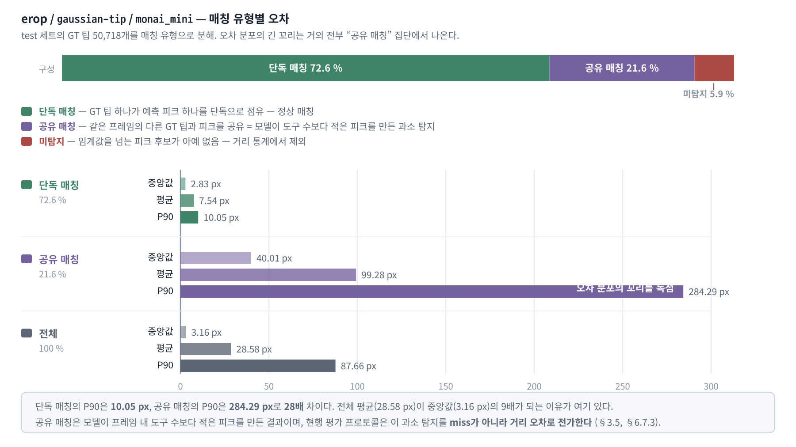

**그림 9. `erop`/`gaussian-tip`/`monai_mini`의 매칭 유형별 오차 분해 (표 24의 4행).** GT 팁 50,718개를 단독 매칭(72.6 %)·공유 매칭(21.6 %)·미탐지(5.9 %)로 나누면, 오차 분포의 긴 꼬리가 공유 매칭 집단에 거의 전부 몰려 있음이 드러난다. 단독 매칭의 P90은 10.05 px인데 공유 매칭의 P90은 284.29 px로 28배 차이이며, 전체 평균(28.58 px)이 중앙값(3.16 px)의 9배가 되는 이유가 여기 있다. 공유 매칭은 모델이 프레임 내 도구 수보다 적은 피크를 만든 결과이므로 본질은 과소 탐지지만, 현행 평가 프로토콜은 이를 miss가 아니라 거리 오차로 집계한다.

#### 6.7.3 해석

이 분석은 본 시스템의 성능을 보는 관점을 바꾼다.

**모델의 위치 추정(localization) 능력은 현행 지표가 보여주는 것보다 훨씬 좋다.** `gaussian-tip`으로 학습한 모델은 자신이 단독으로 탐지한 도구에 대해 중앙값 3 px 수준의 정밀도로 팁을 짚는다(계통 편차가 있는 조합도 편차 보정 후 3.6 px, §6.3.1). 이는 어노테이션 자체의 불확실성에 근접한 수치다.

**실제 병목은 "도구 개수를 맞히는 것", 즉 인스턴스 분리(instance separation)다.** 모델이 프레임 내 도구 수보다 적은 피크를 만들면, 남는 GT 팁들이 엉뚱한 도구의 피크로 끌려가 100 px대의 오차를 만든다. 이 실패는 다음 두 원인이 결합된 결과다.

1. **모델 측**: 두 도구가 겹치거나 인접할 때 히트맵 응답이 하나로 이어져 §3.4의 연결요소 분석이 피크를 하나만 뽑는다. NMS 반경 20 px도 가까운 두 팁 중 하나를 제거할 수 있다.
2. **평가 측**: 일대일 배정이 없으므로 이 실패가 miss로 기록되지 않고 거리 오차로 전가된다.

**따라서 현행 miss율은 탐지 실패를 심각하게 과소평가한다.** `erop`/`gaussian-tip`/`monai`의 공식 miss율은 5.03 %지만, 공유 피크까지 "그 팁에 대한 탐지 실패"로 세면 실질 실패율은 25.6 %가 된다. 8개 조합 전체로는 **22.0–40.4 %**이며, 최악은 `cholec80`/`gaussian-tip`/`monai_mini`(miss 8.22 % + 공유 32.17 % = 40.4 %)다. 즉 누수 없는 평가에서는 GT 팁 5개 중 2개가 실질적으로 탐지되지 않는다. 반대로 거리 통계는 과대평가된다 — 실제로 탐지에 성공한 팁만 보면 평균 오차가 1/4 수준이다.

**개선의 지렛대가 어디에 있는지도 분명해진다.** 히트맵 회귀 자체를 개선하는 것보다, (i) 인접·중첩 도구의 응답을 분리하는 후처리(더 작은 NMS 반경, watershed 기반 분할, 또는 도구 인스턴스를 명시적으로 예측하는 헤드)와 (ii) 헝가리안 알고리즘 등 일대일 배정 기반 평가 프로토콜 도입이 훨씬 큰 효과를 낼 것이다.

#### 6.7.4 헝가리안 일대일 배정 재평가

기존 최근접 지표는 연속성을 위해 남겨 두되, 프레임마다 GT 팁과 예측 피크를 헝가리안 알고리즘으로 일대일 배정했다. 배정 상한을 넘는 GT는 FN, 남는 예측 피크는 FP로 집계했다. 따라서 거리 통계는 TP만을 대상으로 하며, precision·recall·F1은 과소 탐지를 거리 오차로 숨기지 않는다.

**표 24-1. 헝가리안 배정 지표 (P / R / F1, 상한 10 / 20 / 50 px)**

| 조합                                   |                  10 px |              20 px |                  50 px |
| -------------------------------------- | ---------------------: | -----------------: | ---------------------: |
| `erop`/`gradient-seg`/`monai`          |     .459 / .450 / .454 | .714 / .700 / .707 |     .834 / .818 / .826 |
| `erop`/`gradient-seg`/`monai_mini`     |     .399 / .410 / .404 | .663 / .681 / .672 |     .791 / .813 / .801 |
| `erop`/`gaussian-tip`/`monai`          |     .811 / .695 / .749 | .923 / .791 / .852 | .956 / .818 / **.882** |
| `erop`/`gaussian-tip`/`monai_mini`     | .872 / .734 / **.797** | .924 / .777 / .844 |     .956 / .804 / .874 |
| `cholec80`/`gradient-seg`/`monai`      |     .320 / .300 / .310 | .590 / .554 / .571 |     .789 / .741 / .764 |
| `cholec80`/`gradient-seg`/`monai_mini` |     .259 / .251 / .255 | .531 / .515 / .523 |     .755 / .732 / .744 |
| `cholec80`/`gaussian-tip`/`monai`      |     .771 / .595 / .672 | .868 / .669 / .756 |     .932 / .719 / .812 |
| `cholec80`/`gaussian-tip`/`monai_mini` |     .761 / .581 / .659 | .861 / .658 / .746 |     .928 / .708 / .803 |

50 px 상한에서 recall은 **70.8–81.8 %**로, 기존 최근접 miss율 2.9–8.2 %가 실질적인 미배정 비율을 크게 과소평가했음을 보인다. 반면 10 px에서는 `gaussian-tip`의 F1이 .659–.797로 `gradient-seg`의 .255–.454보다 높아, 좁은 거리에서의 위치 정밀도 우위는 일대일 지표에서도 유지된다.

**precision과 recall의 비대칭이 타겟 방식을 가른다.** `gaussian-tip`은 50 px에서 precision .928–.956 대 recall .708–.818로 **precision이 15–22 %p 높다** — 내놓는 피크는 거의 다 맞지만 만들어야 할 피크를 못 만든다(과소 탐지). `gradient-seg`는 precision .755–.834 대 recall .732–.818로 두 값이 대등하며, 특히 `erop`/`gradient-seg`/`monai_mini`는 recall(.813)이 precision(.791)보다 높다 — 피크를 넉넉하게 만들어 놓치는 건 적지만 헛피크가 섞인다. §6.3의 초과-임계 영역 크기 차이가 일대일 지표에서도 그대로 재현되는 셈이다.

`cholec80`의 F1@50이 누수 없는 분할에서 .744–.812로 내려앉아, `erop`(.801–.882)과의 격차가 .038–.070으로 벌어졌다. 구 프레임 분할과의 직접 비교는 §11.3에 있다.

**표 24-2. 프레임 내 도구 수별 헝가리안 FN율 (50 px 상한, 미배정 GT 팁 비율 %)**

| 조합                                   | 도구 1개 | 도구 2개 | 도구 3개 | 도구 4개+ |
| -------------------------------------- | -------: | -------: | -------: | --------: |
| `erop`/`gradient-seg`/`monai`          |   14.6 % |   13.6 % |   23.2 % |    39.2 % |
| `erop`/`gradient-seg`/`monai_mini`     |   15.4 % |   14.2 % |   23.2 % |    40.3 % |
| `erop`/`gaussian-tip`/`monai`          |   14.0 % |   13.5 % |   23.8 % |    39.5 % |
| `erop`/`gaussian-tip`/`monai_mini`     |   15.9 % |   14.7 % |   24.9 % |    41.1 % |
| `cholec80`/`gradient-seg`/`monai`      |   18.8 % |   20.6 % |   33.3 % |    50.0 % |
| `cholec80`/`gradient-seg`/`monai_mini` |   19.9 % |   21.5 % |   34.2 % |    49.9 % |
| `cholec80`/`gaussian-tip`/`monai`      |   18.7 % |   22.4 % |   37.5 % |    54.9 % |
| `cholec80`/`gaussian-tip`/`monai_mini` |   20.1 % |   23.3 % |   38.3 % |    56.2 % |

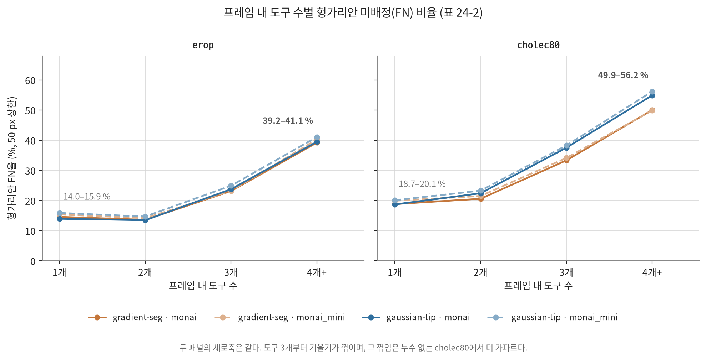

**그림 10. 프레임 내 도구 수별 헝가리안 미배정(FN) 비율 (표 24-2).** 여덟 조합의 곡선이 도구 1–2개 구간에서는 거의 겹쳐 있다가 3개부터 함께 치솟는다. 즉 이 실패는 모델 크기나 타겟 방식이 아니라 **프레임에 도구가 몇 개 있는지**에 지배된다. 도구 4개 이상 프레임에서는 `erop` 39.2–41.1 %, 누수 없는 `cholec80` 49.9–56.2 %의 GT 팁이 아무 피크에도 배정되지 못한다. 두 패널의 세로축은 같다.

두 가지가 확인된다.

**(1) §6.7.1의 "도구 1개일 때 실패율이 가장 높다"는 역설은 사라졌다.** 도구 1개와 2개의 FN율이 13.5–23.3 %로 사실상 같은 수준이다(`erop`에서는 오히려 2개가 근소하게 낮고, `cholec80`에서는 근소하게 높다). 최근접 매칭에서 관찰된 3.8배 격차는 단일 피크를 여러 GT가 공유할 수 있었던 평가 산술의 산물이었음이 확정된다.

**(2) 대신 도구 3개 이상에서 실패율이 급증한다는 사실이 드러났다.** 도구 1–2개의 13.5–23.3 %에서 3개 23.2–38.3 %, 4개 이상 **39.2–56.2 %**로 올라간다. 도구가 4개 이상인 프레임에서는 GT 팁의 **절반 가까이가 아무 피크에도 배정되지 못한다.** 최근접 지표에서 이 실패는 miss율 2.4–8.3 %로만 보였으므로(표 23), 일대일 배정이 비로소 실제 크기를 드러낸 것이다. 이 급증 폭은 `cholec80`에서 더 크고(50.0–56.2 % 대 `erop` 39.2–41.1 %), 같은 데이터셋 안에서는 `gaussian-tip`이 `gradient-seg`보다 더 크다(54.9–56.2 % 대 49.9–50.0 %). §6.7.3이 지목하는 인스턴스 분리 병목이 도구 수에 따라 어떻게 악화되는지를 정량화한 값이다.

### 6.8 추론 속도 비교

CPU 환경에서 `erop` 테스트 세트 임의 샘플 1,000건(seed=42, batch=16, workers=0)에 대해 추론 속도를 측정하였다. `forward_time`은 모델 forward 연산만, `wall_time`은 데이터 로딩·후처리를 포함한 종단 간 루프 시간이다.

**표 25. 추론 속도 비교 (CPU, test 샘플 1,000건)**

| 모델         | 파라미터 수 | Forward / frame | Wall / frame | Forward FPS | Wall FPS |
| ------------ | ----------: | --------------: | -----------: | ----------: | -------: |
| `monai`      |  11,450,828 |       277.00 ms |    287.49 ms |        3.61 |     3.48 |
| `monai_mini` |   5,502,870 |       204.57 ms |    215.06 ms |        4.89 |     4.65 |

경량 모델은 풀 모델 대비 forward 기준 **1.35배**, wall-clock 기준 **1.34배** 빠르다. 파라미터를 약 52 % 줄였음에도 속도 향상이 1.35배(약 26 % 단축)에 그치는 것은, 인코더 후반 스테이지의 고채널·저해상도 블록보다 디코더의 고해상도 연산이 전체 지연 시간에서 큰 비중을 차지하고 디코더는 경량화 대상이 아니었기 때문으로 해석된다.

**GPU 측 보조 지표.** 학습 로그(`metric.csv`)의 에포크 소요 시간도 같은 경향을 보인다. `erop`에서 풀 모델이 에포크당 2,783–2,885초, 경량 모델이 2,270–2,275초이고, `cholec80`에서는 1,905–1,925초 대 1,535–1,541초다. 두 데이터셋 모두 **1.25배** 차이로 일치한다(순전파 + 역전파 + 데이터 로딩·증강 포함이므로 순수 추론 비율보다 격차가 작다). 데이터셋 간 절대값 차이는 train 프레임 수 차이(108,424 대 71,032)에서 온다.

**실시간성 평가.** CPU에서 3.6–4.9 FPS는 실시간 영상 처리(≥ 25 FPS)에 크게 못 미친다. `tooltip-tracker` GUI는 벽시계 기준 재생 중 필요 시 프레임을 드롭하는 방식으로 대응하지만, 임상 적용을 위해서는 GPU 추론이나 추가 최적화(양자화, TensorRT 등)가 필수적이다.

**측정의 한계.** 이 측정은 2026-06-30에 CPU·batch 16·단일 시드로 1회 수행된 것으로, 아키텍처별 특성이므로 재학습 후에도 유효하지만 GPU 추론 속도·배치 크기 의존성·측정 분산은 포함하지 않는다. 또한 `erop`/`gradient-seg` 경로에만 저장되어 있다.

### 6.9 정확도–속도–레이블링 비용 종합

**표 26. 세 축의 종합 비교**

| 관점                            | `monai` + `gradient-seg` | `monai_mini` + `gaussian-tip` |
| ------------------------------- | -----------------------: | ----------------------------: |
| 정밀도 (Hit@10 px, `erop`)      |                  44.98 % |                   **73.44 %** |
| 정밀도 (Hit@10 px, `cholec80`)  |                  30.04 % |                   **58.22 %** |
| 강건성 (Hit@50 px, `erop`)      |              **82.95 %** |                       82.41 % |
| 강건성 (Hit@50 px, `cholec80`)  |              **76.12 %** |                       73.70 % |
| 일대일 F1@50 (`erop`)           |                    0.826 |                     **0.874** |
| 일대일 F1@50 (`cholec80`)       |                    0.764 |                     **0.803** |
| 탐지 실패율 (`erop`)            |               **3.09 %** |                        5.85 % |
| 탐지 실패율 (`cholec80`)        |               **2.90 %** |                        8.22 % |
| 파라미터                        |                  11.45 M |                    **5.50 M** |
| CPU forward FPS                 |                     3.61 |                      **4.89** |
| 학습 시간 (`erop` / `cholec80`) |          24.0 h / 15.9 h |           **18.9 h / 12.8 h** |
| 레이블링 요구                   |  팁 + 분할 마스크 + bbox |                 **팁 좌표만** |

가장 비싼 조합(풀 모델 + 분할 마스크 레이블링)과 가장 싼 조합(경량 모델 + 팁 좌표만)을 비교하면, **싼 조합이 정밀도에서 28.2–28.5 %p 앞서고 일대일 F1@50에서도 0.039–0.048 앞선다.** 두 데이터셋에서 같은 방향이며, 누수 없는 `cholec80`에서도 결론이 유지된다.

싼 조합이 뒤지는 항목은 두 가지다. 강건성(Hit@50 px)에서 `erop` 0.5 %p, `cholec80` 2.4 %p 뒤지고, 탐지 실패율에서 `erop` 2.76 %p, `cholec80` **5.32 %p** 불리하다. **탐지 실패율의 불리함이 누수 없는 평가에서 2배로 커진다**는 점이 새로 드러난 대가이며, 이 항목은 임계값 조정으로 개선될 여지가 큰 지표다(§6.3, §11.1에서 val 최적 임계값이 `cholec80`에서 0.3으로 내려간 것과 정합한다).

## 7. 도구 및 재현성 (Tooling and Reproducibility)

본 프로젝트는 학습·평가뿐 아니라 실험 현황 파악과 결과의 시각적 검증을 위한 도구 일체를 제공한다. 모든 스크립트는 `run <script> [args...]`(Windows는 `run.bat`) 형태로 실행하며, `--dataset`은 대부분의 스크립트에서 필수 인자다.

**표 27. 스크립트 목록**

| 스크립트               | 용도                                                               |
| ---------------------- | ------------------------------------------------------------------ |
| `run dashboard`        | 8개 조합의 학습·평가 진행 상태를 한 표로 표시, 실행 명령 안내·복사 |
| `run train-model`      | 모델 학습 (중단 시 자동 재개, 에포크별 `metric.csv` 기록)          |
| `run eval-model`       | 테스트 세트 정량 평가 → `summary.json`, `per_tip.csv`              |
| `run compare-speed`    | 두 모델의 추론 속도 비교                                           |
| `run tooltip-detector` | 탐지 결과 시각화 GUI (이미지·데이터셋 프레임)                      |
| `run tooltip-tracker`  | 동영상 실시간 탐지·카메라 이동 방향 안내 GUI                       |
| `run dataset-browser`  | 데이터셋 시각화 GUI                                                |


**그림 11. `run tooltip-detector` GUI 화면.** 학습된 모델로 복강경 프레임을 추론하여 원본·히트맵·예측 팁·GT·오차를 함께 시각화한다. 상단 `Dataset`·`Target`·`Model` 드롭다운으로 8개 조합을 실행 중에 전환하며 비교할 수 있고, Threshold·NMS 슬라이더로 후처리 파라미터를 실시간 조정하면서 탐색한 프레임의 누적 Hit-rate·거리 통계를 집계한다.

**재현성 관련 설계:**

- **경로 분리:** 체크포인트와 결과가 `<dataset>/<target-mode>/<model-type>` 세 축으로 분리되어 조합 간 덮어쓰기가 구조적으로 불가능하다.
- **학습 재개:** `train-status.json`에 완료 에포크·best val loss·학습률 스케줄 상태가 기록되어, 중단된 학습을 같은 명령으로 이어갈 수 있다(옵티마이저 모멘텀은 재초기화됨).
- **에포크별 로깅:** `metric.csv`가 train/val loss, MAE, ME, std, lr, 소요 시간을 에포크마다 기록하며 재개 시에도 이어서 기록된다.
- **GT 팁 단위 기록:** `per_tip.csv`가 GT 팁 1개당 좌표·예측 좌표·거리·탐지 여부·매칭 유형·헝가리안 배정 결과를 남겨, §6.7 같은 사후 분석을 결과 파일만으로 수행할 수 있다. 본 보고서의 표 14·15·16·17·17-2·23·24·24-2는 전부 이 파일에서 재계산한 것이며, `scripts/generate-summary.py`가 같은 계산을 자동화해 [results-summary.md](results-summary.md)로 모은다.
- **실험 재현 명령:** 8개 조합 전체의 학습·평가 명령이 [commands.md](commands.md)에 정리되어 있다.
- **그림 재현:** 표에서 파생된 그림 4·5·6·10·12는 `notebook/final-report-graph.ipynb`가 `metric.csv`·`summary.json`·`per_tip.csv`만 읽어 다시 계산해 `docs/figures/`에 저장한다. 보고서의 수치를 옮겨 적지 않으므로 재학습·재평가 뒤에 노트북을 다시 실행하면 그림도 함께 갱신된다.

환경은 Python 3.12 이상, `uv` 패키지 매니저, CUDA 12.8 호환 GPU를 기준으로 하며, `uv sync`로 의존성을 설치한다.

## 8. 한계 (Limitations)

1. **자동 생성 라벨의 미검증성.** 학습·평가의 기준이 되는 분할 마스크와 팁 어노테이션은 사전학습 모델 추론과 contour 휴리스틱으로 생성된 반자동 라벨로, 사람이 검증한 정답 대비 정확도가 측정되지 않았다(§2.3). 본 보고서의 모든 정확도 수치는 검증되지 않은 기준값에 대한 상대 성능이다. 특히 `gaussian-tip`의 중앙값 오차 3–4 px는 어노테이션 자체의 불확실성과 같은 자릿수일 가능성이 있어, 이 구간의 수치는 모델 성능보다 라벨 노이즈를 재고 있을 수 있다.

2. **시간적 누수 — `cholec80`에서 해소, `erop`에서 잔존.** `cholec80`은 영상 단위 스플릿으로 재구축·재학습·재평가되어(§2.2, §11.3) **그 4개 조합의 수치는 미지의 새 영상에 대한 일반화 성능이다.** 반면 `erop`은 여전히 프레임 단위 분할이므로 같은 영상의 인접(≈0.3초 간격) 프레임이 train과 test에 동시에 존재하고, **`erop` 4개 조합의 수치는 일반화 성능이 아니다.**

   이 비대칭이 두 개의 새 한계를 만든다. 첫째, **데이터셋 간 비교(§6.5)가 데이터셋 난이도와 분할 방식을 뒤섞는다** — 두 성분은 분리 측정되지 않았다. 둘째, `erop`을 영상 단위로 재분할하려면 세션이 5개뿐이어서 test가 단일 세션에 의존하게 되므로, **`erop`의 누수는 데이터를 늘리지 않는 한 해소할 수 없다.**

   또한 `cholec80`의 재구축은 누수만 제거한 것이 아니라 train을 110,747 → 71,032 프레임(−35.9 %)으로 줄이고 test를 36,930 → 98,234로 늘렸다. §11.3의 구·신 분할 성능 차이는 **누수 제거·학습 데이터 감소·test 구성 변화의 합**이며, 세 성분은 분리되지 않았다. 누수만의 크기를 재려면 train 프레임 수를 맞춘 대조군(예: 프레임 단위 분할에서 71,032 프레임만 샘플링해 학습)이 필요하다.

3. **후처리 설정의 제한된 최적화.** `monai_mini`의 데이터셋 × 타겟 네 조합은 val 기반 threshold × NMS 스윕을 마쳤고, 선택값은 §11.1에 기록했다. 그러나 `monai`는 탐색 범위 밖이며, 8개 조합의 표준 결과는 여전히 공통 설정(`threshold=0.5`, `nms-radius=20 px`)으로 비교된다. 또한 선택 설정 test에는 bias 보정이 함께 적용되어 순수한 threshold/NMS 효과가 분리되지 않았고, watershed 비교도 bias 적용 조건이 달랐다. 따라서 설정 최적화의 일반화와 인스턴스 분리 효과는 아직 확정할 수 없다.

4. **평가 프로토콜의 매칭 방식 — 해소.** 기존 최근접 지표는 연속성을 위해 보존하되, 10·20·50 px 상한의 헝가리안 일대일 배정으로 TP·FP·FN·precision·recall·F1을 8개 조합 모두에서 산출했다(§6.7.4). 따라서 과소 탐지는 더 이상 거리 오차로만 전가되지 않는다. 남은 한계는 배정 상한과 후처리 파라미터의 선택이며, 이는 2단계 val 기반 스윕의 대상이다.

5. **계통 편차 보정의 범위.** `erop` 4개 조합은 val 세트의 20 px 이내 매칭으로 편차를 추정해 `bias.json`에 저장하고 test에서 원본·보정 지표를 함께 산출했다(§6.3.2). `cholec80` 영상 단위 분할에서는 2단계 노트북이 `monai_mini` 두 target의 bias를 새 val에서 추정하고 선택 설정 test에 적용했다(`gradient-seg`: +4, −3 px; `gaussian-tip`: 0, 0 px). 하지만 `monai` 두 조합의 새 val 기반 보정은 아직 없고, 표 11의 표준 결과도 bias 미보정이다. 보정의 순수 효과를 비교하려면 같은 설정에서 원본·보정 평가를 병기해야 한다.

6. **학습 예산의 제약.** 전 조합이 30 에포크에서 종료되었으나 §5에서 보듯 val loss가 여전히 감소 중이었다. 관측된 조합 간 성능 차이 중 일부는 "수렴 지점의 차이"가 아니라 "동일 예산 하에서의 수렴 속도 차이"일 수 있다.

7. **속도 측정 범위.** 속도는 CPU·batch 16·단일 시드에서 1회 측정되었으며, GPU 추론 속도, 배치 크기 의존성, 측정 분산은 포함되지 않는다(§6.8).

8. **단일 시드, 그리고 실행 간 분산의 실측 크기.** 모든 조합이 1회만 학습되어 관측된 차이 중 어디까지가 실행 간 분산인지 구분할 수 없다. 이 한계는 추정이 아니라 **두 번 실측되었다.**

   첫째, `erop`/`gaussian-tip`/`monai`를 동일 설정·동일 데이터로 두 번 학습한 결과(§6.4, 부록 B) Miss율이 2.26 %p, P90이 69.5 px, 중앙값이 3.81 px 달라졌고 계통 편차의 유무까지 바뀌었다. 둘째, `cholec80`/`gradient-seg`에서 모델 크기 효과의 **부호가 뒤집혔다** — Hit@10 px 차이가 −1.92 %p(구 분할)에서 +4.94 %p(신 분할)로 6.86 %p 이동했다(§6.4a). 두 번째 사례는 스플릿 변경이 함께 작용했으므로 순수한 시드 분산은 아니지만, 어느 쪽이든 이 크기는 §6.4가 측정하려는 모델 크기 효과(±5 %p)와 같은 자릿수다.

   따라서 **본 보고서의 모델 크기 비교는 방향성 참고 이상으로 해석해서는 안 되며**, 확정에는 조합당 다중 시드 반복이 필요하다. 반면 §6.3의 타겟 방식 효과(평균 29.9 %p)는 이 분산보다 한 자릿수 크므로 결론이 안정적이다.

## 9. 향후 연구 (Future Work)

분석에서 도출된 개선 방향을 우선순위와 함께 정리한다.

**표 28. 향후 개선 방향**

| 우선순위     | 방향                                                            | 근거                                                                                                                                                            |
| ------------ | --------------------------------------------------------------- | --------------------------------------------------------------------------------------------------------------------------------------------------------------- |
| 완료 (1단계) | 일대일 배정 기반 평가 지표 (헝가리안 매칭 + precision/recall)   | 8개 조합을 10·20·50 px 상한에서 재평가 (§6.7.4)                                                                                                                 |
| 완료 (1단계) | 계통 편차 보정 (val 편차 추정 → 추론 시 차감)                   | `erop` 4개 조합의 원본·보정 지표 병기 (§6.3.2)                                                                                                                  |
| 완료 (2단계) | threshold × NMS 스윕 및 조합별 최적점 산출                      | val F1@50 기준 `erop` 두 target 0.4/30 px, `cholec80`은 gradient 0.4/30 px·gaussian 0.3/30 px (§11.1)                                                           |
| 완료 (4단계) | `cholec80` 영상 단위 분할 재구축·재학습·재평가                  | 누수 없는 일반화 성능 확보, 누수 크기 정량화 (§2.2, §11.3)                                                                                                      |
| **최상**     | 인스턴스 분리 개선 (인스턴스 헤드, 학습 단계 분리 손실)         | 전체 GT 팁의 18.7–32.2 %가 공유 피크에 매칭. 도구 4개+ 프레임의 헝가리안 FN율 39.2–**56.2 %** — 최대 단일 병목이며 누수 없는 평가에서 더 커진다 (§6.7, 표 24-2) |
| **최상**     | `erop` 영상 단위 분할을 위한 세션 추가 확보                     | `erop` 4개 조합의 수치가 여전히 일반화 성능이 아니고, 세션 5개로는 재분할이 불가능 (§8.2)                                                                       |
| **상**       | `cholec80`/`monai`의 val 기반 편차 보정 및 공통 조건 재평가     | `monai_mini` 두 target은 2단계에서 재추정했지만, 두 모델 타입의 원본·보정·watershed 비교 조건이 통일되지 않음 (§8.5, §11.1)                                     |
| **상**       | 조합당 다중 시드 반복 학습                                      | 동일 설정 재학습에서 Miss율 2.26 %p 변동, 재분할에서 모델 크기 효과의 부호가 뒤집힘 — 모델 크기 효과와 같은 자릿수 (§6.4, §8.8)                                 |
| **상**       | 누수 크기의 순수 측정 (train 프레임 수를 맞춘 대조군)           | §11.3의 격차가 누수 제거·학습 데이터 −35.9 %·test 구성 변화의 합이며 분리되지 않음 (§8.2)                                                                       |
| 중           | 자동 생성 라벨의 사람 검수·정량 검증 (IoU·팁 오차 측정)         | 모든 수치의 기준값 신뢰도 확보. `gaussian-tip` 중앙값 4–5 px는 라벨 노이즈 수준 (§8.1)                                                                          |
| 중           | `cholec80` `video50` 개별 조사, `video30`의 학습 오염 여부 확인 | `video50`은 네 조합 모두 평균 거리 95–102 px로 극단적 이상치. `video30`은 train으로 이동해 관측 불가 (§6.6)                                                     |
| 중           | 학습 예산 확대 (60–100 에포크)                                  | 8개 조합 모두 30 에포크에서 val loss가 여전히 감소 중. 특히 `cholec80`/`gradient-seg`는 곡선이 요동쳐 조기 종료 지점이 불명확 (§5)                              |
| 중           | `gaussian-tip`의 σ 튜닝 (5–30 px)                               | σ가 초과-임계 영역 크기 = 정밀도·miss율 트레이드오프를 직접 결정. 누수 없는 평가에서 `gaussian-tip` miss율이 7.5–8.2 %로 악화 (§6.3)                            |
| 하           | GPU 추론 속도 측정 및 양자화·TensorRT 최적화                    | CPU 3.6–4.9 FPS로 실시간 미달, 임상 적용의 전제 (§6.8)                                                                                                          |
| 하           | 두 타겟 방식의 앙상블 또는 다중 헤드 학습                       | `gaussian-tip`의 정밀도와 `gradient-seg`의 낮은 miss율이 상보적 (§6.3)                                                                                          |

**우선순위의 무게중심이 후처리에서 학습·데이터로 옮겨갔다.** 2.2판은 "가장 큰 기회는 모델이 아니라 평가와 후처리에 있다"고 정리했고, 그 판단에 따른 네 항목(평가 지표 교정·임계값 튜닝·계통 편차 보정·후처리 스윕)은 1·2단계에서 실제로 완료되었다. 그러나 **그 결과가 병목을 옮기지는 못했다.** §11.1의 선택 설정 test에서는 F1@50이 0.004–0.026 높고 공유 피크율도 17.36–29.85 %로 남았다. 다만 이 test 결과에는 bias 보정이 함께 적용되어 있으므로, 이득을 threshold × NMS만의 효과로 귀속할 수 없으며 watershed 비교도 동일 보정 조건으로 재평가해야 한다. 표 24-2가 새로 보인 도구 4개+ 프레임의 FN율 39.2–56.2 %는 후처리 파라미터로 닿을 수 있는 크기가 아니다.

따라서 남은 최상위 항목은 **후처리가 아니라 (i) 인스턴스를 명시적으로 예측하는 모델 구조와 (ii) 누수 없는 평가를 두 데이터셋 모두에 확보하는 데이터 작업**이다. `cholec80`은 4단계에서 (ii)를 달성했고, `erop`은 세션 수 제약 때문에 데이터 확보 없이는 불가능하다. 한편 단독 매칭된 팁에 한정하면 모델은 여전히 중앙값 4 px(`cholec80`/`gaussian-tip`) 수준의 정밀도를 내므로(§6.7), **위치 추정 능력이 아니라 개수 추정 능력이 병목이라는 진단 자체는 누수 없는 평가에서도 확인되었다.**

## 10. 결론 (Conclusion)

본 연구는 복강경 수술 영상의 수술도구 팁 탐지를 히트맵 회귀 문제로 정식화하고, **데이터셋 2종 × 학습 타겟 생성 방식 2종 × 모델 크기 2종의 8개 조합을 전수 실험**하여 각 축의 기여를 분리하였다. 총 36만 프레임 규모의 두 데이터셋에서 229.5시간의 GPU 학습(현재 유효한 8개 조합 142.7시간 + 폐기하지 않은 `cholec80` 구 분할 4개 조합 86.8시간)과 12회의 전체 테스트 세트 평가를 수행했다. 특히 `cholec80`은 프레임 단위 분할과 영상 단위 분할 양쪽에서 학습·평가되어, **시간적 누수가 보고 수치에 미치는 영향을 같은 데이터·같은 설정에서 직접 측정**할 수 있었다.

**첫째, 성능을 지배하는 것은 모델 크기가 아니라 학습 타겟의 공간적 형태였다.** 타겟 생성 방식이 Hit@10 px에 미치는 영향은 평균 29.9 %p로, 데이터셋(14.0 %p)이나 모델 크기(1.6 %p)를 압도한다. `gaussian-tip`은 중앙값 3–8 px의 높은 정밀도를 내는 대신 탐지 실패율이 높고, `gradient-seg`는 그 반대다. 이 차이는 임계값 0.5에서 두 타겟이 만드는 초과-임계 영역의 크기(반경 17.7 px의 원판 대 도구별 최대 팁 거리의 절반 안에 있는 마스크 화소)로 기계적으로 설명된다. 실무적으로 더 중요한 결론은, **분할 마스크 레이블링에 드는 비용이 팁 탐지 정확도로 회수되지 않는다**는 것이다 — 팁 좌표 하나만 요구하는 `gaussian-tip`이 Hit@10 px에서 크게 앞서고 일대일 F1@50에서도 앞선다. **이 결론은 누수 없는 영상 단위 평가에서도 유지된다**(`cholec80` F1@50 0.803–0.812 대 0.744–0.764).

**둘째, 오차 분포의 긴 꼬리는 위치 추정의 실패가 아니라 인스턴스 분리의 실패였다.** 전체 GT 팁의 18.7–32.2 %가 같은 프레임의 다른 GT 팁과 예측 피크를 공유하며(모델이 도구 수보다 적은 피크를 생성), 이 집단이 평균 99–106 px, P90 270–284 px로 꼬리를 독점한다. 단독 매칭된 팁만 보면 `gaussian-tip` 모델의 평균 오차는 7.5–12.5 px, 중앙값은 2.8–4.1 px에 불과하다. 헝가리안 일대일 배정으로 다시 재면 이 실패의 크기가 도구 수에 따라 급증한다 — 도구 1–2개 프레임의 FN율 13.5–23.3 %가 도구 4개 이상에서 **39.2–56.2 %**가 된다. **누수를 제거하면 이 병목이 더 커진다**: `cholec80`의 공유 피크 비율이 26.5–29.9 %에서 28.4–32.2 %로 올랐다.

**셋째, 경량화의 비용은 여전히 작지만, 그 크기를 확정할 수는 없다.** 파라미터를 48.1 %로 줄이고 CPU 추론을 1.35배, 학습 시간을 20 % 단축했음에도 4개 비교쌍 전부에서 지표 차이가 ±5 %p 이내였다. 영상 단위 재학습 후에는 4개 쌍 대부분에서 풀 모델이 일관되게 소폭 앞서는 쪽으로 정리됐으나(2.2판의 혼재 양상에서 변화), 바로 그 정리 과정에서 `cholec80`/`gradient-seg`의 Hit@10 px 차이가 −1.92 %p에서 +4.94 %p로 부호가 뒤집혔다. 이 6.86 %p 이동은 측정하려는 효과와 같은 자릿수이므로, 결론은 **"자원 제약이 있으면 경량 모델을 택해도 손실이 미미하다"**까지이고 "어느 쪽이 더 낫다"로 나아갈 수 없다(§8.8).

**넷째, 정밀도 지표의 일부는 모델 능력이 아니라 보정되지 않은 좌표 편차를 재고 있었다.** 8개 조합 중 5개의 예측 좌표에 4.5–5.7 px 크기의 계통 편차가 남아 있고, 한 조합에서는 이 상수 편차만 제거해도 중앙값 오차가 7.28 px에서 3.61 px로, 5 px 이내 비율이 19.8 %에서 66.4 %로 개선된다. **이 편차는 `cholec80`을 재구축·재학습한 뒤에도 동일한 값으로 재현되었다**((+4, −2) px / (0, 0) px) — 학습 실행의 우연이 아니라 타겟 생성 방식과 데이터셋에 결부된 구조적 성질이라는 뜻이다. 히트맵 MSE는 피크 위치의 정확도를 직접 측정하지 않으므로 검증 손실이 가장 낮은 조합이 가장 정밀한 조합은 아니었다.

**다섯째, 시간적 누수는 보고 수치를 실제로 부풀리고 있었다.** `cholec80`을 영상 단위로 재분할해 다시 학습·평가하면 Hit@50 px가 3.4–4.7 %p, 헝가리안 F1@50이 0.025–0.034 떨어지고, 평균 오차는 4.6–6.0 px, P90은 24–33 px 늘어난다(§11.3). val loss 수준으로 보면 `gradient-seg`가 22–24 %, `gaussian-tip`이 9–10 % 높아진다. 이 격차에는 학습 데이터 35.9 % 감소가 함께 작용하므로 누수만의 크기는 아니지만, **프레임 단위 분할로 보고된 수치를 일반화 성능으로 읽으면 안 된다**는 결론에는 영향이 없다. 본 보고서의 `erop` 4개 조합이 여전히 이 조건에 있으며, 세션이 5개뿐이라 데이터를 늘리지 않고는 해소할 수 없다(§8.2).

종합하면, 현 시스템은 자신이 단독으로 탐지한 도구에 대해서는 이미 어노테이션 정밀도에 근접한 위치 추정을 하고 있으며, **위치 추정이 아니라 개수 추정이 병목이라는 진단은 누수 없는 평가에서도 확인되었다.** 1·2단계에서 평가 지표 교정·계통 편차 보정·후처리 파라미터 최적화를 모두 완료했으나 병목은 옮겨가지 않았고(F1@50 개선 0.004–0.026), 4단계의 누수 제거는 오히려 병목이 실제로는 더 크다는 것을 드러냈다. 따라서 남은 과제는 후처리 수준을 넘어 **인스턴스를 명시적으로 예측하는 모델 구조**와 **두 데이터셋 모두에 누수 없는 평가 기반을 확보하는 데이터 작업**이다.

## 부록 A. 실험 환경 및 설정 요약

| 항목             | 값                                                                                                                       |
| ---------------- | ------------------------------------------------------------------------------------------------------------------------ |
| 데이터셋 A       | `erop` — 5 세션, 180,706 프레임 (108,424 / 36,140 / 36,142), 팁 252,977개                                                |
| 데이터셋 A 분할  | **프레임 단위** 60:20:20 — 5 세션 전부가 세 스플릿에 등장, 시간적 누수 **있음**                                          |
| 데이터셋 B       | `cholec80` — 80 영상, 184,578 프레임 (71,032 / 15,312 / 98,234), 팁 315,204개                                            |
| 데이터셋 B 분할  | **영상 단위** 편수 40:10:50 — `video01–32` / `33–40` / `41–80`, 시간적 누수 **없음**                                     |
| 입력 해상도      | 736 × 480 px (RGB, letterbox)                                                                                            |
| 모델 (풀)        | EfficientNet-B2 + U-Net, 인코더 23블록, 11,450,828 파라미터                                                              |
| 모델 (경량)      | 인코더 13블록, 5,502,870 파라미터 (48.1 %)                                                                               |
| 학습 타겟 A      | `gradient-seg` — 분할 마스크 기반 거리 히트맵                                                                            |
| 학습 타겟 B      | `gaussian-tip` — 팁 중심 가우시안, σ = 15 px                                                                             |
| 손실 함수        | MSE(sigmoid(pred[:,1]), target)                                                                                          |
| 옵티마이저       | Adam, lr = 1e-4                                                                                                          |
| 스케줄러         | CosineAnnealingLR (T_max = epochs)                                                                                       |
| 학습 설정        | 30 epochs, batch 16 (전 조합 동일)                                                                                       |
| 평가 설정        | threshold = 0.5, NMS radius = 20 px, `--peak-method connected-components` (전 조합 동일)                                 |
| 평가 범위        | 테스트 세트 전체 (`erop` 36,142 / `cholec80` 98,234 프레임)                                                              |
| 일대일 배정      | 헝가리안, 거리 상한 10 / 20 / 50 px                                                                                      |
| 속도 측정        | CPU, `erop` test 1,000건, batch 16, seed 42                                                                              |
| GPU 학습 시간    | 유효 8개 조합 **142.7 시간** (`erop` 85.1 h: 풀 23.2–24.0 / 경량 18.9–19.0, `cholec80` 57.5 h: 풀 15.9–16.0 / 경량 12.8) |
| 총 GPU 학습 시간 | **229.5 시간** (위 + 보존된 `cholec80` 구 프레임 분할 4개 조합 86.8 h)                                                   |

## 부록 B. 결과 데이터 출처

| 파일                                                           | 내용                                                   | 산출 시각                |
| -------------------------------------------------------------- | ------------------------------------------------------ | ------------------------ |
| `data/results/erop/gradient-seg/monai/summary.json`            | 조합 1 평가 결과                                       | 2026-08-20 16:38         |
| `data/results/erop/gradient-seg/monai_mini/summary.json`       | 조합 2 평가 결과                                       | 2026-08-20 16:51         |
| `data/results/erop/gaussian-tip/monai/summary.json`            | 조합 3 평가 결과 (재학습 후)                           | 2026-08-20 16:39         |
| `data/results/erop/gaussian-tip/monai.old/summary.json`        | 조합 3 이전 평가 결과 (보존용)                         | 2026-08-10 11:48         |
| `data/results/erop/gaussian-tip/monai_mini/summary.json`       | 조합 4 평가 결과                                       | 2026-08-20 17:03         |
| `data/results/cholec80/gradient-seg/monai/summary.json`        | 조합 5 평가 결과 (**영상 단위 분할**)                  | 2026-08-24 09:56         |
| `data/results/cholec80/gradient-seg/monai_mini/summary.json`   | 조합 6 평가 결과 (**영상 단위 분할**)                  | 2026-08-24 09:52         |
| `data/results/cholec80/gaussian-tip/monai/summary.json`        | 조합 7 평가 결과 (**영상 단위 분할**)                  | 2026-08-24 09:54         |
| `data/results/cholec80/gaussian-tip/monai_mini/summary.json`   | 조합 8 평가 결과 (**영상 단위 분할**)                  | 2026-08-24 10:23         |
| `data/results/cholec80-frame-split/<타겟>/<모델>/summary.json` | 조합 5–8의 구 프레임 분할 결과 (§11.3 비교의 원천)     | 2026-08-20 16:26 ~ 17:01 |
| `data/results/<...>/per_tip.csv`                               | GT 팁 단위 상세 기록 (표 14·16·17-2·23·24·24-2의 원천) | 상동                     |
| `data/results/erop/gradient-seg/speed-comparison.json`         | 추론 속도 비교                                         | 2026-06-30 16:24         |
| `data/results/phase2/`                                         | 2단계 val 그리드 서치·watershed 비교 (§11.1)           | 2026-08-20 19:25 ~ 20:56 |
| `data/models/<...>/metric.csv`                                 | 에포크별 학습 곡선 (표 9의 원천)                       | 학습 시각                |
| `data/models/<...>/train-status.json`                          | 학습 완료 상태 (표 8의 원천)                           | 학습 시각                |
| `data/models/erop/<타겟>/<모델>/bias.json`                     | `erop` val 편차 추정 (표 17-1의 원천)                  | 2026-08-20 13:31 ~ 13:36 |
| `data/dataset/cholec80/split-manifest.json`                    | `cholec80` 영상 단위 분할 규칙과 모달리티별 파일 수    | 2026-08-21 11:10         |

**표 8·9의 학습 수치와 표 11 이하의 평가 수치는 `docs/results-summary.md`(2026-08-24 10:34 생성, 8/8 조합 완비)와 일치한다.** 그 문서는 `scripts/generate-summary.py`가 `data/models`·`data/results`만 읽어 자동 생성하며, 재학습·재평가 후에는 다시 실행해 갱신한다.

**결과 파일 갱신 이력.**

**(0) 조합 5–8 (`cholec80` 전부) — 3.0판에서 재구축·재학습·재평가.** 데이터셋이 영상 단위 스플릿으로 재구축되어(2026-08-21) 네 조합을 새 train 스플릿으로 처음부터 재학습하고(2026-08-22 ~ 08-23) 새 test 스플릿에서 재평가했다(2026-08-24). 구 프레임 분할의 체크포인트·결과는 `data/models/cholec80-frame-split/`·`data/results/cholec80-frame-split/`에 보존되어 있으며, 두 분할의 대조는 §11.3에 있다. 이 재평가는 `--estimate-bias`·`--apply-bias` 없이 실행되어 `cholec80`의 새 `bias.json`은 존재하지 않는다(§8.5).

**(1) 조합 1·2 (`erop`/`gradient-seg`) — 2.0판 작성 시 재평가.** 이전 결과(2026-06-29·30 산출)는 갱신 전 `erop` 어노테이션(테스트 GT 팁 52,489개)과 재학습 전 체크포인트 기준이었다. 참고용 수치 — 조합 1: miss 2.97 %, Hit@10 38.10 %, mean 39.76 px / 조합 2: miss 3.20 %, Hit@10 29.61 %, mean 41.35 px. 현재 결과가 전반적으로 개선된 것은 재학습과 어노테이션 갱신이 함께 반영된 결과로, 두 효과는 분리 측정되지 않았다.

**(2) 조합 3 (`erop`/`gaussian-tip`/`monai`) — 2.1판에서 재학습·재평가.** 학습 기록이 없던 유일한 조합이어서 2026-08-15에 재학습(23.2 h, best val loss 0.000658)하고 2026-08-19에 재평가하였다(§4.1). 이전 결과는 동일한 어노테이션·동일한 평가 설정에서 산출된 것이므로, 두 수치의 차이는 **순수하게 학습 실행 간 차이**다.

| 지표      | 이전 (2026-08-10) | 현재 (2026-08-19) |      변화 |
| --------- | ----------------: | ----------------: | --------: |
| Miss율    |            7.29 % |            5.03 % |  −2.26 %p |
| Hit@10 px |           68.38 % |           69.52 % |  +1.14 %p |
| Hit@20 px |           73.46 % |           79.36 % |  +5.90 %p |
| Hit@50 px |           77.91 % |           83.82 % |  +5.91 %p |
| Median    |           4.00 px |           7.81 px |  +3.81 px |
| Mean      |          36.26 px |          29.85 px |  −6.41 px |
| P90       |         143.77 px |          74.28 px | −69.49 px |
| 계통 편차 |         (0, 0) px |       (+4, −4) px |         — |

이전 결과는 `data/results/erop/gaussian-tip/monai.old/`에 보존되어 있다. 두 실행이 서로 다른 국소 최적해에 도달했다는 사실(한쪽은 편차 없이 정밀하고 산포가 크며, 다른 쪽은 편차가 있으나 산포가 작다)이 §8.8에서 논하는 단일 시드 한계의 실측 근거다.

## 부록 C. 관련 문서

| 문서                                                 | 내용                                                          |
| ---------------------------------------------------- | ------------------------------------------------------------- |
| [dataset-guide.md](dataset-guide.md)                 | 데이터셋 디렉터리 구조, 파일 포맷, 어노테이션 스펙, 타겟 수식 |
| [model-monai.md](model-monai.md)                     | 풀 모델 아키텍처 상세                                         |
| [model-monai_mini.md](model-monai_mini.md)           | 경량 모델 아키텍처 상세                                       |
| [train-guide.md](train-guide.md)                     | 학습 실행 방법, 인수, 증강, 체크포인트, 재개 동작             |
| [eval-guide.md](eval-guide.md)                       | 평가 실행 방법, 피크 탐지 알고리즘, 지표 정의, 결과 파일 구조 |
| [commands.md](commands.md)                           | 8개 조합 전체의 실험 재현 명령                                |
| [dashboard-guide.md](dashboard-guide.md)             | 실험 현황 GUI 사용법                                          |
| [tooltip-detector.md](tooltip-detector.md)           | 탐지 GUI 설계 및 사용법                                       |
| [tooltip-tracker.md](tooltip-tracker.md)             | 추적 GUI 설계, 화살표 스무딩, 오탐지 판정 규칙                |
| [dataset-browser-guide.md](dataset-browser-guide.md) | 데이터셋 브라우저 GUI 사용법                                  |

## 11. 후속 실험 기록 (2026-08-24)

### 11.1 2단계 후처리 최적화

`monai_mini`를 대표 모델로 고정하고 val에서 threshold `{0.2, 0.3, 0.4, 0.5, 0.6}` × NMS `{5, 10, 15, 20, 30}`을 헝가리안 F1@50으로 탐색했다. 선택 규칙은 F1 최대화 후 recall·precision·더 작은 threshold·더 작은 NMS 반경 순이다. 25개 설정의 선택 결과는 다음과 같다.

| 데이터셋   | 타겟           | threshold | NMS 반경 | val precision | val recall | val F1@50 |
| ---------- | -------------- | --------: | -------: | ------------: | ---------: | --------: |
| `erop`     | `gradient-seg` |       0.4 |    30 px |          .821 |       .822 |  **.821** |
| `erop`     | `gaussian-tip` |       0.4 |    30 px |          .940 |       .817 |  **.874** |
| `cholec80` | `gradient-seg` |       0.4 |    30 px |          .779 |       .763 |  **.771** |
| `cholec80` | `gaussian-tip` |       0.3 |    30 px |          .891 |       .788 |  **.836** |

`cholec80`도 이제 영상 단위 분할의 val(`video33–40`)에서 탐색했다. 따라서 이전 기록의 “두 target 모두 0.3 / 30 px”은 유효하지 않으며, `gradient-seg`의 선택값은 **0.4 / 30 px**다. 네 조합 모두 NMS 반경 30 px가 선택되어, 인스턴스 분리 문제를 더 작은 NMS 반경만으로 해결할 수 없음을 다시 보였다.

선택값 하나만 held-out test에 적용한 결과는 아래와 같다.

| 조합                      | 기준선 F1@50 | 선택 설정 F1@50 |   변화 | recall 변화 |
| ------------------------- | -----------: | --------------: | -----: | ----------: |
| `erop`/`gradient-seg`     |        .8014 |           .8274 | +.0260 | .813 → .825 |
| `erop`/`gaussian-tip`     |        .8736 |           .8776 | +.0040 | .804 → .820 |
| `cholec80`/`gradient-seg` |        .7436 |           .7652 | +.0217 | .732 → .747 |
| `cholec80`/`gaussian-tip` |        .8034 |           .8148 | +.0114 | .708 → .754 |

**해석 주의.** 노트북의 선택 설정 test 실행은 `--apply-bias`를 함께 적용했지만, 위 기준선은 기존의 bias 미보정 평가 결과다. 따라서 이 차이는 threshold/NMS 변경과 좌표 편차 보정의 **결합 효과**이며, 후처리 파라미터만의 순수 개선폭으로 해석할 수 없다. 각 target의 최적점 선택 자체는 val만 사용했으므로 test 누수는 없지만, 순수한 설정 효과를 분리하려면 기준선(0.5 / 20 px)도 같은 `bias.json`을 적용해 재평가해야 한다.

선택 설정에서 watershed 피크 분할도 별도로 실행했다. 그러나 watershed 실행에는 `--apply-bias`가 빠져 있어, 연결요소 방식(보정 적용)과 watershed(보정 미적용)의 F1@50 `.8274 → .7801`, `.8776 → .8792`, `.7652 → .7275`, `.8148 → .8165` 및 공유 피크율 `17.36–29.85 % → 15.80–29.12 %`는 방법만의 공정한 비교가 아니다. 이 실행은 watershed가 즉시 압도적 개선을 보이지 않았다는 탐색적 근거로만 남기며, 기본 `connected-components` 유지 여부를 확정하려면 **동일한 bias 적용 조건**에서 재평가해야 한다. 재현 노트북은 `notebook/parameter-optimization.ipynb`이며 원본 결과는 `data/results/phase2/`에 분리 저장했다.

### 11.2 3단계 생략과 4단계 영상 단위 재분할

사람 검수가 필요한 3단계는 인적 비용 때문에 **의도적으로 생략**했다. 그러므로 자동 생성 라벨의 IoU·팁 오차 noise floor는 여전히 미측정이며, 이후 재학습 결과는 이 한계를 해소하지 않는다.

**영상 단위 분할의 구현 방식이 바뀌었다.** 2.2판 시점에는 기존 프레임 분할의 파일을 심볼릭 링크로 재배치해 `cholec80-vs`라는 별도 데이터셋을 만들었고 전용 스크립트 `scripts/create-cholec80-video-split.py`를 두었다. 이 방식은 폐기되었다. 대신 데이터셋 생성 스크립트 자체에 `--split-unit {frame,video}` 옵션을 추가해(`tooltip-annotator/scripts/generate_dataset.py`의 `assign_video_splits()`·`save_frames_for_video(forced_split=...)`) **영상 단위 분할을 정식 생성 경로로 편입했다.** 그 결과:

- `cholec80-vs`라는 별도 이름과 심볼릭 링크 트리, 그리고 전용 스크립트가 모두 제거되었다.
- **영상 단위 분할이 `cholec80`이라는 원래 이름을 차지한다.** `data/dataset/cholec80`은 이제 `video01–32` train (71,032 프레임), `video33–40` val (15,312), `video41–80` test (98,234)이며, `split-manifest.json`에 그 규칙이 기록되어 있다. 재현 명령은 `--split-unit video --train 40 --val 10 --test 50`이다(§2.2).
- 구 프레임 분할로 학습·평가한 산출물은 `data/models/cholec80-frame-split/`·`data/results/cholec80-frame-split/`로 이름을 바꿔 보존했다. `ttd.dataset.DATASETS`에는 등록되지 않으므로 CLI·GUI로 선택되지 않으며, 대조 자료로만 쓴다.
- `ttd.dataset.DATASETS`는 `("cholec80", "erop")` 두 항목으로 되돌아갔다.

이어서 `cholec80` 4개 조합을 새 train 스플릿으로 처음부터 재학습(2026-08-22 ~ 08-23, 57.5 h)하고 새 test 스플릿에서 재평가했다(2026-08-24). 학습·평가 설정은 조합 1–4와 완전히 동일하다.

### 11.3 시간적 누수의 크기 — 구 프레임 분할 대 신 영상 단위 분할

`cholec80`은 이제 **같은 프레임 집합·같은 어노테이션·같은 학습 설정**에서 두 가지 분할로 학습·평가된 결과를 모두 갖는다. 2.2판의 §8.2가 "미측정"으로 남겨 둔 시간적 누수의 크기를 직접 읽을 수 있는 유일한 지점이다.

**표 29. `cholec80` 분할 방식별 성능 (프레임 단위 → 영상 단위)**

| 조합                        | Miss율        | Hit@10          | Hit@50          | Median           | Mean             | P90              | 헝가리안 F1@50 |
| --------------------------- | ------------- | --------------- | --------------- | ---------------- | ---------------- | ---------------- | -------------- |
| `gradient-seg`/`monai`      | 2.13 → 2.90 % | 29.55 → 30.04 % | 79.54 → 76.12 % | 15.26 → 16.12 px | 43.80 → 48.41 px | 128.2 → 156.7 px | 0.789 → 0.764  |
| `gradient-seg`/`monai_mini` | 2.15 → 3.16 % | 31.46 → 25.10 % | 78.84 → 75.29 % | 15.65 → 18.36 px | 44.57 → 49.52 px | 131.8 → 156.1 px | 0.775 → 0.744  |
| `gaussian-tip`/`monai`      | 5.42 → 7.48 % | 65.38 → 59.55 % | 79.14 → 74.72 % | 4.24 → 5.39 px   | 36.38 → 42.37 px | 134.2 → 167.3 px | 0.843 → 0.812  |
| `gaussian-tip`/`monai_mini` | 5.89 → 8.22 % | 64.68 → 58.22 % | 78.40 → 73.70 % | 4.47 → 5.66 px   | 36.98 → 43.00 px | 138.0 → 169.7 px | 0.838 → 0.803  |

**표 30. 변화량 (영상 단위 − 프레임 단위)**

| 조합                        |   Miss율 |   Hit@10 |   Hit@50 |     Mean |      P90 |  F1@50 | best val loss |
| --------------------------- | -------: | -------: | -------: | -------: | -------: | -----: | ------------: |
| `gradient-seg`/`monai`      | +0.77 %p | +0.49 %p | −3.42 %p | +4.61 px | +28.4 px | −0.025 |       +22.4 % |
| `gradient-seg`/`monai_mini` | +1.01 %p | −6.36 %p | −3.55 %p | +4.95 px | +24.3 px | −0.031 |       +23.8 % |
| `gaussian-tip`/`monai`      | +2.06 %p | −5.83 %p | −4.42 %p | +5.99 px | +33.2 px | −0.032 |        +9.4 % |
| `gaussian-tip`/`monai_mini` | +2.33 %p | −6.46 %p | −4.70 %p | +6.02 px | +31.7 px | −0.034 |        +9.8 % |

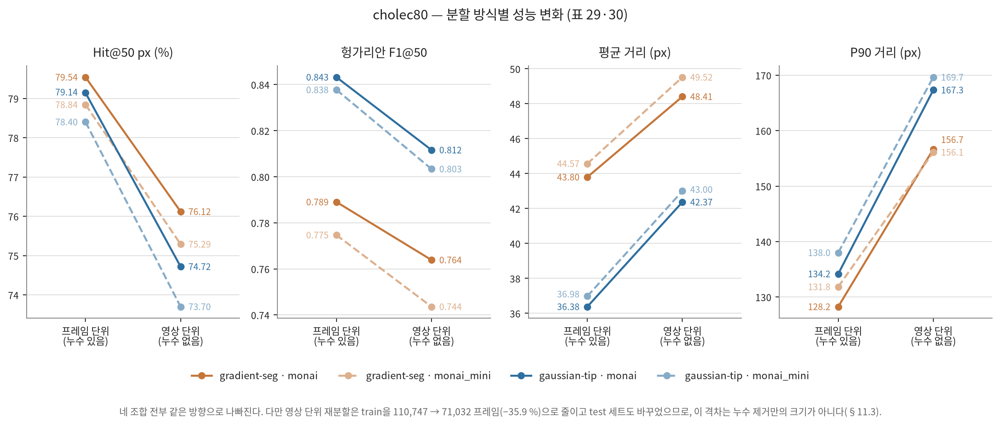

**그림 12. `cholec80`의 분할 방식별 성능 변화 (표 29·30).** 같은 프레임 집합·같은 어노테이션·같은 학습 설정에서 프레임 단위 분할(누수 있음)과 영상 단위 분할(누수 없음)로 각각 학습·평가한 결과를 이은 것이다. 네 조합 × 네 지표, 열여섯 개 선이 예외 없이 같은 방향(성능 악화)으로 기운다. 다만 영상 단위 재분할은 train 프레임을 35.9 % 줄이고 test 세트 구성도 바꾸었으므로, 이 기울기를 시간적 누수만의 크기로 읽어서는 안 된다(§11.3).

**네 조합 전부, 모든 지표에서 성능이 나빠졌다.** 방향이 예외 없이 일치하므로 이 격차는 우연이 아니다. 크기를 정리하면:

- **강건성 (Hit@50 px): −3.4 ~ −4.7 %p.** 가장 안정적으로 측정되는 지표이며, 격차가 가장 일관된다.
- **일대일 F1@50: −0.025 ~ −0.034.** 과소 탐지를 거리 오차로 숨기지 않는 지표에서도 같은 크기의 하락이 확인된다.
- **꼬리 (P90): +24 ~ +33 px.** 상대적 증가율로는 18–25 %다. 처음 보는 영상에서 큰 오차가 눈에 띄게 늘어난다.
- **탐지 실패율: +0.8 ~ +2.3 %p**, `gaussian-tip`에서 더 크다. 좁은 초과-임계 영역이 도메인 변화에 취약하다는 §6.3의 기계적 설명과 일치한다.
- **Hit@10 px: −6.5 ~ +0.5 %p로 일관성이 낮다.** 세 조합에서 5.8–6.5 %p 떨어지지만 `gradient-seg`/`monai`에서는 오히려 0.49 %p 올랐다. 10 px 이내 정밀도는 계통 편차(§6.3.1)와 라벨 노이즈에 민감해 분할 방식보다 다른 요인에 좌우되는 것으로 보인다.

**세 가지 해석상의 제약을 반드시 함께 읽어야 한다.**

1. **누수만의 효과가 아니다.** 영상 단위 분할은 train을 110,747 → 71,032 프레임(**−35.9 %**)으로 줄였다. 위 격차는 누수 제거와 학습 데이터 감소가 함께 만든 것이며, 두 성분은 분리되지 않았다. 누수만의 크기를 재려면 프레임 단위 분할에서 71,032 프레임만 뽑아 학습한 대조군이 필요하다(§9).
2. **test 세트가 다른 프레임 집합이다.** 36,930 → 98,234 프레임, 80편 → 40편이다. 따라서 표 29는 "같은 시험지의 점수 변화"가 아니라 "두 실험 설계의 결과 비교"다. 신 분할의 test가 2.7배 크므로 신 분할 쪽 수치의 통계적 안정성이 더 높다.
3. **val loss는 척도가 다르다.** best val loss가 `gradient-seg`에서 22–24 %, `gaussian-tip`에서 9–10 % 올랐지만, val 세트 자체가 바뀌었으므로 이 값을 성능 저하폭으로 읽을 수는 없다. 다만 `gradient-seg`의 상승폭이 `gaussian-tip`의 2배 이상이라는 **상대 관계**는 의미가 있다 — 도구 몸통 전체를 타겟으로 삼는 방식이 영상별 도구 외형·조명에 더 크게 의존한다는 뜻이다.

**결론.** 이 제약들을 감안하고도 한 가지는 분명하다. **프레임 단위 분할로 보고된 수치는 미지의 새 영상에 대한 성능보다 낙관적이며, 그 낙관의 크기는 Hit@50 px 3–5 %p·F1@50 0.03 수준이다.** 본 보고서의 `erop` 4개 조합이 여전히 이 조건에 있으므로, `erop` 수치를 임상 적용 근거로 인용할 때는 같은 크기의 하향 여지를 감안해야 한다.

한 가지 부수 효과도 기록해 둔다. 계통 편차(§6.3.1)는 **재분할·재학습 후에도 값이 그대로 재현되었다**((+4, −2) px / (0, 0) px). 학습 데이터와 test 세트가 모두 바뀌었는데도 편차가 유지된다는 사실은, 이것이 학습 실행의 우연이 아니라 타겟 생성 방식과 데이터셋에 결부된 구조적 성질임을 뒷받침한다.
