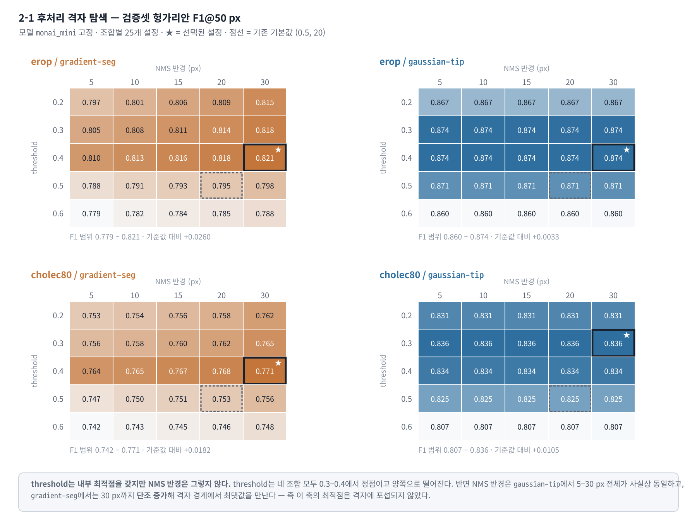
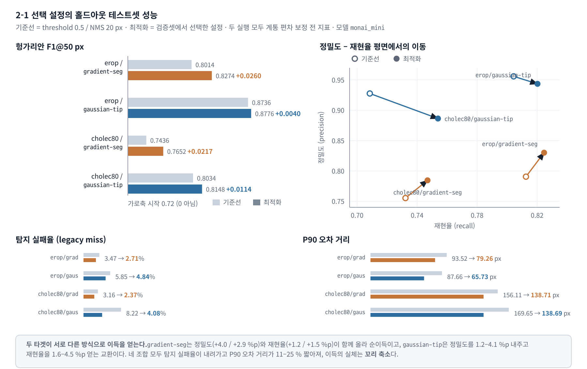
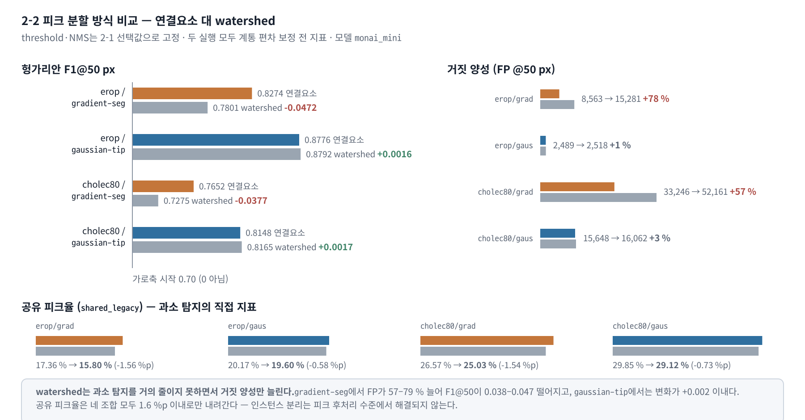

# 후처리 파라미터 최적화 (2단계) 실험 결과

- **실행 노트북:** [notebook/parameter-optimization.ipynb](../notebook/parameter-optimization.ipynb)
- **실행일:** 2026-08-20 (2-1·2-2), 선택 설정 test 재실행 2026-08-24
- **작성일:** 2026-08-24
- **대상 모델:** `monai_mini` (데이터셋 2종 × 타겟 방식 2종 = 4개 조합)

이 문서는 위 노트북의 실행 결과를 코드 없이 영구 기록한 것이다. 요약 수치는
[docs/final-report.md](final-report.md) §11.1에 인용되어 있고, 이 문서는 그 근거가 되는
전체 격자·전체 지표를 담는다.

## 1. 목적과 범위

1단계 보고서는 8개 조합 전부를 **공통 후처리 설정**(`threshold=0.5`, `NMS radius=20 px`)으로 평가했다.
이 설정은 근거 없이 고정된 값이었으므로, 조합별로 최적화하면 얼마나 좋아지는지, 그리고 그 이득이
**과소 탐지(공유 피크) 병목을 옮길 만한 크기인지**를 확인하는 것이 2단계의 목적이다.

두 개의 하위 실험으로 구성된다.

| 하위 실험 | 내용                                                         | 변수                             |
| --------- | ------------------------------------------------------------ | -------------------------------- |
| **2-1**   | val에서 `threshold` × `NMS radius` 격자 탐색 → test 1회 확인 | threshold, NMS 반경              |
| **2-2**   | 2-1 선택 설정을 고정하고 피크 분할 방식 비교                 | connected-components / watershed |

**대표 모델을 `monai_mini`로 고정한 이유.** 개선 계획의 완료 조건이 (데이터셋 × 타겟) 네 개의 최적점을
요구하고, 1단계 결론이 모델 크기 축의 효과가 작다(Hit@10 px 평균 1.6 %p)는 것이었기 때문이다.
`monai`의 후처리 최적화는 이 실험의 범위 밖이며, §5의 남은 과제로 남는다.

## 2. 실험 설계

**탐색 격자 (25개 설정)**

- `threshold ∈ {0.2, 0.3, 0.4, 0.5, 0.6}`
- `nms_radius ∈ {5, 10, 15, 20, 30} px`

**선택 기준.** 1단계에서 도입한 **헝가리안 일대일 배정 F1@50 px**를 최대화한다. 동률이면
recall → precision → 더 작은 threshold → 더 작은 NMS 반경 순으로 결정한다. 최근접 매칭 기반의
기존 지표(miss율·중앙값 거리)를 쓰지 않은 이유는, 그 지표가 과소 탐지를 miss가 아니라 거리 오차로
집계해 후처리 설정 비교에 부적합하기 때문이다.

**누수 방지.** 25개 설정 전체는 **val에서만** 평가하고, 조합당 선택된 **1개 설정만** held-out test에
적용한다. 2-2의 watershed 비교도 2-1의 val 선택값을 그대로 고정해 실행하며, 그 결과로
threshold·NMS를 다시 조정하지 않는다.

**비용 절감.** 모델 추론은 조합별 val에서 **한 번만** 수행하고, 같은 히트맵에 25개 후처리를 적용한다.
연결요소 극대점은 threshold별로 한 번만 계산하고 NMS만 반경별로 다시 적용하므로,
`ttd.peaks.find_peaks()`와 결과가 정확히 일치한다.

**실행 환경 및 데이터 규모**

| 항목           | 값                                                                   |
| -------------- | -------------------------------------------------------------------- |
| 프레임워크     | PyTorch 2.7.1+cu128, NVIDIA RTX A6000                                |
| 배치·워커      | `batch_size=16`, `num_workers=0`, 조합별 GPU 1장 (`cuda:0`–`cuda:3`) |
| 데이터 스냅숏  | `data/dataset-snapshot-2026-08-20.txt`                               |
| val 프레임     | `erop` 36,140 · `cholec80` 15,312                                    |
| test 프레임    | `erop` 36,142 (GT 팁 50,718) · `cholec80` 98,234 (GT 팁 161,969)     |
| 격자 탐색 시간 | 818 s · 888 s · 348 s · 308 s (합계 약 40분)                         |

**체크포인트 지문 (SHA-256 앞 16자리).** 재현 시 동일 가중치인지 확인하는 데 쓴다.

| 조합                      | `best.pt` SHA-256 (prefix) |
| ------------------------- | -------------------------- |
| `erop`/`gradient-seg`     | `33b2c2efac694413…`        |
| `erop`/`gaussian-tip`     | `da76dc254c387d64…`        |
| `cholec80`/`gradient-seg` | `c1e89aff50e94e68…`        |
| `cholec80`/`gaussian-tip` | `096a086a6ef443d6…`        |

`cholec80`은 영상 단위 분할(`video01–32` / `33–40` / `41–80`)로 재구축된 데이터셋을 사용했다.
따라서 val은 `video33–40`이고, 이전 프레임 단위 분할 시절에 기록된 선택값은 이 문서에 적용되지 않는다.

## 3. 2-1 결과 — threshold × NMS 격자 탐색

### 3.1 검증셋 격자 전체



**그림 1. 조합별 25개 설정의 검증셋 헝가리안 F1@50 px.** 굵은 테두리와 ★이 선택된 설정,
점선이 1단계 기본값 (0.5, 20)이다. 색은 조합 내부에서 정규화했으므로 패널 간 색을 비교하면 안 된다.

**표 1. `erop` / `gradient-seg` — val F1@50**

| threshold \ NMS |     5 |    10 |    15 |    20 |        30 |
| --------------- | ----: | ----: | ----: | ----: | --------: |
| 0.2             | .7969 | .8015 | .8057 | .8093 |     .8146 |
| 0.3             | .8050 | .8084 | .8114 | .8141 |     .8177 |
| **0.4**         | .8103 | .8134 | .8157 | .8177 | **.8212** |
| 0.5             | .7875 | .7912 | .7933 | .7952 |     .7981 |
| 0.6             | .7790 | .7820 | .7838 | .7853 |     .7882 |

**표 2. `erop` / `gaussian-tip` — val F1@50**

| threshold \ NMS |     5 |    10 |    15 |    20 |        30 |
| --------------- | ----: | ----: | ----: | ----: | --------: |
| 0.2             | .8668 | .8668 | .8669 | .8669 |     .8670 |
| 0.3             | .8742 | .8742 | .8742 | .8742 |     .8742 |
| **0.4**         | .8742 | .8742 | .8742 | .8742 | **.8742** |
| 0.5             | .8709 | .8710 | .8710 | .8710 |     .8710 |
| 0.6             | .8603 | .8603 | .8603 | .8603 |     .8604 |

**표 3. `cholec80` / `gradient-seg` — val F1@50**

| threshold \ NMS |     5 |    10 |    15 |    20 |        30 |
| --------------- | ----: | ----: | ----: | ----: | --------: |
| 0.2             | .7527 | .7541 | .7562 | .7582 |     .7621 |
| 0.3             | .7560 | .7576 | .7597 | .7616 |     .7652 |
| **0.4**         | .7644 | .7654 | .7668 | .7679 | **.7710** |
| 0.5             | .7472 | .7497 | .7513 | .7528 |     .7558 |
| 0.6             | .7421 | .7434 | .7446 | .7459 |     .7480 |

**표 4. `cholec80` / `gaussian-tip` — val F1@50**

| threshold \ NMS |     5 |    10 |    15 |    20 |        30 |
| --------------- | ----: | ----: | ----: | ----: | --------: |
| 0.2             | .8310 | .8310 | .8310 | .8311 |     .8312 |
| **0.3**         | .8360 | .8360 | .8360 | .8360 | **.8360** |
| 0.4             | .8337 | .8337 | .8337 | .8337 |     .8338 |
| 0.5             | .8254 | .8254 | .8254 | .8254 |     .8255 |
| 0.6             | .8067 | .8067 | .8067 | .8067 |     .8068 |

### 3.2 선택된 설정

**표 5. val 기반 선택 결과와 기본값 대비 이득**

| 데이터셋   | 타겟           | threshold | NMS 반경 | val precision | val recall | val F1@50 | 기본값(0.5/20) F1 |       차이 |
| ---------- | -------------- | --------: | -------: | ------------: | ---------: | --------: | ----------------: | ---------: |
| `erop`     | `gradient-seg` |       0.4 |    30 px |         .8206 |      .8218 | **.8212** |             .7952 | **+.0260** |
| `erop`     | `gaussian-tip` |       0.4 |    30 px |         .9400 |      .8171 | **.8742** |             .8710 | **+.0033** |
| `cholec80` | `gradient-seg` |       0.4 |    30 px |         .7788 |      .7633 | **.7710** |             .7528 | **+.0182** |
| `cholec80` | `gaussian-tip` |       0.3 |    30 px |         .8907 |      .7876 | **.8360** |             .8254 | **+.0105** |

### 3.3 두 축의 성질이 다르다

**threshold는 내부 최적점을 갖는다.** 네 조합 모두 0.3–0.4에서 정점이고 양쪽으로 떨어진다.
특히 `gradient-seg`에서는 0.4 → 0.5 구간의 낙차가 크다(`erop` −.0231, `cholec80` −.0152).
1단계가 기본값으로 쓴 0.5는 이 낙차의 아래쪽에 있었다.

**NMS 반경은 그렇지 않다.** 성질이 타겟 방식에 따라 갈린다.

- `gaussian-tip`에서는 5 px부터 30 px까지 F1이 사실상 동일하다. `erop`의 경우 0.4행 전체가
  .874219–.874225로, 차이가 10⁻⁵ 수준이다. 가우시안 타겟이 만드는 초과-임계 영역은 팁 중심
  반경 17.7 px 이하의 좁은 원판이라 도구당 연결요소가 하나뿐이고, NMS가 억제할 중복 후보 자체가
  거의 생기지 않기 때문이다.
- `gradient-seg`에서는 5 → 30 px로 갈수록 **단조 증가**한다. 도구 몸통을 따라 값이 선형 감소하는
  넓은 영역이 임계값을 넘으므로 한 도구에서 여러 연결요소 극대점이 만들어지고, 반경이 커질수록
  이 중복이 제거된다.

**따라서 네 조합 모두 NMS 30 px가 선택된 것은 격자 경계에서 최댓값을 만난 결과이며, 이 축의 최적점은
탐색 범위에 포섭되지 않았다.** 40 px·50 px로 격자를 확장하지 않은 채 "30 px가 최적"이라고 읽으면 안 된다.

## 4. 2-1 결과 — 홀드아웃 테스트셋 확인

각 조합의 선택 설정 **1개만** test에 적용했다.



**그림 2. 선택 설정의 홀드아웃 테스트셋 성능.** 기준선은 1단계의 공통 설정(0.5 / 20 px)이다.
좌상단 막대는 F1@50 px, 우상단은 같은 변화를 정밀도–재현율 평면에서 본 것(빈 원 = 기준선,
채운 원 = 최적화), 하단은 탐지 실패율과 P90 오차 거리다.

**표 6. 헝가리안 지표 (@50 px 상한)**

| 조합                      | 설정 (기준선 → 선택) | F1@50 기준선 | F1@50 선택 |   차이 | precision     | recall        |
| ------------------------- | -------------------- | -----------: | ---------: | -----: | ------------- | ------------- |
| `erop`/`gradient-seg`     | 0.5/20 → **0.4/30**  |        .8014 |  **.8274** | +.0260 | .7905 → .8301 | .8126 → .8247 |
| `erop`/`gaussian-tip`     | 0.5/20 → **0.4/30**  |        .8736 |  **.8776** | +.0040 | .9559 → .9435 | .8043 → .8202 |
| `cholec80`/`gradient-seg` | 0.5/20 → **0.4/30**  |        .7436 |  **.7652** | +.0217 | .7552 → .7844 | .7323 → .7470 |
| `cholec80`/`gaussian-tip` | 0.5/20 → **0.3/30**  |        .8034 |  **.8148** | +.0114 | .9276 → .8864 | .7085 → .7539 |

**표 7. 최근접 매칭 기반 지표 (기준선 → 선택)**

| 조합                      | Miss율        | Hit@10 px       | Hit@50 px       | Median           | Mean             | P90                |
| ------------------------- | ------------- | --------------- | --------------- | ---------------- | ---------------- | ------------------ |
| `erop`/`gradient-seg`     | 3.47 → 2.71 % | 40.99 → 41.22 % | 82.48 → 83.79 % | 11.40 → 11.40 px | 35.78 → 33.71 px | 93.52 → 79.26 px   |
| `erop`/`gaussian-tip`     | 5.85 → 4.84 % | 73.44 → 74.31 % | 82.41 → 84.37 % | 3.16 → 3.16 px   | 28.58 → 26.14 px | 87.66 → 65.73 px   |
| `cholec80`/`gradient-seg` | 3.16 → 2.37 % | 25.10 → 25.47 % | 75.29 → 76.90 % | 18.36 → 18.11 px | 49.52 → 47.15 px | 156.11 → 138.71 px |
| `cholec80`/`gaussian-tip` | 8.22 → 4.08 % | 58.22 → 60.69 % | 73.70 → 78.88 % | 5.66 → 5.83 px   | 43.00 → 38.62 px | 169.65 → 138.69 px |

### 4.1 세 가지 관찰

**(1) val에서 고른 이득이 test에서 거의 그대로 재현된다.** val 이득이 +.0260 / +.0033 / +.0182 / +.0105였고
test 이득은 +.0260 / +.0040 / +.0217 / +.0114다. 네 조합 모두 부호가 같고 크기도 ±.0035 이내로 일치한다.
격자 탐색이 val 잡음에 과적합되지 않았다는 뜻이다.

**(2) 이득의 실체는 정밀도가 아니라 꼬리 축소다.** 중앙값 오차는 거의 움직이지 않았고
(`erop` 두 조합은 소수점까지 동일, `cholec80`/`gaussian-tip`은 5.66 → 5.83 px로 오히려 나빠졌다),
반면 P90 오차 거리는 네 조합 모두 11–25 % 짧아졌고 탐지 실패율도 전부 내려갔다.
threshold·NMS 조정은 **잘 맞히던 팁을 더 잘 맞히게 하는 것이 아니라, 크게 틀리던 팁의 수를 줄인다.**

**(3) 두 타겟이 서로 다른 방식으로 이득을 얻는다.**
`gradient-seg`는 정밀도(+4.0 / +2.9 %p)와 재현율(+1.2 / +1.5 %p)이 함께 올라 순이득이다.
`gaussian-tip`은 정밀도를 1.2–4.1 %p 내주고 재현율을 1.6–4.5 %p 얻는 **교환**이며,
F1 이득이 작은(+.0040 / +.0114) 이유가 여기 있다. threshold를 낮춰 가우시안 응답의 옆구리까지
후보로 승격시킨 결과다.

### 4.2 계통 편차 보정과의 관계

노트북은 선택 설정 test를 `--apply-bias`와 함께 실행했다. `scripts/eval-model.py`는 이 옵션이 주어지면
보정 지표를 `summary.json`의 **`bias_correction.corrected` 하위 블록에 따로** 기록하고, 최상위 지표는
보정 전 값을 그대로 유지한다. 위 표 6·표 7의 값은 기준선·선택 설정 **양쪽 모두 최상위(보정 전) 지표**이므로,
표시된 차이는 **threshold·NMS 변경만의 효과**다.

`cholec80` 영상 단위 val에서 `monai_mini` 두 타겟의 편차를 새로 추정한 결과와, 선택 설정에서 이를 적용했을 때의
변화는 다음과 같다.

**표 8. 계통 편차 추정값과 보정 효과 (선택 설정 기준)**

| 조합                      | dx, dy (px) | 추정 매칭 수 | Median 보정 전 → 후 | Hit@10 px 보정 전 → 후 | F1@50 보정 전 → 후 |
| ------------------------- | ----------- | -----------: | ------------------- | ---------------------- | ------------------ |
| `erop`/`gradient-seg`     | +4.0, +2.0  |       34,492 | 11.40 → 11.05 px    | 41.22 → 44.24 %        | .8274 → .8288      |
| `erop`/`gaussian-tip`     | 0.0, 0.0    |       39,614 | 3.16 → 3.16 px      | 74.31 → 74.31 %        | .8776 → .8776      |
| `cholec80`/`gradient-seg` | +4.0, −3.0  |       12,872 | 18.11 → 17.09 px    | 25.47 → 25.04 %        | .7652 → .7680      |
| `cholec80`/`gaussian-tip` | 0.0, 0.0    |       17,731 | 5.83 → 5.83 px      | 60.69 → 60.69 %        | .8148 → .8148      |

편차는 `gradient-seg` 두 조합에만 존재하고 `gaussian-tip`은 (0, 0)으로 추정되어 보정이 항등변환이 된다.
보정의 효과도 F1@50 기준 +.0014 / +.0028로 후처리 설정 이득보다 한 자릿수 작다.
편차 추정은 항상 1단계 `bias.json`이 만들어진 설정(0.5 / 20 px)에서 수행해 조건을 고정했다.

## 5. 2-2 결과 — 피크 분할 방식 비교

2-1의 선택 설정으로도 test의 공유 피크율(`shared_legacy`)이 17.36–29.85 %로 남았다. 즉 GT 팁의
1/5~1/3이 같은 프레임의 다른 GT 팁과 예측 피크를 공유하고 있으며, 이는 모델이 프레임 내 도구 수보다
적은 피크를 만든다는 뜻이다. 하나의 연결요소를 여러 인스턴스로 쪼개는 watershed가 이 문제를
후처리 수준에서 해결할 수 있는지 확인했다. threshold·NMS는 2-1 선택값으로 고정했다.



**그림 3. 피크 분할 방식 비교.** 왼쪽은 헝가리안 F1@50 px, 오른쪽은 같은 상한에서의 거짓 양성 수,
아래는 공유 피크율이다. 두 실행 모두 계통 편차 보정 전 지표이므로 방식만의 비교다.

**표 9. `connected-components` → `watershed`**

| 조합                      | 설정   | F1@50             |       차이 | FP @50 px       |  증가 | Hit@50 px       | 공유 피크율     |
| ------------------------- | ------ | ----------------- | ---------: | --------------- | ----: | --------------- | --------------- |
| `erop`/`gradient-seg`     | 0.4/30 | .8274 → **.7801** | **−.0472** | 8,563 → 15,281  | +78 % | 83.79 → 84.44 % | 17.36 → 15.80 % |
| `erop`/`gaussian-tip`     | 0.4/30 | .8776 → .8792     |     +.0016 | 2,489 → 2,518   |  +1 % | 84.37 → 84.41 % | 20.17 → 19.60 % |
| `cholec80`/`gradient-seg` | 0.4/30 | .7652 → **.7275** | **−.0377** | 33,246 → 52,161 | +57 % | 76.90 → 77.57 % | 26.57 → 25.03 % |
| `cholec80`/`gaussian-tip` | 0.3/30 | .8148 → .8165     |     +.0017 | 15,648 → 16,062 |  +3 % | 78.88 → 79.13 % | 29.85 → 29.12 % |

탐지 실패율은 네 조합 모두 두 방식이 동일하다(2.71 / 4.84 / 2.37 / 4.08 %). 임계값이 같으면
"후보가 하나도 없는 프레임"의 집합도 같기 때문이다. 분할 방식은 후보의 **개수**만 바꾼다.

**결론: watershed는 채택하지 않는다.**

- **`gradient-seg`에서는 명백히 해롭다.** 넓은 그래디언트 덩어리를 잘게 쪼개면서 거짓 양성이 57–78 % 늘고,
  재현율이 조금 오르는 것(+0.75 / +0.88 %p)으로는 이를 상쇄하지 못해 F1@50이 0.038–0.047 떨어진다.
- **`gaussian-tip`에서는 무의미하다.** 가우시안 응답은 이미 도구당 하나의 조밀한 덩어리라 쪼갤 것이
  거의 없고, 변화는 +0.002 이내다.
- **무엇보다 목표를 달성하지 못한다.** 도입 이유였던 공유 피크율이 네 조합 모두 **1.6 %p 이내로만**
  내려간다(17.36 → 15.80, 20.17 → 19.60, 26.57 → 25.03, 29.85 → 29.12 %).
  과소 탐지의 대부분은 "하나의 응답 덩어리 안에 두 도구가 들어 있는" 형태가 아니라, **애초에 두 번째 도구에
  대한 응답이 생성되지 않은** 형태다. 이는 피크 분할 알고리즘이 닿을 수 있는 문제가 아니다.

기본값은 `connected-components`를 유지한다.

## 6. 종합 및 남은 과제

**후처리 최적화로 얻을 수 있는 것의 상한이 측정되었다.** 조합별로 최적 설정을 찾아도 헝가리안 F1@50
개선폭은 **+0.004 ~ +0.026**이고, 그 이득은 정밀도가 아니라 오차 분포의 꼬리에서 나온다.
공유 피크율은 15.8–29.9 % 수준에서 거의 움직이지 않는다. **2단계는 병목을 옮기지 못했다** —
이 결론이 3·4단계에서 "남은 과제는 후처리가 아니라 인스턴스를 명시적으로 예측하는 모델 구조"라는
판단의 근거가 되었다.

**남은 과제**

| 항목               | 내용                                                                                                      |
| ------------------ | --------------------------------------------------------------------------------------------------------- |
| NMS 반경 격자 확장 | 네 조합 모두 경계값 30 px가 선택되었다. 40·50 px를 포함해 최적점을 실제로 포섭해야 한다.                  |
| `monai` 모델 타입  | 이 실험은 `monai_mini` 4개 조합만 다뤘다. 8개 조합 표준 결과는 여전히 공통 설정(0.5 / 20 px)이다.         |
| 기준선의 조건 통일 | 표 6·7의 기준선은 1단계 실행 결과를 그대로 인용한 것이다. 동일 실행에서 두 설정을 재평가하면 더 깨끗하다. |
| `--gaussian-sigma` | 전 실험이 σ = 15 px 고정이다. 타겟 폭 자체는 탐색되지 않았다.                                             |
| 헝가리안 배정 상한 | 선택 기준을 50 px 상한 F1에 고정했다. 상한을 바꾸면 선택값이 달라질 수 있다.                              |

## 7. 산출물과 재현

노트북은 결과를 1단계 기준선(`data/results/<dataset>/<target-mode>/<model-type>/`)과 분리된 경로에 저장한다.

| 경로                                                                | 내용                                                  |
| ------------------------------------------------------------------- | ----------------------------------------------------- |
| `data/results/phase2/val-grid/<dataset>/<target>/monai_mini.json`   | 25개 설정의 val 지표 전체, 선택 규칙, 체크포인트 해시 |
| `data/results/phase2/test/<dataset>/<target>/monai_mini/`           | 선택 설정의 test `summary.json` · `per_tip.csv`       |
| `data/results/phase2/watershed-test/<dataset>/<target>/monai_mini/` | 2-2 watershed 실행 결과                               |

`data/`는 버전 관리 대상이 아니므로, 위 파일이 없으면 노트북을 다시 실행해 재생성한다.
학습된 체크포인트나 1단계 평가 결과를 덮어쓰지 않으며, val 격자 JSON만 갱신된다.
개별 설정을 CLI로 단독 재현하려면 다음과 같이 실행한다. 이때 `--results-dir`를 반드시 지정한다 —
생략하면 결과가 1단계 기준선 디렉터리에 그대로 덮어써진다.

```bash
# 선택 설정의 test 재평가 (예: erop / gradient-seg)
run eval-model --dataset erop --target-mode gradient-seg --model-type monai_mini \
    --threshold 0.4 --nms-radius 30 \
    --results-dir data/results/phase2/test/erop/gradient-seg/monai_mini

# 2-2 watershed 비교
run eval-model --dataset erop --target-mode gradient-seg --model-type monai_mini \
    --threshold 0.4 --nms-radius 30 --peak-method watershed \
    --results-dir data/results/phase2/watershed-test/erop/gradient-seg/monai_mini
```

## 관련 문서

| 문서                                          | 관계                                          |
| --------------------------------------------- | --------------------------------------------- |
| [docs/final-report.md](final-report.md)       | §11.1이 이 실험의 요약, §6.7이 공유 피크 분석 |
| [docs/eval-guide.md](eval-guide.md)           | 피크 탐지 알고리즘·헝가리안 지표 정의         |
| [docs/results-summary.md](results-summary.md) | 1단계 공통 설정(0.5 / 20 px) 기준 전체 수치   |
