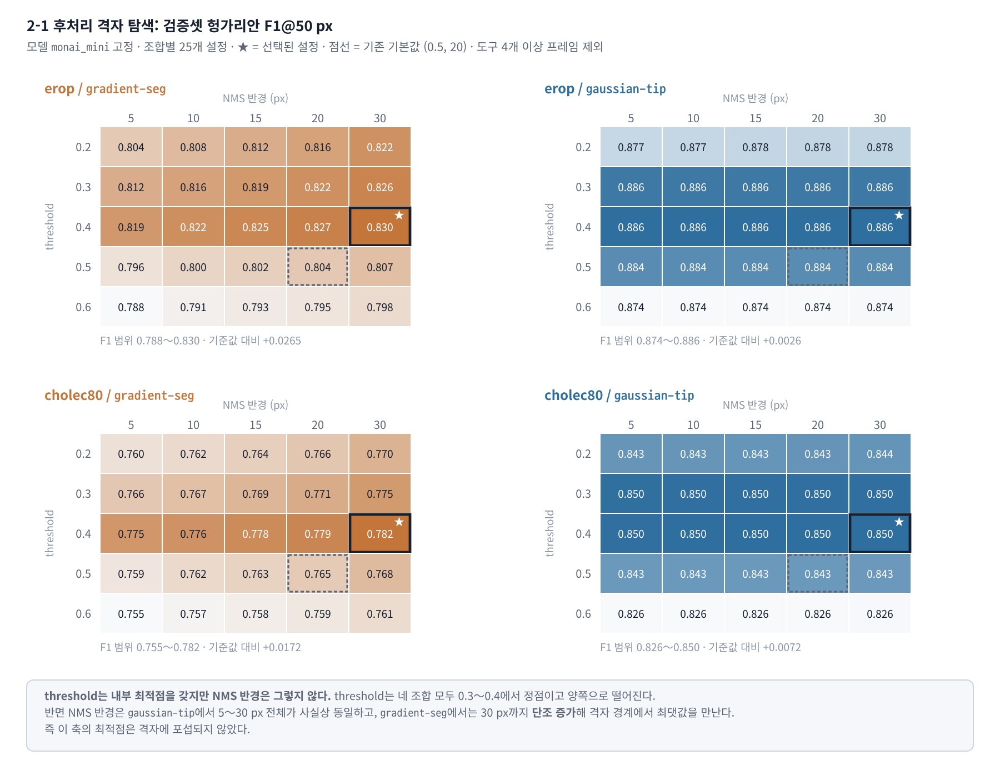
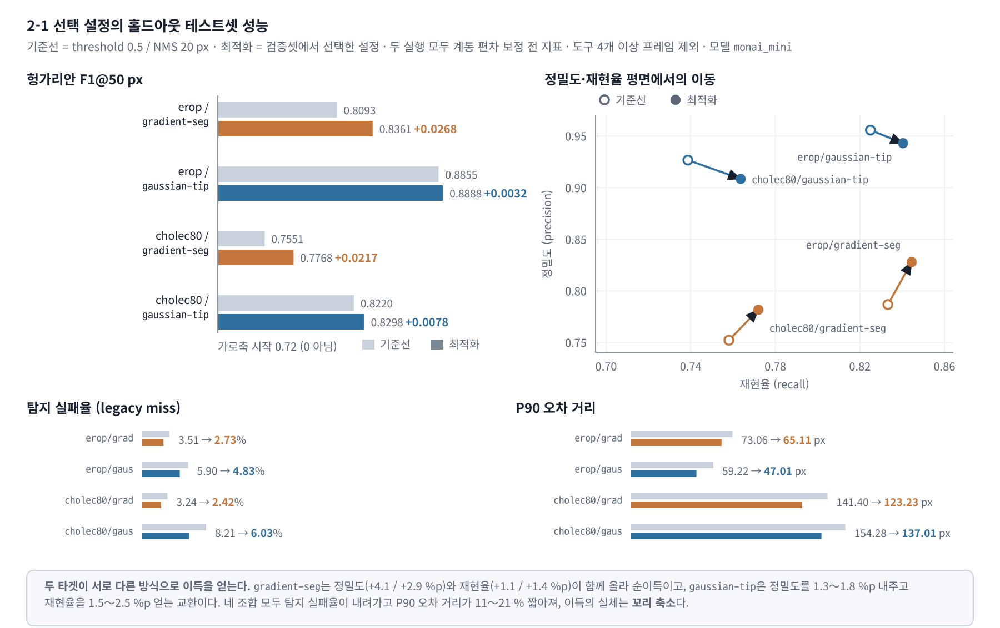
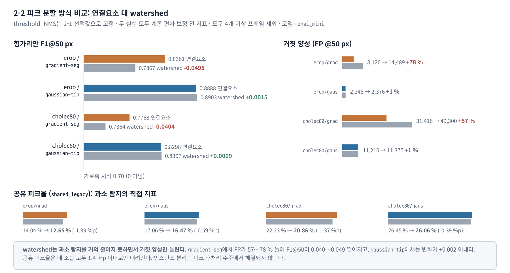

# 후처리 파라미터 최적화 (2단계) 실험 결과

- **실행 노트북:** [notebook/parameter-optimization.ipynb](../notebook/parameter-optimization.ipynb)
- **실행일:** 2026-08-20 최초 실행, 2026-10-06 재실행 (도구 4개 이상 레이블링 프레임 제외)
- **작성일:** 2026-10-08
- **대상 모델:** `monai_mini` (데이터셋 2종 × 타겟 방식 2종 = 4개 조합)

이 문서는 위 노트북의 실행 결과를 코드 없이 영구 기록한 것이다. 요약 수치는
[docs/final-report.md](final-report.md) §11.1에 인용되어 있고, 이 문서는 그 근거가 되는
전체 격자·전체 지표를 담는다. 모든 수치는 2026-10-06 재실행 결과다.

## 0. 2026-10-06 재실행에서 바뀐 것

내시경 시야에 수술도구가 4개 이상 동시에 들어오는 경우는 사실상 없고, 그렇게 레이블링된 프레임은
대부분 반자동 라벨링의 오검출이다. 최종 보고서 4.0판은 이 프레임을 평가에서 제외하기로 했고
([final-report.md](final-report.md) §2.7), 이 실험도 같은 규칙으로 처음부터 다시 실행했다.
제외는 val 격자 탐색, val 편차 추정, test 확인, watershed 비교에 모두 적용된다(노트북의
`MAX_TOOLS = 3`, `eval-model.py --max-tools 3`). 이전 실행(2026-08-20) 대비 달라진 점은 세 가지다.

1. **`cholec80`/`gaussian-tip`의 선택값이 threshold 0.3에서 0.4로 바뀌었다.** 이전 실행에서는
   0.3이 0.4보다 val F1@50이 0.0023 높았지만, 이번에는 두 행의 차이가 0.0001 미만으로 사실상 같아졌고
   선택 규칙에 따라 F1이 근소하게 높은 0.4가 선택되었다(§3.2). 이제 네 조합 모두 0.4 / 30 px다.
2. **watershed 비교의 편차 조건을 맞췄다.** 이전 실행의 watershed는 `--apply-bias` 없이 실행되었다.
   이번에는 연결요소 방식과 같이 `--apply-bias`로 실행해, 원본 지표와 보정 지표 어느 쪽으로 비교해도
   두 방식의 편차 조건이 같다(§5).
3. **수치가 전반적으로 달라졌다.** 평가 프레임이 바뀌었으므로 이전 실행의 수치와 이 문서의 수치를
   직접 비교해서는 안 된다. 결론(threshold는 0.3〜0.4가 최적, NMS는 격자 경계 30 px, 이득은 꼬리 축소,
   watershed 비채택)은 그대로다.

## 1. 목적과 범위

1단계 보고서는 8개 조합 전부를 **공통 후처리 설정**(`threshold=0.5`, `NMS radius=20 px`)으로 평가했다.
이 설정은 근거 없이 고정된 값이었으므로, 조합별로 최적화하면 얼마나 좋아지는지, 그리고 그 이득이
**과소 탐지(공유 피크) 병목을 옮길 만한 크기인지**를 확인하는 것이 2단계의 목적이다.

두 개의 하위 실험으로 구성된다.

| 하위 실험 | 내용                                                         | 변수                             |
| --------- | ------------------------------------------------------------ | -------------------------------- |
| **2-1**   | val에서 `threshold` × `NMS radius` 격자 탐색 → test 1회 확인 | threshold, NMS 반경              |
| **2-2**   | 2-1 선택 설정을 고정하고 피크 분할 방식 비교                 | connected-components / watershed |

**대표 모델을 `monai_mini`로 고정한 이유.** 개선 계획의 완료 조건이 (데이터셋 × 타겟) 네 개의 최적점을
요구하고, 1단계 결론이 모델 크기 축의 효과가 작다(Hit@10 px 평균 1.6 %p)는 것이었기 때문이다.
`monai`의 후처리 최적화는 이 실험의 범위 밖이며, §6의 남은 과제로 남는다.

## 2. 실험 설계

**탐색 격자 (25개 설정)**

- `threshold ∈ {0.2, 0.3, 0.4, 0.5, 0.6}`
- `nms_radius ∈ {5, 10, 15, 20, 30} px`

**선택 기준.** 1단계에서 도입한 **헝가리안 일대일 배정 F1@50 px**를 최대화한다. 동률이면
recall → precision → 더 작은 threshold → 더 작은 NMS 반경 순으로 결정한다. 최근접 매칭 기반의
기존 지표(miss율·중앙값 거리)를 쓰지 않은 이유는, 그 지표가 과소 탐지를 miss가 아니라 거리 오차로
집계해 후처리 설정 비교에 부적합하기 때문이다.

**누수 방지.** 25개 설정 전체는 **val에서만** 평가하고, 조합당 선택된 **1개 설정만** held-out test에
적용한다. 2-2의 watershed 비교도 2-1의 val 선택값을 그대로 고정해 실행하며, 그 결과로
threshold·NMS를 다시 조정하지 않는다.

**평가 대상 프레임.** val과 test 모두 도구가 4개 이상 레이블링된 프레임을 제외한다(§0). val 격자 탐색은
도구 없는 프레임도 포함해 그 프레임에서 나온 피크를 거짓 양성으로 센다. test 확인은 `eval-model.py`의
규칙대로 도구 1〜3개 프레임만 평가한다.

**비용 절감.** 모델 추론은 조합별 val에서 **한 번만** 수행하고, 같은 히트맵에 25개 후처리를 적용한다.
연결요소 극대점은 threshold별로 한 번만 계산하고 NMS만 반경별로 다시 적용하므로,
`ttd.peaks.find_peaks()`와 결과가 정확히 일치한다.

**실행 환경 및 데이터 규모**

| 항목           | 값                                                                                           |
| -------------- | -------------------------------------------------------------------------------------------- |
| 프레임워크     | PyTorch 2.7.1+cu128, NVIDIA RTX A6000                                                        |
| 배치·워커      | `batch_size=16`, `num_workers=0`, 조합별 GPU 1장 (`cuda:1`〜`cuda:3`, `cuda:0`은 쓰지 않음)  |
| 데이터 스냅숏  | `data/dataset-snapshot-2026-08-20.txt`                                                       |
| val 프레임     | `erop` 34,994 (36,140 중 1,146 제외) · `cholec80` 14,822 (15,312 중 490 제외)               |
| test 프레임    | `erop` 27,462 (GT 팁 46,275) · `cholec80` 85,849 (GT 팁 145,705), 도구 1〜3개 프레임        |
| 격자 탐색 시간 | 751 s · 669 s · 338 s · 295 s (합계 약 34분)                                                 |

**체크포인트 지문 (SHA-256 앞 16자리).** 재현 시 동일 가중치인지 확인하는 데 쓴다. 이전 실행과 같은
체크포인트다.

| 조합                      | `best.pt` SHA-256 (prefix) |
| ------------------------- | -------------------------- |
| `erop`/`gradient-seg`     | `33b2c2efac694413…`        |
| `erop`/`gaussian-tip`     | `da76dc254c387d64…`        |
| `cholec80`/`gradient-seg` | `c1e89aff50e94e68…`        |
| `cholec80`/`gaussian-tip` | `096a086a6ef443d6…`        |

`cholec80`은 영상 단위 분할(`video01〜32` / `33〜40` / `41〜80`)로 재구축된 데이터셋을 사용했다.
따라서 val은 `video33〜40`이고, 이전 프레임 단위 분할 시절에 기록된 선택값은 이 문서에 적용되지 않는다.

## 3. 2-1 결과: threshold × NMS 격자 탐색

### 3.1 검증셋 격자 전체



**그림 1. 조합별 25개 설정의 검증셋 헝가리안 F1@50 px.** 굵은 테두리와 ★이 선택된 설정,
점선이 1단계 기본값 (0.5, 20)이다. 색은 조합 내부에서 정규화했으므로 패널 간 색을 비교하면 안 된다.

**표 1. `erop` / `gradient-seg`: val F1@50**

| threshold \ NMS |     5 |    10 |    15 |    20 |        30 |
| --------------- | ----: | ----: | ----: | ----: | --------: |
| 0.2             | .8035 | .8082 | .8124 | .8161 |     .8216 |
| 0.3             | .8125 | .8159 | .8190 | .8217 |     .8256 |
| **0.4**         | .8191 | .8222 | .8246 | .8266 | **.8302** |
| 0.5             | .7957 | .7996 | .8017 | .8037 |     .8068 |
| 0.6             | .7880 | .7911 | .7930 | .7946 |     .7978 |

**표 2. `erop` / `gaussian-tip`: val F1@50**

| threshold \ NMS |     5 |    10 |    15 |    20 |        30 |
| --------------- | ----: | ----: | ----: | ----: | --------: |
| 0.2             | .8774 | .8774 | .8775 | .8775 |     .8776 |
| 0.3             | .8856 | .8856 | .8856 | .8856 |     .8856 |
| **0.4**         | .8865 | .8865 | .8865 | .8865 | **.8865** |
| 0.5             | .8839 | .8839 | .8839 | .8839 |     .8840 |
| 0.6             | .8744 | .8744 | .8744 | .8744 |     .8745 |

**표 3. `cholec80` / `gradient-seg`: val F1@50**

| threshold \ NMS |     5 |    10 |    15 |    20 |        30 |
| --------------- | ----: | ----: | ----: | ----: | --------: |
| 0.2             | .7605 | .7618 | .7639 | .7658 |     .7699 |
| 0.3             | .7655 | .7671 | .7692 | .7711 |     .7748 |
| **0.4**         | .7754 | .7763 | .7777 | .7788 | **.7822** |
| 0.5             | .7594 | .7619 | .7634 | .7649 |     .7683 |
| 0.6             | .7554 | .7566 | .7579 | .7590 |     .7613 |

**표 4. `cholec80` / `gaussian-tip`: val F1@50**

| threshold \ NMS |     5 |    10 |    15 |    20 |        30 |
| --------------- | ----: | ----: | ----: | ----: | --------: |
| 0.2             | .8433 | .8434 | .8434 | .8435 |     .8435 |
| 0.3             | .8498 | .8498 | .8498 | .8498 |     .8499 |
| **0.4**         | .8498 | .8499 | .8499 | .8499 | **.8499** |
| 0.5             | .8427 | .8427 | .8427 | .8427 |     .8428 |
| 0.6             | .8260 | .8260 | .8260 | .8260 |     .8261 |

### 3.2 선택된 설정

**표 5. val 기반 선택 결과와 기본값 대비 이득**

| 데이터셋   | 타겟           | threshold | NMS 반경 | val precision | val recall | val F1@50 | 기본값(0.5/20) F1 |       차이 |
| ---------- | -------------- | --------: | -------: | ------------: | ---------: | --------: | ----------------: | ---------: |
| `erop`     | `gradient-seg` |       0.4 |    30 px |         .8171 |      .8437 | **.8302** |             .8037 | **+.0265** |
| `erop`     | `gaussian-tip` |       0.4 |    30 px |         .9386 |      .8398 | **.8865** |             .8839 | **+.0026** |
| `cholec80` | `gradient-seg` |       0.4 |    30 px |         .7779 |      .7865 | **.7822** |             .7649 | **+.0172** |
| `cholec80` | `gaussian-tip` |       0.4 |    30 px |         .9107 |      .7968 | **.8499** |             .8427 | **+.0072** |

**`cholec80`/`gaussian-tip`의 0.3과 0.4는 사실상 동률이다.** NMS 30 px에서 0.3행은 .849854, 0.4행은
.849919로 차이가 0.00007이고, 다른 반경에서도 0.4행이 0.00003〜0.00005 높을 뿐이다. 이전 실행에서는
0.3이 .8360으로 0.4(.8337)보다 0.0023 높아 0.3이 선택되었다. 도구 4개 이상 프레임을 빼자 0.3의 우위가
사라진 것이다. 가짜 인스턴스가 많은 프레임에서는 임계값을 낮춰 피크를 많이 만들수록 recall이 올라가므로,
그 프레임들이 선택을 낮은 임계값 쪽으로 끌어당기고 있었던 것으로 보인다. 다만 지금의 0.4 선택은
규칙상의 근소한 차이로 정해진 것이므로, 0.3과 0.4 중 어느 쪽이 낫다고 읽어서는 안 된다.

### 3.3 두 축의 성질이 다르다

**threshold는 내부 최적점을 갖는다.** 네 조합 모두 0.3〜0.4에서 정점이고 양쪽으로 떨어진다.
특히 `gradient-seg`에서는 0.4 → 0.5 구간의 낙차가 크다(NMS 30 px 기준 `erop` −.0234, `cholec80` −.0139).
1단계가 기본값으로 쓴 0.5는 이 낙차의 아래쪽에 있었다.

**NMS 반경은 그렇지 않다.** 성질이 타겟 방식에 따라 갈린다.

- `gaussian-tip`에서는 5 px부터 30 px까지 F1이 사실상 동일하다. `erop`의 경우 0.4행 전체가
  .886489〜.886497로, 차이가 10⁻⁵ 수준이다. 가우시안 타겟이 만드는 초과-임계 영역은 팁 중심
  반경 17.7 px 이하의 좁은 원판이라 도구당 연결요소가 하나뿐이고, NMS가 억제할 중복 후보 자체가
  거의 생기지 않기 때문이다.
- `gradient-seg`에서는 5 → 30 px로 갈수록 **단조 증가**한다. 도구 몸통을 따라 값이 선형 감소하는
  넓은 영역이 임계값을 넘으므로 한 도구에서 여러 연결요소 극대점이 만들어지고, 반경이 커질수록
  이 중복이 제거된다.

**따라서 네 조합 모두 NMS 30 px가 선택된 것은 격자 경계에서 최댓값을 만난 결과이며, 이 축의 최적점은
탐색 범위에 포섭되지 않았다.** 40 px·50 px로 격자를 확장하지 않은 채 "30 px가 최적"이라고 읽으면 안 된다.

## 4. 2-1 결과: 홀드아웃 테스트셋 확인

각 조합의 선택 설정 **1개만** test에 적용했다.



**그림 2. 선택 설정의 홀드아웃 테스트셋 성능.** 기준선은 1단계의 공통 설정(0.5 / 20 px)이다.
좌상단 막대는 F1@50 px, 우상단은 같은 변화를 정밀도·재현율 평면에서 본 것(빈 원 = 기준선,
채운 원 = 최적화), 하단은 탐지 실패율과 P90 오차 거리다.

**표 6. 헝가리안 지표 (@50 px 상한, 계통 편차 보정 전)**

| 조합                      | 설정 (기준선 → 선택) | F1@50 기준선 | F1@50 선택 |   차이 | precision     | recall        |
| ------------------------- | -------------------- | -----------: | ---------: | -----: | ------------- | ------------- |
| `erop`/`gradient-seg`     | 0.5/20 → **0.4/30**  |        .8093 |  **.8361** | +.0268 | .7868 → .8280 | .8333 → .8445 |
| `erop`/`gaussian-tip`     | 0.5/20 → **0.4/30**  |        .8855 |  **.8888** | +.0033 | .9557 → .9431 | .8250 → .8404 |
| `cholec80`/`gradient-seg` | 0.5/20 → **0.4/30**  |        .7551 |  **.7768** | +.0217 | .7522 → .7817 | .7581 → .7720 |
| `cholec80`/`gaussian-tip` | 0.5/20 → **0.4/30**  |        .8220 |  **.8298** | +.0078 | .9266 → .9085 | .7387 → .7637 |

**표 7. 최근접 매칭 기반 지표 (기준선 → 선택, 계통 편차 보정 전)**

| 조합                      | Miss율        | Hit@10 px       | Hit@50 px       | Median           | Mean             | P90                |
| ------------------------- | ------------- | --------------- | --------------- | ---------------- | ---------------- | ------------------ |
| `erop`/`gradient-seg`     | 3.51 → 2.73 % | 41.98 → 42.19 % | 84.17 → 85.39 % | 11.18 → 11.18 px | 32.87 → 31.02 px | 73.06 → 65.11 px   |
| `erop`/`gaussian-tip`     | 5.90 → 4.83 % | 75.44 → 76.29 % | 84.07 → 85.96 % | 3.16 → 3.16 px   | 25.44 → 23.31 px | 59.22 → 47.01 px   |
| `cholec80`/`gradient-seg` | 3.24 → 2.42 % | 25.92 → 26.26 % | 77.37 → 78.87 % | 17.46 → 17.46 px | 46.48 → 44.49 px | 141.40 → 123.23 px |
| `cholec80`/`gaussian-tip` | 8.21 → 6.03 % | 60.81 → 62.23 % | 76.13 → 78.85 % | 5.10 → 5.10 px   | 38.94 → 36.98 px | 154.28 → 137.01 px |

기준선은 최종 보고서의 표준 평가(`data/results/<dataset>/<target>/monai_mini/`, 표 11·표 24-1)이고,
선택 설정은 노트북의 test 실행(`data/results/phase2/test/`)이다. 두 실행 모두 2026-10-06에 같은
체크포인트·같은 평가 프레임으로 수행했다.

### 4.1 세 가지 관찰

**(1) val에서 고른 이득이 test에서 거의 그대로 재현된다.** val 이득이 +.0265 / +.0026 / +.0172 / +.0072였고
test 이득은 +.0268 / +.0033 / +.0217 / +.0078이다. 네 조합 모두 부호가 같고 크기도 ±.0045 이내로 일치한다.
격자 탐색이 val 잡음에 과적합되지 않았다는 뜻이다.

**(2) 이득의 실체는 정밀도가 아니라 꼬리 축소다.** 중앙값 오차는 네 조합 모두 소수점까지 그대로이고,
반면 P90 오차 거리는 네 조합 모두 11〜21 % 짧아졌고 탐지 실패율도 전부 내려갔다.
threshold·NMS 조정은 **잘 맞히던 팁을 더 잘 맞히게 하는 것이 아니라, 크게 틀리던 팁의 수를 줄인다.**

**(3) 두 타겟이 서로 다른 방식으로 이득을 얻는다.**
`gradient-seg`는 정밀도(+4.1 / +2.9 %p)와 재현율(+1.1 / +1.4 %p)이 함께 올라 순이득이다.
`gaussian-tip`은 정밀도를 1.3〜1.8 %p 내주고 재현율을 1.5〜2.5 %p 얻는 **교환**이며,
F1 이득이 작은(+.0033 / +.0078) 이유가 여기 있다. threshold를 낮춰 가우시안 응답의 옆구리까지
후보로 승격시킨 결과다.

### 4.2 계통 편차 보정과의 관계

노트북은 선택 설정 test를 `--apply-bias`와 함께 실행했다. `scripts/eval-model.py`는 이 옵션이 주어지면
보정 지표를 `summary.json`의 **`bias_correction.corrected` 하위 블록에 따로** 기록하고, 최상위 지표는
보정 전 값을 그대로 유지한다. 위 표 6·표 7의 값은 기준선·선택 설정 **양쪽 모두 최상위(보정 전) 지표**이므로,
표시된 차이는 **threshold·NMS 변경만의 효과**다.

편차는 1단계 `bias.json`이 만들어진 설정(0.5 / 20 px)에서 val의 20 px 이내 근거리 매칭으로 추정하며,
도구 4개 이상 프레임은 여기서도 제외했다. 추정값과, 선택 설정에서 이를 적용했을 때의 변화는 다음과 같다.

**표 8. 계통 편차 추정값과 보정 효과 (선택 설정 기준)**

| 조합                      | dx, dy (px) | 추정 매칭 수 | Median 보정 전 → 후 | Hit@10 px 보정 전 → 후 | F1@50 보정 전 → 후 |
| ------------------------- | ----------- | -----------: | ------------------- | ---------------------- | ------------------ |
| `erop`/`gradient-seg`     | +4.0, +2.0  |       31,986 | 11.18 → 10.77 px    | 42.19 → 45.34 %        | .8361 → .8377      |
| `erop`/`gaussian-tip`     | 0.0, 0.0    |       36,780 | 3.16 → 3.16 px      | 76.29 → 76.29 %        | .8888 → .8888      |
| `cholec80`/`gradient-seg` | +4.0, −3.0  |       12,198 | 17.46 → 16.40 px    | 26.26 → 25.78 %        | .7768 → .7796      |
| `cholec80`/`gaussian-tip` | 0.0, 0.0    |       16,900 | 5.10 → 5.10 px      | 62.23 → 62.23 %        | .8298 → .8298      |

편차는 `gradient-seg` 두 조합에만 존재하고 `gaussian-tip`은 (0, 0)으로 추정되어 보정이 항등변환이 된다.
편차 추정값 자체는 이전 실행과 같다. 보정의 효과도 F1@50 기준 +.0016 / +.0028로 후처리 설정 이득보다
한 자릿수 작다. `cholec80`/`gradient-seg`에서는 중앙값이 1.06 px 줄지만 Hit@10 px는 오히려 0.48 %p
내려간다. 상수 차감이 분포를 원점 쪽으로 밀면서 10 px 경계에 걸친 예측 일부를 밖으로 밀어내기 때문이다.

## 5. 2-2 결과: 피크 분할 방식 비교

2-1의 선택 설정으로도 test의 공유 피크율(`shared_legacy`)이 14.04〜26.45 %로 남았다. 즉 GT 팁의
1/7〜1/4이 같은 프레임의 다른 GT 팁과 예측 피크를 공유하고 있으며, 이는 모델이 프레임 내 도구 수보다
적은 피크를 만든다는 뜻이다. 하나의 연결요소를 여러 인스턴스로 쪼개는 watershed가 이 문제를
후처리 수준에서 해결할 수 있는지 확인했다. threshold·NMS는 2-1 선택값으로 고정했다.



**그림 3. 피크 분할 방식 비교.** 왼쪽은 헝가리안 F1@50 px, 오른쪽은 같은 상한에서의 거짓 양성 수,
아래는 공유 피크율이다. 두 실행 모두 계통 편차 보정 전 지표이므로 방식만의 비교다.

**표 9. `connected-components` → `watershed` (계통 편차 보정 전)**

| 조합                      | 설정   | F1@50             |       차이 | FP @50 px       |  증가 | Hit@50 px       | 공유 피크율     |
| ------------------------- | ------ | ----------------- | ---------: | --------------- | ----: | --------------- | --------------- |
| `erop`/`gradient-seg`     | 0.4/30 | .8361 → **.7867** | **−.0495** | 8,120 → 14,489  | +78 % | 85.39 → 86.00 % | 14.04 → 12.65 % |
| `erop`/`gaussian-tip`     | 0.4/30 | .8888 → .8903     |     +.0015 | 2,348 → 2,376   |  +1 % | 85.96 → 86.01 % | 17.06 → 16.47 % |
| `cholec80`/`gradient-seg` | 0.4/30 | .7768 → **.7364** | **−.0404** | 31,416 → 49,300 | +57 % | 78.87 → 79.50 % | 22.23 → 20.86 % |
| `cholec80`/`gaussian-tip` | 0.4/30 | .8298 → .8307     |     +.0009 | 11,210 → 11,375 |  +1 % | 78.85 → 78.92 % | 26.45 → 26.06 % |

이번 실행은 두 방식 모두 `--apply-bias`로 실행했으므로 보정 지표로도 같은 조건의 비교가 된다. 보정 지표의
F1@50은 `.8377 → .7880`, `.8888 → .8903`, `.7796 → .7390`, `.8298 → .8307`로, 보정 전과 같은 결론이다
(최종 보고서 §11.1은 이 보정 지표를 인용한다).

탐지 실패율은 네 조합 모두 두 방식이 동일하다(2.73 / 4.83 / 2.42 / 6.03 %). 임계값이 같으면
"후보가 하나도 없는 프레임"의 집합도 같기 때문이다. 분할 방식은 후보의 **개수**만 바꾼다.

**결론: watershed는 채택하지 않는다.**

- **`gradient-seg`에서는 명백히 해롭다.** 넓은 그래디언트 덩어리를 잘게 쪼개면서 거짓 양성이 57〜78 % 늘고,
  재현율이 조금 오르는 것(+0.68 / +0.79 %p)으로는 이를 상쇄하지 못해 F1@50이 0.040〜0.049 떨어진다.
- **`gaussian-tip`에서는 무의미하다.** 가우시안 응답은 이미 도구당 하나의 조밀한 덩어리라 쪼갤 것이
  거의 없고, 변화는 +0.002 이내다.
- **무엇보다 목표를 달성하지 못한다.** 도입 이유였던 공유 피크율이 네 조합 모두 **1.4 %p 이내로만**
  내려간다(14.04 → 12.65, 17.06 → 16.47, 22.23 → 20.86, 26.45 → 26.06 %).
  과소 탐지의 대부분은 "하나의 응답 덩어리 안에 두 도구가 들어 있는" 형태가 아니라, **애초에 두 번째 도구에
  대한 응답이 생성되지 않은** 형태다. 이는 피크 분할 알고리즘이 닿을 수 있는 문제가 아니다.

기본값은 `connected-components`를 유지한다.

## 6. 종합 및 남은 과제

**후처리 최적화로 얻을 수 있는 것의 상한이 측정되었다.** 조합별로 최적 설정을 찾아도 헝가리안 F1@50
개선폭은 **+0.003〜+0.027**이고, 그 이득은 정밀도가 아니라 오차 분포의 꼬리에서 나온다.
공유 피크율은 14.0〜26.5 % 수준에서 거의 움직이지 않는다. **2단계는 병목을 옮기지 못했다.**
이 결론이 3·4단계에서 "남은 과제는 후처리가 아니라 인스턴스를 명시적으로 예측하는 모델 구조"라는
판단의 근거가 되었다.

**남은 과제**

| 항목               | 내용                                                                                                                  |
| ------------------ | --------------------------------------------------------------------------------------------------------------------- |
| NMS 반경 격자 확장 | 네 조합 모두 경계값 30 px가 선택되었다. 40·50 px를 포함해 최적점을 실제로 포섭해야 한다.                              |
| `monai` 모델 타입  | 이 실험은 `monai_mini` 4개 조합만 다뤘다. 8개 조합 표준 결과는 여전히 공통 설정(0.5 / 20 px)이다.                     |
| 기준선의 조건 통일 | 표 6·7의 기준선은 같은 날 같은 규칙으로 실행한 표준 평가를 인용한다. 한 실행 안에서 두 설정을 함께 평가하면 더 깨끗하다. |
| threshold 0.3〜0.4 | `cholec80`/`gaussian-tip`은 두 값이 동률이다(§3.2). 0.35 등 더 촘촘한 격자로 확인할 수 있다.                         |
| `--gaussian-sigma` | 전 실험이 σ = 15 px 고정이다. 타겟 폭 자체는 탐색되지 않았다.                                                         |
| 헝가리안 배정 상한 | 선택 기준을 50 px 상한 F1에 고정했다. 상한을 바꾸면 선택값이 달라질 수 있다.                                          |

## 7. 산출물과 재현

노트북은 결과를 1단계 기준선(`data/results/<dataset>/<target-mode>/<model-type>/`)과 분리된 경로에 저장한다.

| 경로                                                                | 내용                                                  |
| ------------------------------------------------------------------- | ----------------------------------------------------- |
| `data/results/phase2/val-grid/<dataset>/<target>/monai_mini.json`   | 25개 설정의 val 지표 전체, 선택 규칙, 체크포인트 해시, 제외 프레임 수 |
| `data/results/phase2/test/<dataset>/<target>/monai_mini/`           | 선택 설정의 test `summary.json` · `per_tip.csv`       |
| `data/results/phase2/watershed-test/<dataset>/<target>/monai_mini/` | 2-2 watershed 실행 결과                               |

`data/`는 버전 관리 대상이 아니므로, 위 파일이 없으면 노트북을 다시 실행해 재생성한다.
노트북은 학습된 체크포인트나 1단계 평가 결과를 덮어쓰지 않는다. 다만 `bias.json`이 없는 조합에 한해
편차를 추정해 체크포인트 옆에 저장한다.

최종 보고서의 평가 전체를 재현하는 [scripts/evaluate-all.sh](../scripts/evaluate-all.sh)는 3단계에서
이 노트북을 실행한다. 그 2단계에서 `bias.json`을 같은 규칙으로 다시 추정해 두므로, 스크립트로 실행하면
이 문서와 같은 편차 조건이 된다. 노트북만 따로 실행하려면 다음과 같이 한다.

```bash
uv run jupyter nbconvert --to notebook --execute --inplace notebook/parameter-optimization.ipynb
```

개별 설정을 CLI로 단독 재현하려면 다음과 같이 실행한다. 도구 4개 이상 프레임 제외(`--max-tools 3`)는
기본값이다. 이때 `--results-dir`를 반드시 지정한다. 생략하면 결과가 1단계 기준선 디렉터리에 그대로
덮어써진다.

```bash
# 선택 설정의 test 재평가 (예: erop / gradient-seg)
run eval-model --dataset erop --target-mode gradient-seg --model-type monai_mini \
    --threshold 0.4 --nms-radius 30 --apply-bias \
    --results-dir data/results/phase2/test/erop/gradient-seg/monai_mini

# 2-2 watershed 비교
run eval-model --dataset erop --target-mode gradient-seg --model-type monai_mini \
    --threshold 0.4 --nms-radius 30 --peak-method watershed --apply-bias \
    --results-dir data/results/phase2/watershed-test/erop/gradient-seg/monai_mini
```

## 관련 문서

| 문서                                          | 관계                                                       |
| --------------------------------------------- | ---------------------------------------------------------- |
| [docs/final-report.md](final-report.md)       | §11.1이 이 실험의 요약, §2.7이 평가 제외 규칙, §6.7이 공유 피크 분석 |
| [docs/eval-guide.md](eval-guide.md)           | 피크 탐지 알고리즘·헝가리안 지표 정의, `--max-tools`        |
| [docs/results-summary.md](results-summary.md) | 1단계 공통 설정(0.5 / 20 px) 기준 전체 수치                |
