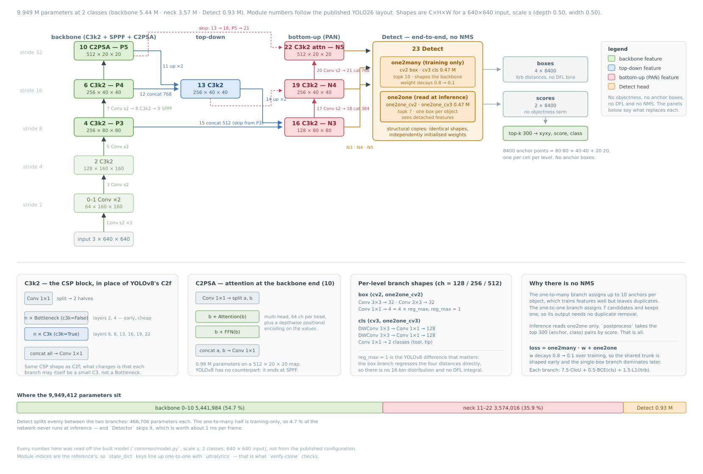
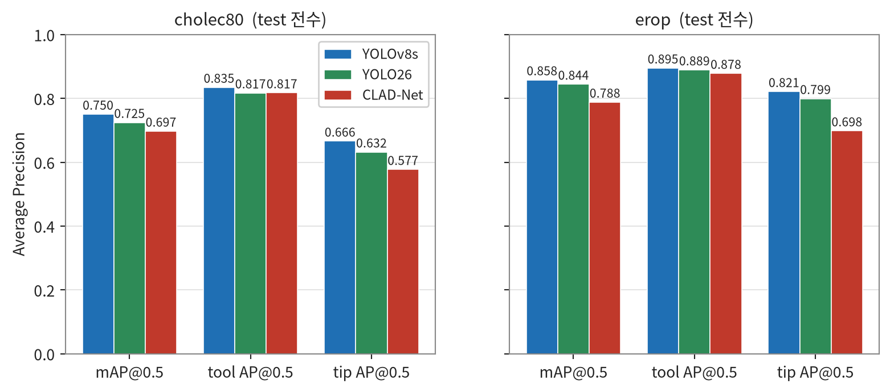
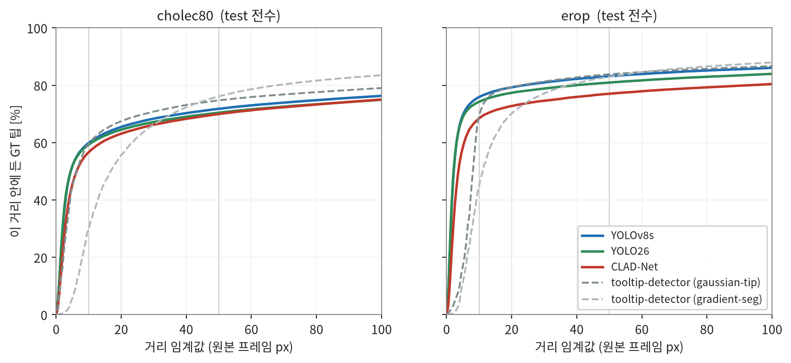
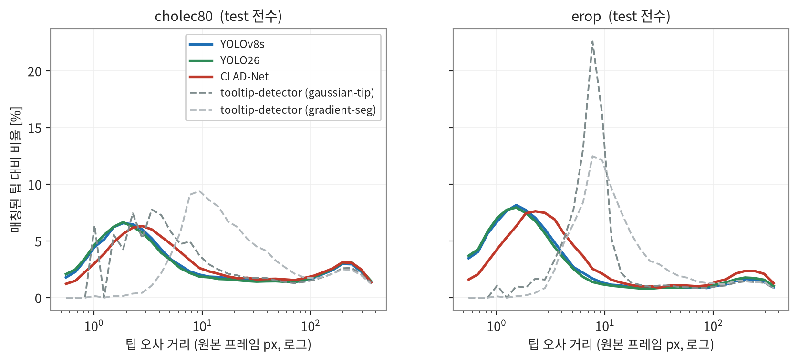
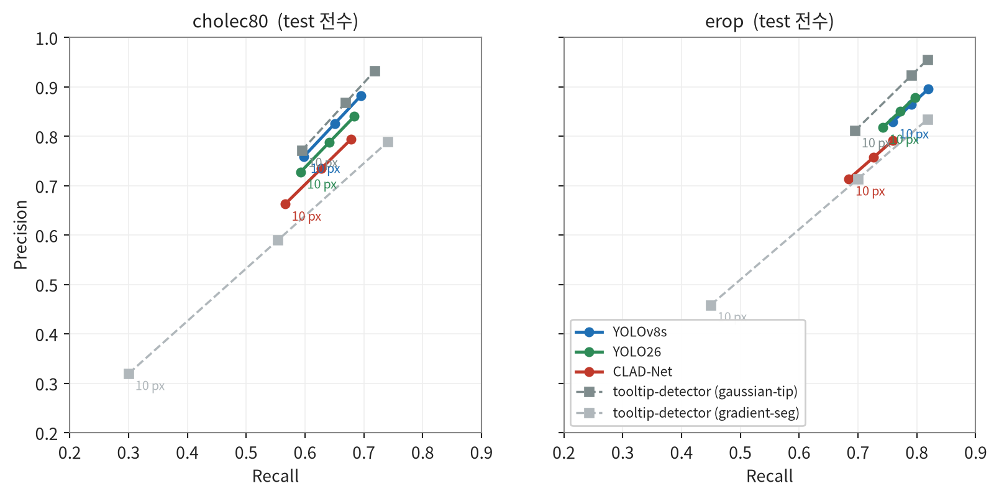
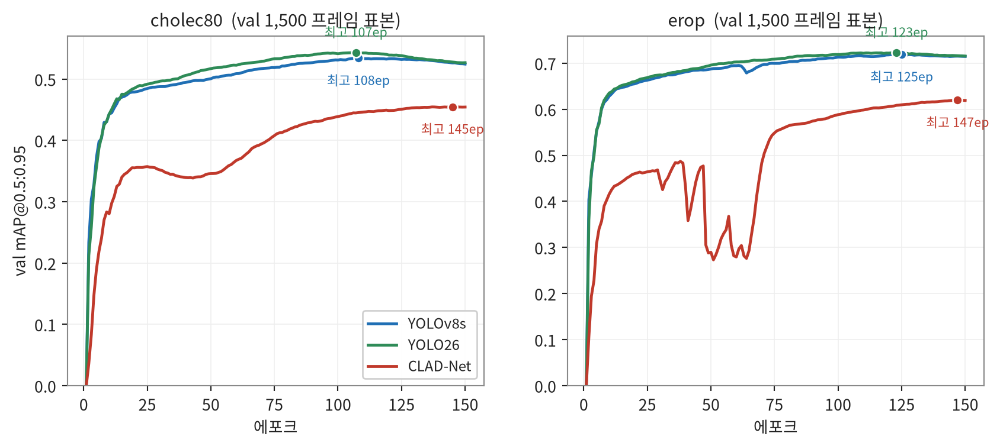
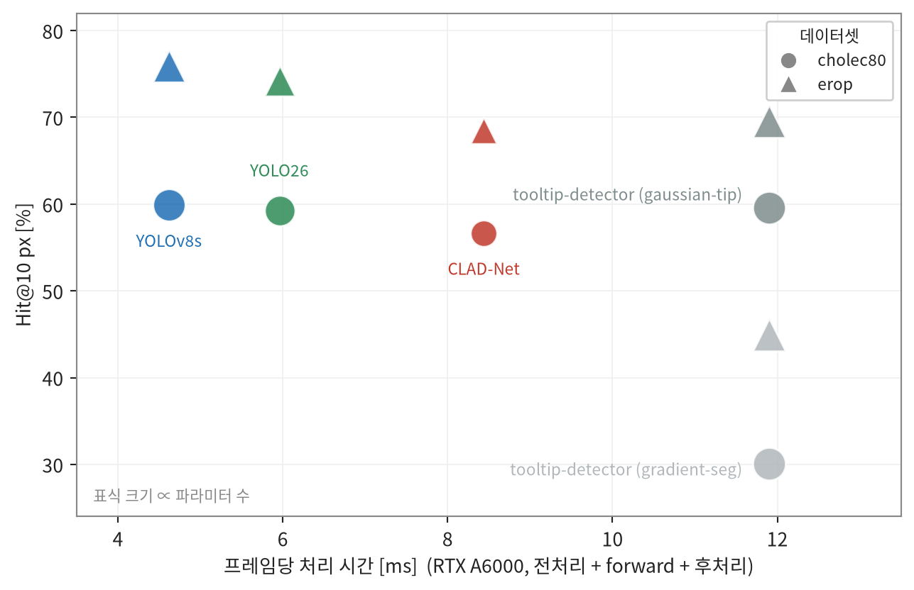
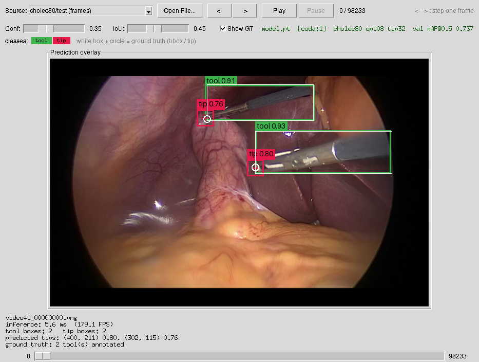
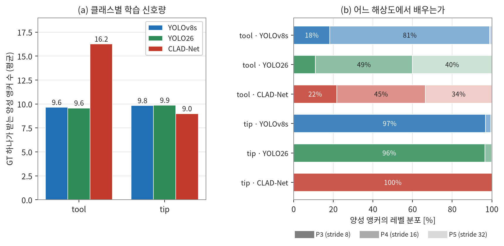

# 복강경 수술 영상에서의 YOLO 계열 객체 탐지를 이용한 수술도구 및 팁 탐지

## 실험결과보고서: CLAD-Net, YOLOv8s, YOLO26의 비교

이 보고서는 [`baseline/`](../baseline/) 아래 세 서브 프로젝트의 실험을 종합한다.
각 실험의 상세는 [CLAD-Net 보고서](../baseline/cladnet/docs/experimental-results.md),
[YOLOv8s 보고서](../baseline/yolov8sclone/docs/experimental-results.md),
[YOLO26 보고서](../baseline/yolo26clone/docs/experimental-results.md)에 있고,
여기서는 **세 방법론의 비교**와 **성능 차이의 원인**에 집중한다.

인용한 수치는 모두 `baseline/<name>/data/` 아래 산출물에서 재계산된다. 그림 4〜11은
[`notebook/reports-yolo-variants-graph.ipynb`](../notebook/reports-yolo-variants-graph.ipynb)가
같은 산출물에서 다시 그리고, 구조 도해인 그림 1〜3은 각 서브 프로젝트의
`docs/model-architecture.svg`에서 가져왔다.

## 초록 (Abstract)

복강경 수술 영상에서 수술도구의 위치와 그 **끝점(tip)** 을 실시간으로 얻는 문제를,
객체 탐지 방식으로 접근한 세 방법론을 같은 조건에서 비교했다. 내시경 수술도구 탐지를
위해 제안된 전용 아키텍처 **CLAD-Net** [1], 범용 탐지기 **YOLOv8s** [2], 그리고 NMS를
없앤 최신 세대 **YOLO26** [14] 이다.
**세 모델 모두 `ultralytics` 등 외부 탐지 프레임워크 없이 PyTorch로 직접 구현했고, 사전학습
가중치 없이 처음부터 학습했다.** CLAD-Net은 저자 공개 코드가 없어 논문 본문과 도해만으로
재구성했고, YOLO26은 참조 구현의 출력·손실과 비트 단위로 일치함을 확인했다(§2.3).
이하 세 모델을 각각 `CLAD-Net`, `YOLOv8s`, `YOLO26`으로 부르며, **별도로 밝히지 않는 한 모두
본 저장소의 자체 구현을 가리킨다.**

팁이라는 **점 어노테이션**을 32 × 32 px 상자로 바꾸어 `tool`·`tip` 2클래스 탐지 문제로
정식화함으로써, 하나의 탐지기가 도구 상자와 팁 좌표를 동시에 산출하도록 했다. 이로써 탐지
지표(AP)와 이 프로젝트의 팁 지표(Hit-rate @ N px)를 같은 모델에서 함께 측정할 수 있고,
기존 세그멘테이션 기반 접근 [3] 과 동일한 test 프레임·동일한 매칭 규칙으로 비교할 수 있다.

동일 조건(150 에포크, `--frame-stride 5`, 팁 32 px, 640 × 640 입력)에서 **두 범용 탐지기가
전용 아키텍처를 앞섰다.** cholec80 test mAP@0.5는 YOLOv8s 0.751, YOLO26 0.725, CLAD-Net
0.697이고, 팁 오차 중앙값은 **YOLO26이 3.45 px로 가장 작다**(YOLOv8s 3.60 px, CLAD-Net
4.93 px). 헝가리안 정밀도는 YOLOv8s 0.759, YOLO26 0.728, CLAD-Net 0.663이며, 속도는
YOLOv8s 4.62 ms, YOLO26 5.96 ms, CLAD-Net 8.44 ms로 파라미터가 가장 적은 CLAD-Net이
가장 느렸다. CLAD-Net과의 격차는 `tool` 클래스보다 **`tip` 클래스에서 두 배 이상** 벌어졌다.

학습 없이 수행한 라벨 할당 진단으로 그 원인을 좁혔다. CLAD-Net의 정적 앵커 비율 매칭은
`tool` GT 하나에 평균 16.2개, `tip` GT 하나에 9.0개의 양성 앵커를 배정해 **1.81 : 1의 신호
불균형**을 만드는 반면, 동적 할당을 쓰는 두 모델은 균형에 가깝다: YOLOv8s의
TaskAlignedAssigner [4] 가 9.6개와 9.8개(**0.98 : 1**), YOLO26이 9.6개와 9.9개
(**0.97 : 1**)다. 작은 객체가 구조적으로 불리해지는 정적 할당이 팁 클래스 격차의
직접적 원인으로 보인다.

**YOLO26의 end-to-end 헤드는 이 과제에서 뚜렷한 이점을 보이지 못했다.** NMS를 없앴는데도
오탐이 YOLOv8s보다 17 % 많고(헝가리안 10 px 기준 35,877 대 30,694), AP@0.5도 낮다. 대신
DFL을 버리고 거리를 직접 회귀한 덕에 **엄격한 IoU와 팁 좌표 정밀도에서는 앞선다**
(mAP@0.5:0.95 0.555 대 0.552, 팁 오차 중앙값 3.45 대 3.60 px).

## 1. 서론 (Introduction)

### 1.1 연구 배경

최소침습수술에서 수술도구의 위치를 실시간으로 파악하는 것은 내시경 카메라 자동 유도,
술기 평가, 수술 단계 인식의 공통 전제다 [5]. 특히 도구의 **끝점**은 조직과 실제로 상호작용하는
지점이므로, 도구 전체의 위치보다 임상적 의미가 크다.

이 저장소의 주 프로젝트(tooltip-detector)는 이 문제를 **히트맵 회귀**로 푼다. 팁 위치를
가우시안 또는 거리 기반 맵으로 인코딩해 U-Net 계열 [6] 로 회귀하고, 피크를 추출해 좌표를
얻는다 [3]. 본 보고서는 같은 문제를 **객체 탐지**로 푸는 세 방법론을 검증한다.

### 1.2 비교 대상

**CLAD-Net** [1] 은 내시경 수술도구 탐지를 목표로 제안된 전용 아키텍처다. CSPDarknet53 백본에
교차층 집계 어텐션 넥(cross-layer aggregation attention)을 얹어, 복합 어텐션 모듈(CAM)과
정제 모듈(RM)로 다중 스케일 특징을 융합한다. 저자들은 Cholec80 부분집합에서 AP@0.5 98.9 %와
68.5 FPS를 보고하며, YOLOv5 [7]·YOLOX [8]·YOLOv6 [9]·RT-DETR [10] 등 10종 대비 우위를 주장한다.

**YOLOv8s** [2] 는 범용 단일 단계 탐지기다. CLAD-Net이 기반한 YOLOv5 계열과 비교해 네 가지가
바뀌었다. 앵커를 없앤 **앵커프리** 예측, 상자 변을 분포로 회귀하는 **DFL** [11], 정적 규칙 대신
예측 품질로 양성을 고르는 **TaskAlignedAssigner** [4], 그리고 C3를 대체한 **C2f** 블록이다.

**YOLO26** [14] 은 같은 계열의 최신 세대다. YOLOv8s와 비교해 다시 네 가지가 바뀌었다.
학습용 one2many 분기와 추론용 one2one 분기를 함께 두어 **NMS를 없앤 end-to-end 헤드**
[15], **DFL을 버리고**(`reg_max=1`) 네 거리를 직접 회귀하는 상자 표현, C2f를 대체한
**C3k2** 블록과 백본 말단의 **C2PSA** 어텐션 스테이지, 그리고 행렬 모양 파라미터에
직교화된 업데이트를 더하는 옵티마이저 **MuSGD**(Muon [16] + SGD)다.

> **이 보고서의 YOLO26은 자체 구현이다.** [`baseline/yolo26clone`](../baseline/yolo26clone/README.md)의
> 순수 PyTorch 구현을 가리키며, `ultralytics` 패키지를 그대로 쓰고 COCO 사전학습 가중치를
> 파인튜닝하는 [`baseline/yolo26`](../baseline/yolo26/README.md)과는 **다른 모델이다.**
> 후자는 비교 조건(스크래치 학습)이 달라 이 보고서에 넣지 않았다.

### 1.3 기여

1. `ultralytics` 없이 세 아키텍처를 PyTorch로 재구현했다. YOLOv8s 재구현은 공개 체크포인트와
   **17개 모듈 전부에서 파라미터 수가 정확히 일치**하고(11,138,309개, `nc=7` 기준),
   YOLO26 재구현은 파라미터·출력·손실이 참조 구현과 **비트 단위로 일치**한다(§2.3).
2. 점 어노테이션을 고정 크기 상자로 바꾸는 정식화로, 탐지기와 세그멘테이션 기반 방법을
   **동일한 지표로** 비교할 수 있게 했다.
3. 세 탐지기의 성능 차이를 **학습 없이 측정 가능한 라벨 할당 통계**로 설명했다. 동적 할당을
   쓰는 두 세대(YOLOv8s·YOLO26)가 정적 할당(CLAD-Net)과 갈리는 지점을 직접 보였다.
4. 세 모델의 추론 경로에서 **정확도를 잃지 않는 최적화**를 찾아 적용했다(§3.5).

## 2. 방법 (Methods)

### 2.1 문제 정의: 점을 상자로

데이터셋은 도구마다 바운딩 상자와 팁 좌표를 갖고, **도구 종류 레이블은 없다.** 따라서 두
클래스를 정의했다.

표 1. 학습에 사용한 객체 클래스 정의

| 클래스 | 정의                                             |
| ------ | ------------------------------------------------ |
| `tool` | 어노테이션의 바운딩 상자 그대로                  |
| `tip`  | 팁 좌표를 중심으로 한 **32 × 32 px 정사각 상자** |

예측된 `tip` 상자의 중심이 팁 좌표다. 상자 한 변의 길이는 형식적 선택이 아니라 실제
하이퍼파라미터이며, 그 근거는
[CLAD-Net 보고서 부록 A](../baseline/cladnet/docs/experimental-results.md)에서 유도했다.
요약하면 이렇다. CLAD-Net의 objectness 학습 목표가 예측·GT 상자의 IoU이므로, 상자가 작으면 정확히
맞힌 예측조차 높은 신뢰도를 낼 수 없다. 초기 10 px 설정에서 팁 예측의 최대 신뢰도는 0.694였고,
32 px로 키운 뒤 0.925가 되었다.

### 2.2 아키텍처

세 모델 모두 백본에서 세 해상도의 특징(P3 / P4 / P5, stride 8 / 16 / 32)을 뽑아 넥에서 섞고,
그 셋을 각각 헤드에 넣어 예측한다는 큰 틀은 같다. 다른 것은 **넥이 어떻게 섞는가**와
**헤드가 무엇을 내놓는가**다.

#### CLAD-Net


벡터 원본은 [baseline/cladnet/docs/model-architecture.svg](../baseline/cladnet/docs/model-architecture.svg)에 있다.

논문의 기여는 전부 **넥**에 있다. 백본(CSPDarknet53)과 헤드는 YOLOv5 계열의 관습을 따르고,
넥에서 세 가지가 더해진다.

- **교차층 lateral 연결.** 백본의 C3 / C4 / C5를 depthwise separable conv로 통과시켜
  top-down 경로의 P3 / P4 / P5와 직접 잇는다. 얕은 층의 윤곽·경계 정보를 깊은 층에
  다시 넣어 상자 경계 회귀를 돕는다는 것이 논문의 주장이다.
- **RM(Refinement Module).** 그 lateral 특징과 top-down 특징 두 갈래에 각각 채널 가중치
  `ω₁`, `ω₂`를 구해 `ω = ω₁ + ω₂`로 합치고, `ω · F_a`와 `(1 − ω) · F_b`를 이어 붙인다.
  어느 쪽 정보를 얼마나 실을지 층마다 다시 정하는 장치다.
- **CAM(Composite Attention Mechanism).** bottom-up 경로에서 concat 직후에 놓인다.
  적응 풀링 네 스케일로 문맥을 모으는 AAB와, 채널별·픽셀별 두 갈래 채널 어텐션을 더하는
  MSAB를 병렬로 돌려 곱한 뒤 이어 붙이고 1 × 1로 채널을 줄인다.

헤드는 **앵커 기반 분리형**이다. 레벨마다 앵커 3개를 두고 셀마다 Obj / Reg / Cls를 예측하므로
640 × 640 입력에서 후보가 25,200개 나온다.

#### YOLOv8s


벡터 원본은 [baseline/yolov8sclone/docs/model-architecture.svg](../baseline/yolov8sclone/docs/model-architecture.svg)에 있다.

넥은 평범한 PAN-FPN이고, 대신 **블록과 헤드**가 다르다.

- **C2f 블록.** YOLOv5의 C3를 대체한다. C3가 병목 사슬의 마지막 출력만 쓰는 반면 C2f는
  중간 출력을 전부 남겨 이어 붙이므로, 융합 conv가 `2 + n`갈래를 본다. 같은 채널 폭에서
  경사 경로가 늘어난다.
- **앵커프리 헤드.** 앵커 상자를 두지 않고, 셀 중심을 앵커 포인트로 삼아 상·하·좌·우
  네 방향 거리를 예측한다. 후보가 셀당 하나뿐이라 8,400개로 줄고, 데이터셋마다 앵커를
  다시 정할 필요가 없다.
- **DFL(Distribution Focal Loss) [11].** 각 변의 거리를 값 하나가 아니라 **16개 빈에 대한
  분포**로 예측하고, 그 기댓값을 거리로 쓴다. 경계가 흐리거나 가려진 상황에서 분포가
  퍼지는 방식으로 불확실성을 표현할 수 있다.
- **objectness가 없다.** 클래스 점수가 곧 신뢰도이며, 그 학습 목표는 아래 할당기가
  정한다.
- **TaskAlignedAssigner [4].** 정적 규칙 대신 `클래스 점수^0.5 × CIoU^6`로 정렬도를 재어
  GT마다 상위 10개를 양성으로 뽑는다. §4.1이 다루는 차이가 여기서 나온다.

#### YOLO26



벡터 원본은 [baseline/yolo26clone/docs/model-architecture.svg](../baseline/yolo26clone/docs/model-architecture.svg)에 있다.

넥은 YOLOv8s와 같은 PAN-FPN이고, 바뀐 것은 **블록·헤드·상자 표현·옵티마이저** 넷이다.

- **end-to-end 헤드 [15].** 헤드가 두 벌이다. 학습용 `one2many` 분기는 GT마다 상위 10개를
  양성으로 받고, 추론용 `one2one` 분기는 상위 7개에 2차 top-k 1개를 더해 **객체당 상자
  하나만** 남도록 학습된다. 추론은 후자만 읽으므로 **NMS가 없다.** 손실은
  `w·L_one2many + (1 − w)·L_one2one`이고 `w`가 0.8에서 0.1로 선형 감쇠해, 초반에는 조밀한
  할당이 끌고 가다 후반에는 실제로 추론에 쓰이는 분기가 끌고 간다. `one2one` 분기는
  **detach된 특징**을 받아 공유 백본에 그래디언트를 보내지 않는다.
- **DFL이 없다.** `reg_max=1`이라 각 변을 분포가 아니라 **값 하나로** 회귀하고, 세 번째
  손실항이 DFL 대신 네 거리의 L1이다. 이산 빈의 해상도 한계가 없어지는 대신, 불확실성을
  분포로 표현하는 능력을 잃는다. §3.2의 팁 정밀도 차이가 여기서 나오는 것으로 보인다.
- **C3k2 + C2PSA.** C2f 자리에 C3k2가 들어가고, 백본 말단 SPPF 뒤에 **C2PSA** 어텐션
  스테이지가 붙는다.
- **라벨 할당에 두 가지가 더해진다.** TaskAlignedAssigner를 쓰되 (i) 한 변이 stride보다
  짧은 GT 상자를 stride 크기로 늘려 "상자 안에 들어오는 앵커"를 세고, (ii) 2차 top-k를
  적용한다. (i)은 작은 객체가 양성을 하나도 못 받는 것을 막는 장치인데, 32 px 팁 상자는
  letterbox 후 27.8 px이라 이 하한(16 px)에 걸리지 않는다.
- **MuSGD.** 모든 파라미터가 SGD 업데이트를 받고, 행렬 모양 파라미터는 Newton-Schulz
  반복으로 직교화한 업데이트를 하나 더 받는다(Muon [16]). 분류 헤드는 학습률 3배다.
  **세 모델 중 이 모델만 옵티마이저가 다르다**(§2.4).

표 2. 세 모델의 주요 구조 차이

|            | CLAD-Net                                  | YOLOv8s                                  | YOLO26                                          |
| ---------- | ----------------------------------------- | ---------------------------------------- | ----------------------------------------------- |
| 백본       | CSPDarknet53 (C3 블록)                    | CSPDarknet (C2f 블록)                    | C3k2 + SPPF + **C2PSA** 어텐션                  |
| 넥         | 교차층 집계 어텐션 (CAM + RM)             | PAN-FPN                                  | PAN-FPN                                         |
| 헤드       | 분기 하나                                 | 분기 하나                                | **분기 둘** (one2many + one2one) [15]           |
| 추론 후처리 | NMS                                      | NMS                                      | **없음** (객체당 상자 하나, top-k만)            |
| 상자 표현  | 앵커 상대 offset                          | 앵커프리(4방향 거리)                     | 앵커프리(4방향 거리)                            |
| 상자 회귀  | 값 1개                                    | **DFL**(변마다 16개 빈) [11]             | **DFL 없음** (`reg_max=1`), 세 번째 항이 L1     |
| Objectness | 있음                                      | 없음                                     | 없음                                            |
| 라벨 할당  | 앵커 **모양** 비율 매칭(≤ 4배) + 이웃 셀  | **TaskAlignedAssigner** [4]              | 같음 + **상자 크기 하한** + **2차 top-k**       |
| 손실       | `0.05·CIoU + 1.0·BCE(obj) + 0.5·BCE(cls)` | `7.5·CIoU + 0.5·BCE(cls) + 1.5·DFL`      | `7.5·CIoU + 0.5·BCE(cls) + 1.5·L1`, 두 분기 가중합 |
| 옵티마이저 | SGD                                       | SGD                                      | **MuSGD** (Muon [16] + SGD)                     |
| 후보 상자 수 | 25,200                                  | 8,400                                    | 8,400 (분기당)                                  |
| 파라미터   | **7,488,483**                             | 11,136,374                               | 9,949,412                                       |

CIoU [12] 는 세 모델 공통이다.

### 2.3 재구현 검증

CLAD-Net은 저자 공개 코드가 없어 논문 Fig. 1〜3만으로 재구성했고, 본문과 도해가 어긋나는
지점이 여덟 곳 있었다(예: 본문은 bottom-up 경로를 "upsampling"이라 쓰지만 그 방향은 해상도가
줄어드는 쪽이다).  **구조 해석이 맞는지에 대한
독립 검증은 파라미터 수 일치(7.488 M 대 논문 보고 7.5 M)뿐이다.**

YOLOv8s 재구현은 공개된 사전학습 체크포인트 `yolov8s_cholec80.pt`(Cholec80 도구 7종으로
학습된 것, [baseline/yolov8s](../baseline/yolov8s/README.md))의 state_dict와 모듈 단위로 대조해
17개 모듈 전부에서 파라미터 수가 일치함을 확인했다. **가중치는 가져오지 않았고 구조 대조에만
썼다.** 그 체크포인트는 클래스 구성이 다르고, 언피클하려면 `ultralytics`가 필요하다.

YOLO26 재구현은 **세 모델 중 가장 강하게 검증됐다.** 참조 체크포인트를 평문 텐서로 추출해
네 단계를 대조했고, 네 단계 모두 통과한다.

표 3. YOLO26 재구현 검증 (`run verify-clone`)

| 질문                     | 확인 방법                            | 결과                                |
| ------------------------ | ------------------------------------ | ----------------------------------- |
| 모양이 맞는가            | 모듈별 파라미터 수                   | 10,009,784 (`nc=80`) 완전 일치      |
| 파라미터가 맞는가        | 참조 `state_dict`를 그대로 로드      | 708 / 708 키, 누락 0, 초과 0        |
| **같은 것을 계산하는가** | 참조의 입력으로 참조의 출력을 재현   | **최대 오차 0.000e+00**             |
| **같은 것을 학습하는가** | 참조의 GT 상자로 참조의 손실을 재현  | **최대 오차 0.000e+00**             |

마지막 두 항목이 중요하다. assigner와 손실 함수는 대조할 가중치가 없으므로 파라미터 수만
맞춰서는 검증되지 않는 부분이며, 실제로 이 대조가 잡아낸 버그가 있었다. 참조 구현은 모델을
만든 뒤 **모든 BatchNorm의 `eps`를 1e-3, `momentum`을 0.03으로 덮어쓴다**(PyTorch 기본값은
1e-5와 0.1). 파라미터 수도 `state_dict` 키도 이 값에 영향받지 않으므로 앞의 두 단계는
통과하지만, 출력은 첫 Conv 레이어에서부터 어긋났다.

**다만 이 검증은 구조·손실이 참조와 같음을 보인 것이고, 학습 결과가 참조와 같음을 보인 것은
아니다.** 후자는 [YOLO26 보고서 §6](../baseline/yolo26clone/docs/experimental-results.md)에서
따로 다룬다(사전학습 없이도 mAP@0.5 격차가 0.003〜0.010에 머문다).

### 2.4 학습 및 평가 프로토콜

표 4. 세 모델에 공통으로 적용한 학습 및 평가 프로토콜

| 항목               | 값                                                            |
| ------------------ | ------------------------------------------------------------- |
| 입력               | 640 × 640 letterbox (원본 736 × 480)                          |
| 에포크 / 배치 / lr | 150 / 16 / 0.01                                               |
| 옵티마이저         | SGD (momentum 0.937, nesterov). **YOLO26만 MuSGD, momentum 0.9** |
| 증강               | mosaic + 좌우 반전 + HSV 지터                                 |
| 공통 추가          | warmup 3 에포크, cosine 감쇠, 가중치 EMA, 그래디언트 클리핑 10 |
| `--frame-stride`   | 5 (학습 프레임 5장 중 1장)                                    |
| 사전학습           | 없음 (무작위 초기화)                                          |
| 평가               | `conf=0.25`, NMS IoU 0.45 (**YOLO26은 NMS가 없어 `max_det=300`**). AP 곡선은 `conf=0.001`까지 |

**팁 상자 크기, 프레임 샘플링, 에포크, 입력 크기, 증강이 세 모델에서 모두 같다.** 다른 것은
두 가지뿐이다: YOLO26의 옵티마이저(MuSGD)와, NMS 대신 `max_det`이 후보 수를 제한한다는 점이다.
둘 다 YOLO26 설정의 일부이므로, **이 보고서의 비교는 "아키텍처만의 비교"가 아니라 "설정
전체의 비교"로 읽어야 한다.** 옵티마이저 몫을 떼어 내려면 `--optimizer sgd` 실행을 따로
쌓아야 하고, 이번 실험에서는 하지 않았다.

### 2.5 데이터셋

표 5. 데이터셋별 분할과 평가 대상 규모

| 데이터셋        | train (stride 5) |    val |   test | test GT 팁 |              세션 |
| --------------- | ---------------: | -----: | -----: | ---------: | ----------------: |
| `cholec80` [13] |  71,032 → 14,207 | 15,312 | 98,234 |    161,969 | 40편 (video41〜80) |
| `erop`          | 108,424 → 21,685 | 36,140 | 36,142 |     50,718 |             5세션 |

`cholec80`은 **영상 단위로 분리된** 분할이다(video01〜32 train / 33〜40 val / 41〜80 test).
`erop`은 영상 내부를 프레임 단위로 섞어 나눈 분할이라 인접 프레임이 train과 test에 함께
들어간다(시간적 누수). **따라서 `erop` 수치는 낙관적으로 읽어야 하며, 본 보고서의 결론은
`cholec80`을 기준으로 삼는다.**

## 3. 결과 (Results)

### 3.1 탐지 성능



표 6. 데이터셋과 모델별 객체 탐지 성능

| 데이터셋   | 모델        |   mAP@0.5 | mAP@0.5:0.95 | tool AP@0.5 | tip AP@0.5 | tip AP@0.5:0.95 |
| ---------- | ----------- | --------: | -----------: | ----------: | ---------: | --------------: |
| `cholec80` | **YOLOv8s** | **0.751** |        0.552 |   **0.835** |  **0.666** |           0.408 |
| `cholec80` | YOLO26      |     0.725 |    **0.555** |       0.817 |      0.632 |       **0.415** |
| `cholec80` | CLAD-Net    |     0.697 |        0.472 |       0.817 |      0.577 |           0.303 |
| `erop`     | **YOLOv8s** | **0.858** |        0.685 |   **0.895** |  **0.821** |           0.567 |
| `erop`     | YOLO26      |     0.844 |    **0.692** |       0.889 |      0.799 |       **0.579** |
| `erop`     | CLAD-Net    |     0.788 |        0.575 |       0.878 |      0.698 |           0.410 |

**두 범용 탐지기가 전용 아키텍처를 앞선다.** 그리고 그 격차는 `tip` 클래스에 몰려 있다.
cholec80에서 YOLOv8s와 CLAD-Net의 `tool` AP@0.5 차이는 +0.018인데 `tip`은 +0.089로 다섯
배다. erop에서는 +0.017 대 +0.123으로 더 벌어진다. 이 비대칭이 §4 분석의 출발점이다.

**YOLO26은 느슨한 IoU에서 지고 엄격한 IoU에서 이긴다.** mAP@0.5는 YOLOv8s보다 낮은데
(−0.026, −0.014) mAP@0.5:0.95는 높고(+0.003, +0.007), `tip` 클래스에서 그 대비가 가장
뚜렷하다(cholec80 AP@0.5 −0.034 대 AP@0.5:0.95 +0.007). **상자를 덜 찾는 대신 찾은 상자는
더 정확하다**는 뜻이며, DFL 없이 거리를 직접 회귀하는 표현(§2.2)의 성질로 읽힌다.
AP@0.5가 낮은 쪽은 후보를 덜 낸 결과다: AP 곡선용 `conf=0.001`에서 `tip` 재현율이 0.893으로
YOLOv8s의 0.910에 못 미친다.

### 3.2 팁 위치 정확도



표 7. 모델별 팁 위치 정확도와 탐지 실패율

| 데이터셋   | 모델                            | 탐지 실패율 |   Hit@10 px |   Hit@20 px |   Hit@50 px |      중앙값 |           P90 |
| ---------- | ------------------------------- | ----------: | ----------: | ----------: | ----------: | ----------: | ------------: |
| `cholec80` | **YOLOv8s**                     |      8.82 % | **59.87 %** |     65.48 % |     71.78 % |     3.60 px |     181.03 px |
| `cholec80` | YOLO26                          |      9.71 % |     59.27 % |     64.51 % |     70.44 % | **3.45 px** |     186.88 px |
| `cholec80` | CLAD-Net                        |      9.56 % |     56.65 % |     63.12 % |     69.96 % |     4.93 px |     184.62 px |
| `cholec80` | tooltip-detector `gaussian-tip` |      7.48 % |     59.55 % | **67.45 %** |     74.72 % |     5.39 px |     167.34 px |
| `cholec80` | tooltip-detector `gradient-seg` |  **2.90 %** |     30.04 % |     55.58 % | **76.12 %** |    16.12 px | **156.66 px** |
| `erop`     | **YOLOv8s**                     |  **4.79 %** | **75.91 %** |     79.28 % |     83.15 % |     2.04 px |      92.05 px |
| `erop`     | YOLO26                          |      5.96 % |     74.24 % |     77.37 % |     80.93 % | **1.96 px** |     112.90 px |
| `erop`     | CLAD-Net                        |      6.84 % |     68.47 % |     72.77 % |     77.03 % |     3.23 px |     159.00 px |
| `erop`     | tooltip-detector `gaussian-tip` |      5.03 % |     69.52 % | **79.36 %** | **83.82 %** |     7.81 px |  **74.28 px** |
| `erop`     | tooltip-detector `gradient-seg` |      3.09 % |     44.98 % |     70.17 % |     82.95 % |    10.77 px |      88.68 px |

**잡은 팁을 가장 정확히 짚는 것은 YOLO26이다.** 오차 중앙값이 cholec80 3.45 px, erop
1.96 px로 다섯 모델 중 가장 작다. 반대로 **놓치는 팁은 가장 많은 축이다**(탐지 실패율
9.71 %, 5.96 %). 두 성질이 함께 나타나는 것은 §3.1에서 본 "덜 찾고 정확히 찾는다"와 같은
현상이다. 꼬리에서도 불리하다: P90 오차가 erop에서 112.90 px로 YOLOv8s(92.05 px)보다 크다.



### 3.3 운용 지점에서의 헝가리안 1:1 매칭

적중률은 오탐을 세지 않는다. 예측과 GT를 1:1로 강제 매칭하면 정밀도가 드러난다.



표 8. 거리 상한 10 px에서의 헝가리안 1:1 매칭 성능

| 데이터셋   | 모델           | cap   |     TP |     FP | Precision |    Recall |
| ---------- | -------------- | ----- | -----: | -----: | --------: | --------: |
| `cholec80` | **YOLOv8s**    | 10 px | 96,914 | 30,694 |     0.759 | **0.598** |
| `cholec80` | YOLO26         | 10 px | 95,944 | 35,877 |     0.728 |     0.592 |
| `cholec80` | CLAD-Net       | 10 px | 91,698 | 46,641 |     0.663 |     0.566 |
| `cholec80` | `gaussian-tip` | 10 px | 96,297 | 28,526 | **0.772** |     0.595 |
| `erop`     | **YOLOv8s**    | 10 px | 38,484 |  7,914 | **0.829** | **0.759** |
| `erop`     | YOLO26         | 10 px | 37,641 |  8,360 |     0.818 |     0.742 |
| `erop`     | CLAD-Net       | 10 px | 34,719 | 13,924 |     0.714 |     0.685 |
| `erop`     | `gaussian-tip` | 10 px | 35,240 |  8,199 |     0.811 |     0.695 |

**CLAD-Net의 오탐이 가장 많다.** cholec80에서 FP 46,641개로 YOLOv8s(30,694)의 1.5배,
`gaussian-tip`(28,526)의 1.6배다.

**그리고 NMS를 없앤 것이 오탐을 줄이지 못했다.** YOLO26의 FP는 35,877개로 YOLOv8s보다
17 % 많다. end-to-end 헤드의 설계 의도는 "객체당 상자 하나"이므로 중복 상자가 줄어들 것을
기대할 수 있지만, 이 데이터에서는 그렇게 나타나지 않았다. 중복 상자를 지우는 문제가 아니라
**어느 객체에 상자를 낼지 고르는 문제**가 남아 있다는 뜻이며, §6.1의 과소 탐지 분석과
같은 방향을 가리킨다.

### 3.4 학습 수렴



표 9. 모델별 초기 수렴, 최고 성능 도달 시점, 학습 시간

| 데이터셋   | 모델     | 2 에포크 mAP@0.5 |   최고 에포크 | 최고 mAP@0.5:0.95 | 학습 시간 |
| ---------- | -------- | ---------------: | ------------: | ----------------: | --------: |
| `cholec80` | YOLOv8s  |        **0.456** |     108 / 150 |            0.534 | **4.1 h** |
| `cholec80` | YOLO26   |            0.399 |     107 / 150 |        **0.543** |     5.8 h |
| `cholec80` | CLAD-Net |            0.125 | **145** / 150 |            0.455 |     9.2 h |
| `erop`     | YOLOv8s  |        **0.699** |     125 / 150 |            0.719 | **5.8 h** |
| `erop`     | YOLO26   |            0.589 |     123 / 150 |        **0.723** |     8.2 h |
| `erop`     | CLAD-Net |            0.310 | **147** / 150 |            0.620 |    14.2 h |

세 가지가 읽힌다. 먼저 **초반 상승 속도.** 두 범용 탐지기는 2 에포크에 mAP@0.5 0.40〜0.46에
도달하는데 CLAD-Net은 0.125다. 다음은 **종착점.** YOLOv8s과 YOLO26은 107〜125 에포크에서
정점을 찍고 과적합으로 돌아서지만, CLAD-Net은 150 에포크에서도 최고점이 끝에 있어 아직
포화하지 않았다.

세 번째가 새로운 관찰이다. **YOLOv8s과 YOLO26의 최고점이 거의 같은 에포크에 있다**
(108 대 107, 125 대 123). 그림 8에서 두 곡선이 거의 겹친다. 데이터를 소진하는 시점이
모델이 아니라 **학습 프레임 수**(14,207·21,685장)로 정해진다는 뜻으로 읽힌다. 다만 종착
높이는 YOLO26이 조금 높다(val mAP@0.5:0.95 0.543 대 0.534, 0.723 대 0.719). §3.1에서 본
"엄격한 IoU에서 앞선다"가 학습 곡선에도 그대로 나타난다.

### 3.5 속도

같은 GPU(RTX A6000)에서 같은 범위를 쟀다. 전처리부터 후처리까지 프레임 한 장을 처리한
실제 시간이다.



표 10. 모델별 추론 속도, 파라미터 수, 후보 상자 수

| 모델                     |   파라미터 |     unfused |       fused |     FPS |    후보 상자 수 |
| ------------------------ | ---------: | ----------: | ----------: | ------: | --------------: |
| **YOLOv8s**              |    11.14 M |     5.51 ms | **4.62 ms** | **217** |           8,400 |
| YOLO26                   |     9.95 M |     7.73 ms |     5.96 ms |     168 | 8,400 (분기당)  |
| CLAD-Net                 | **7.49 M** |    10.22 ms |     8.44 ms |     118 |          25,200 |
| tooltip-detector `monai` |    11.45 M |     11.9 ms |    미적용   |      84 | 해당 없음 (히트맵 피크) |

세 탐지기 모두 **Conv+BN을 합성곱에 접은(fuse) 상태**가 운용값이다. eval 모드의 BatchNorm은
고정 아핀 변환이므로 앞의 합성곱에 접을 수 있고, 탐지 지표는 test 전수에서 헝가리안 TP가
0.01〜0.02 % 움직이는 데 그친다. **순위는 접기 전후로 바뀌지 않는다.** 루트 프로젝트
`monai`에는 아직 같은 최적화를 적용하지 않았다.

**파라미터가 가장 적은 CLAD-Net이 가장 느리다.** 논문이 주장하는 "더 적은 파라미터로 더
빠르다"는 성질은 이 구현·이 과제에서 재현되지 않았다. 이유는 둘로 보인다. 후보가 25,200개로
YOLOv8s의 3배여서 NMS 비용이 크고, CAM이 레벨마다 적응 풀링·업샘플을 4회씩 수행한다
(P3에서 80 × 80 × 336 텐서 대상). 파라미터로 드러나지 않는 연산이며, **BatchNorm이 없어
fuse의 혜택도 받지 못한다.**

**NMS를 없앤 YOLO26이 NMS를 도는 YOLOv8s보다 29 % 느리다.** 파라미터가 11 % 적은데도
그렇다. 두 가지가 겹친다. 첫째, `Detect.forward`가 추론에서도 `one2many` 분기를 계산하는데
읽지는 않는다. 이 낭비가 프레임당 약 1.8 ms였고, 건너뛰도록 고쳐 7.73 ms를 얻었다(표의
unfused 열이 이미 고친 값이다). 둘째, 그렇게 고친 뒤에도 백본이 더 무겁다. YOLO26의
백본 + 넥만 6.09 ms로 YOLOv8s의 전체 forward보다 오래 걸리며, 눈에 띄는 후보였던 C2PSA
어텐션은 0.60 ms에 불과하다. 원인은 한 곳이 아니라 **C3k2 블록 구성 전반**에 퍼져 있다.
**파라미터 수가 실행 시간을 예측하지 못하는 전형적인 사례다.**

### 3.6 정성 결과와 데모 도구

세 서브 프로젝트 모두 학습한 모델을 영상에 바로 돌려 보는 GUI 데모를 갖고 있다(`run demo`).
원본 영상이나 추출 프레임을 골라 재생하면서 신뢰도·NMS 임계값을 바꾸고, 어노테이션을
겹쳐 볼 수 있다. **YOLO26 데모에는 IoU 슬라이더가 없다**: NMS를 돌리지 않으므로 있어도
아무 일도 하지 않는 조작이 되기 때문이다.



화면이 보고서의 수치를 그대로 보여 준다. 상단 상태줄의 `cholec80 ep108 tip32 val mAP@0.5 0.737`은
§3.4에서 확인한 최고 에포크(108)와 §2.1의 팁 상자 크기(32 px)를 그대로 읽은 것이고,
하단 정보창의 `inference: 5.6 ms (179.1 FPS)`는 화면을 캡처한 시점의 값으로, Conv+BN을
접기 전에 측정된 것이다. §3.5의 값과 범위가 다른 것은 그 때문이며, §3.5는 test 전수 평균이라
프레임 읽기 비용도 함께 들어가 있다.

`tool 0.91`·`tool 0.93`과 `tip 0.76`·`tip 0.80`이라는 신뢰도는 §4.2에서 다루는
"32 px 팁 상자에서는 신뢰도 천장이 사라졌다"는 관찰의 한 사례다. 팁 상자 중심의 십자가
흰색 어노테이션 원 안에 들어와 있는 것도 확인할 수 있다.

---

## 4. 분석: 성능 차이는 어디에서 오는가

§3.1이 보여준 비대칭(`tool` 격차는 작고 `tip` 격차는 크다)을 설명하려면, 세 모델이 **무엇을
양성 예측으로 삼아 학습하는지**를 봐야 한다.

### 4.1 라벨 할당 밀도: 직접 측정

학습 없이, `cholec80` val 400 프레임에 대해 세 모델의 할당기를 한 번씩 돌려 "GT 상자 하나가
몇 개의 양성 앵커를 받는가"를 셌다. YOLO26은 두 분기 중 **공유 백본을 실제로 학습시키는
`one2many` 분기**를 측정했다(topk도 10이라 YOLOv8s과 직접 비교된다).



표 11. GT당 양성 할당 수와 클래스 간 불균형

| 모델     |   `tool` 양성/GT |    `tip` 양성/GT | **tool : tip** |
| -------- | ---------------: | ---------------: | -------------: |
| CLAD-Net | 16.2 (중앙값 18) |   9.0 (중앙값 9) |       **1.81** |
| YOLOv8s  |  9.6 (중앙값 10) | 9.8 (중앙값 10)  |       **0.98** |
| YOLO26   |  9.6 (중앙값 10) | 9.9 (중앙값 10)  |       **0.97** |

**CLAD-Net만 도구에 팁의 약 두 배를 배정한다.** 동적 할당을 쓰는 두 모델은 사실상 균형이며,
서로 구분되지 않는다(0.98 대 0.97). 이유는 할당 규칙에 있다.

- CLAD-Net은 **앵커 모양 비율 매칭**이다. GT 상자의 너비·높이가 앵커의 4배 이내면 매칭되고,
  매칭된 각 앵커마다 중심 셀과 이웃 셀 두 개가 양성이 된다. 도구 상자(평균 202 × 116 px)는
  9개 앵커 중 여러 개와, 그것도 여러 레벨에서 매칭된다. 그림 11(b)에서 도구의 양성은
  P3/P4/P5에 22 / 45 / 34 %로 퍼져 있다. 반면 32 px 팁 상자는 **P3의 작은 앵커에만** 매칭되어
  100 %가 한 레벨에 갇힌다.
- YOLOv8과 YOLO26의 TaskAlignedAssigner는 GT마다 정렬도 상위 `topk = 10`개를 고른다.
  **상자 크기와 무관하게 정원이 같으므로** 두 클래스가 9.6개와 9.8〜9.9개로 균등하다.
  YOLO26이 더한 상자 크기 하한(§2.2)은 32 px 팁 상자에 걸리지 않으므로 이 측정에서
  YOLOv8s과의 차이를 만들지 않는다.

정적 규칙은 "상자가 크면 더 많은 앵커와 레벨에 걸린다"는 기하학적 사실을 그대로 학습 신호의
불균형으로 옮긴다. 동적 할당은 그 결합을 끊는다. **§3.1의 비대칭, 즉 `tool`은 거의 대등한데
`tip`만 크게 벌어지는 현상이 이 1.81 대 0.97〜0.98의 차이와 방향이 일치한다.**

그림 11(b)는 레벨 분포에서 세 모델이 또 갈리는 것을 보여 준다. `tip`은 세 모델 모두 P3에
96〜100 % 몰리지만, `tool`에서 YOLOv8s은 P4에 81 %를 몰아 넣는 반면 YOLO26은 P4/P5에
49 / 40 %로 나누고 CLAD-Net은 P3/P4/P5에 22 / 45 / 34 %로 퍼뜨린다. **동적 할당끼리도
어느 해상도에서 배우는지는 다르다**는 뜻이지만, 이 차이가 성능에 어떻게 연결되는지는
이 실험으로 분리되지 않는다.

### 4.2 신뢰도 목표값의 구조

두 번째 차이는 신뢰도를 무엇에 맞춰 학습하는가다. 이 항목은 CLAD-Net과 나머지 둘 사이의
차이이며, YOLOv8s과 YOLO26은 같은 구조를 쓴다.

- CLAD-Net(YOLOv5 계열)은 objectness의 학습 목표를 예측·GT 상자의 **절대 CIoU**로 둔다.
  작은 상자에서는 이 값이 구조적으로 낮게 묶인다. 32 px 팁 상자는 640 공간에서 27.8 px이라
  중심이 2 px 어긋나면 IoU가 0.87, 4 px이면 0.75다.
- YOLOv8과 YOLO26은 objectness가 없고 클래스 점수가 곧 신뢰도이며, 그 목표값은
  TaskAlignedAssigner가 **GT마다 재정규화한 정렬도**다. 각 GT의 최고 정렬 앵커가 그 GT에서
  달성 가능한 IoU를 목표로 받으므로 절대 IoU에 묶이지 않는다.

측정된 신뢰도가 이 구조 차이와 일치한다.

표 12. 팁 예측 신뢰도 비교 (cholec80, `conf=0.25` 평가)

| 지표                            | CLAD-Net | YOLOv8s |     YOLO26 |
| ------------------------------- | -------: | ------: | ---------: |
| 팁 예측 최대 신뢰도             |    0.925 |   0.909 |  **0.936** |
| 10 px 이내 예측의 신뢰도 중앙값 |    0.580 |   0.660 |  **0.741** |

팁 상자를 32 px로 키운 뒤로는 **세 모델 모두 천장이 사라졌다**(최대 0.9 이상). 절대 IoU에
묶이는 구조가 여전히 CLAD-Net에 불리하게 작용하지만(중앙값 0.580), 10 px 시절만큼
결정적이지는 않다. 즉 **이 요인은 팁 상자 크기 선택으로 이미 대부분 완화됐다.**

**YOLO26의 신뢰도가 가장 높다**(중앙값 0.741). end-to-end 헤드는 객체당 상자를 하나만
남기므로 중복 상자를 걸러 내던 NMS의 일을 점수 자체가 떠안는데, 그 압력이 정확히 맞힌
예측의 점수를 밀어 올린 것으로 읽힌다. 다만 §3.3에서 본 것처럼 **그 높은 신뢰도가 오탐
감소로는 이어지지 않았다.**

### 4.3 후보 수와 오탐

CLAD-Net은 셀마다 앵커 3개를 예측하므로 프레임당 후보가 25,200개이고, 나머지 둘은
앵커프리라 8,400개다. 낮은 임계값에서 실제로 살아남는 예측 수도 그만큼 차이 난다.

표 13. 낮은 신뢰도 임계값에서의 클래스별 예측 수 (cholec80, `conf=0.001`)

| 클래스         |  CLAD-Net |   YOLOv8s |    YOLO26 |
| -------------- | --------: | --------: | --------: |
| `tool` 예측 수 | 1,871,421 |   639,771 |   706,934 |
| `tip` 예측 수  | 3,684,172 | 1,904,849 | 2,625,878 |

후보가 3배면 NMS 비용도, 임계값을 통과하는 오탐도 늘어난다. §3.3의 FP 격차(46,641 대
30,694)와 §3.5의 속도 격차가 같은 뿌리에서 나온다.

**YOLO26의 예측 수가 YOLOv8s보다 38 % 많다는 것은 뜻밖이다.** 앵커 격자가 같고 헤드가
객체당 상자 하나를 내도록 학습된 모델인데, NMS 대신 `max_det`으로만 자르므로 낮은 점수의
상자가 그대로 남는다. §3.3의 FP 17 % 증가와 §3.1의 AP@0.5 열세가 여기서 설명된다.
**중복을 지우는 단계를 없앤 대가를 점수만으로는 완전히 메우지 못했다.**

### 4.4 정리: 무엇이 얼마나 기여했는가

표 14. 성능 및 속도 격차에 기여하는 요인의 종합

| 요인                               | 근거                                          | 어느 비교에 걸리는가          | `tip` 격차 기여         | 속도 격차 기여 |
| ---------------------------------- | --------------------------------------------- | ----------------------------- | ----------------------- | -------------- |
| **정적 할당의 클래스 불균형**      | 직접 측정 (그림 11), 1.81 대 0.97〜0.98        | CLAD-Net 대 나머지 둘         | **크다**                | 없음           |
| 후보 수 3배 (앵커 3개 대 앵커프리) | 예측 수 2.9배, FP 1.5배                       | CLAD-Net 대 나머지 둘         | 중간 (오탐)             | **크다**       |
| CAM의 연산 비용                    | P3에서 80 × 80 × 336 텐서에 풀링·업샘플 4회   | CLAD-Net 대 나머지 둘         | 없음                    | **크다**       |
| objectness 목표값 = 절대 IoU       | 신뢰도 중앙값 0.580 대 0.660〜0.741            | CLAD-Net 대 나머지 둘         | 작다 (32 px에서 완화됨) | 없음           |
| **DFL 유무**                       | 오차 중앙값 3.45(없음) 대 3.60(있음) 대 4.93 px | YOLO26 대 YOLOv8s            | 중간 (미분리)           | 없음           |
| **NMS 제거 (end-to-end 헤드)**     | FP 35,877 대 30,694, 예측 수 +38 %            | YOLO26 대 YOLOv8s            | 중간 (불리하게)         | 없음           |
| C3k2 + C2PSA 백본                  | 백본 + 넥만 6.09 ms (C2PSA는 0.60 ms)          | YOLO26 대 YOLOv8s            | 없음                    | 중간           |
| MuSGD 옵티마이저                   | **미분리** (§2.4)                             | YOLO26 대 나머지 둘           | 미지                    | 없음           |

**직접 측정으로 인과를 짚은 것은 첫 두 항목과 백본 비용뿐이다.** DFL 유무, end-to-end 헤드,
C3k2 블록의 기여는 이 실험 설계로 분리되지 않는다. 특히 **YOLO26의 결과에는 옵티마이저
차이(MuSGD)가 섞여 있어**, YOLOv8s과의 차이를 곧바로 "아키텍처의 성질"로 읽으면 안 된다.
분리하려면 헤드만 교체하거나 옵티마이저만 바꾸는 통제된 어블레이션이 필요하다.
본 보고서의 인과 주장은 **정황 증거 수준**임을 명시한다.

## 5. 세그멘테이션 기반 방법과의 비교

주 프로젝트의 히트맵 회귀 방식 [3] 과는 성향이 뚜렷이 갈린다. 그림 5의 두 곡선이 교차하는
지점이 그 차이를 요약한다.

표 15. 객체 탐지 기반과 세그멘테이션 기반 팁 추정의 비교 (cholec80, 탐지 기반은 최고값)

|                           | 탐지 기반 (본 보고서)          | 세그멘테이션 기반 [3] |
| ------------------------- | ------------------------------ | --------------------- |
| 출력                      | 상자 + 클래스 → 상자 중심이 팁 | 히트맵 → 피크가 팁    |
| 근거리 정확도 (Hit@10 px) | **59.9 %** (YOLOv8s)           | 59.6 % / 30.0 %       |
| 오차 중앙값               | **3.45 px** (YOLO26)           | 5.39 px / 16.12 px    |
| 원거리 회수 (Hit@50 px)   | 71.8 % (YOLOv8s)               | 74.7 % / **76.1 %**   |
| 탐지 실패율               | 8.82 % (YOLOv8s)               | 7.48 % / **2.90 %**   |
| 부가 출력                 | **도구 상자도 함께**           | 팁 좌표만             |
| 속도                      | **4.62 ms** (YOLOv8s)          | 11.9 ms               |

**탐지기는 "정확히 짚거나 아예 없거나", 히트맵은 "대충이라도 어딘가는 짚는다".**
`gradient-seg`는 탐지 실패율이 2.90 %로 압도적으로 낮지만 Hit@10 px가 30.0 %에 그친다.
피크 추출이 임계값을 넘는 영역마다 후보를 만들어 내므로 놓치는 일은 드물지만, 그만큼
정밀하지 않다.

**응용이 선택을 정한다.** 로봇 제어나 계측처럼 정밀 좌표가 필요하면 탐지 기반이,
카메라 자동 유도처럼 대략적 방향만 필요하면 놓침이 적은 히트맵 기반이 낫다. 도구 상자가
함께 필요하거나 실시간성이 빠듯하다면 탐지 기반이 유일한 선택이다.

## 6. 한계 (Limitations)

### 6.1 공통 한계: 다중 도구 프레임의 과소 탐지

네 접근 모두가 같은 실패 모드를 안고 있다. 큰 오차(≥ 200 px)의 정체를 `per_tip.csv`에서
확인하면, 대부분은 위치를 틀린 것이 아니라 **한 프레임의 도구 하나를 통째로 놓쳐** 그
GT 팁이 다른 도구의 예측에 매칭된 경우다.

표 16. 큰 팁 오차에서 예측 공유가 차지하는 비율

| 모델 (cholec80) | ≥ 200 px 오차 | 그중 예측 공유 |       비율 |
| --------------- | ------------: | -------------: | ---------: |
| YOLOv8s         |        12,629 |         11,175 | **88.5 %** |
| YOLO26          |        13,139 |         11,454 | **87.2 %** |
| CLAD-Net        |        12,875 |         10,568 | **82.1 %** |

프레임 내 도구 수별 탐지 실패율도 같은 방향을 가리킨다. 세 모델 모두 **도구가 하나뿐인
프레임**에서 가장 많이 놓친다(YOLOv8s 18.1 %, YOLO26 19.3 %, CLAD-Net 19.6 %; 도구 2개
프레임은 6.0 %, 6.9 %, 6.9 %). 기구가 화면에 막 들어오거나 나가는 장면, 일부만 보이는 장면이
여기 몰리는 것으로 보인다.

**NMS를 없앤 YOLO26에서도 이 비율이 87.2 %로 그대로다.** 중복 상자를 지우는 방식의 문제가
아니라, 한 프레임에 비슷하게 생긴 도구가 둘 이상 있을 때 그중 하나만 높은 점수를 받는
문제라는 뜻이다. **이것이 남은 가장 큰 개선 여지이며, 헤드 설계를 바꾸는 것으로는 해결되지
않았다.**

### 6.2 방법론 및 실험 한계

- **CLAD-Net 재구현의 동치성을 보장할 수 없다.** 저자 공개 코드가 없어 논문 해석에 의존했고,
  검증 수단은 파라미터 수 일치뿐이다. 본 보고서의 CLAD-Net 성능은 **이 재구현의 성능**이며
  원 논문 방법의 성능이라 단정할 수 없다.
- **인과 분석이 정황 증거다.** §4.1의 할당 밀도는 직접 측정이지만, 그것이 최종 AP 격차의 몇
  퍼센트를 설명하는지는 통제된 어블레이션 없이는 말할 수 없다.
- **`erop`은 시간적 누수가 있다.** 프레임 단위 분할이라 낙관적이다.
- **논문 수치와 비교 불가.** 논문의 Cholec80-sub는 비공개이고, 8:1:1 무작위 분할이라 test에
  train과 거의 같은 프레임이 들어간다. AP@0.5 98.9 %는 상당 부분 그 분할 방식에서 온 것으로 보인다.
- **단일 시드.** 각 조합을 한 번씩만 학습했으므로 분산을 알 수 없다.
- **팁 상자 32 px이 최적이라는 근거는 없다.** 유도된 값이지 탐색된 값이 아니다.
- **YOLO26의 비교에는 옵티마이저 차이가 섞여 있다.** 세 모델 중 이 모델만 MuSGD로 학습했다
  (§2.4). YOLOv8s과의 차이를 아키텍처 몫으로만 읽으면 안 되며, `--optimizer sgd` 실행을
  한 회차 쌓아야 분리된다.
- **`conf` 임계값을 탐색하지 않았다.** 세 모델 모두 `conf=0.25`를 썼다. YOLO26은 정밀도가
  강점이고 재현율이 약점인 쪽에 있으므로, 임계값을 낮췄을 때 얻을 것이 가장 많은 모델이다.

## 7. 향후 연구 (Future Work)

1. **과소 탐지 대응.** 큰 오차의 82〜88 %를 차지하고, NMS를 없애도 줄지 않았다. TAL `topk`
   상향(YOLO26은 one2one 분기의 `topk`가 7이다), 팁 클래스 전용 임계값, NMS IoU 조정을
   시험할 수 있다.
2. **통제된 어블레이션.** CLAD-Net의 헤드·할당기만 YOLOv8식으로 교체해 §4의 요인을 분리하고,
   YOLO26을 `--optimizer sgd`로 한 회차 더 학습해 옵티마이저 몫을 떼어 낸다.
3. **팁 상자 크기 탐색.** 24 / 32 / 48 px를 비교한다.
4. **입력 캔버스 모양.** 640 × 640 letterbox는 34.8 %가 패딩이다. 800 × 512로 바꾸면 같은
   연산량에서 물체가 23 % 커지고 objectness 기울기가 1.53배가 된다
   ([CLAD-Net 보고서 부록 B](../baseline/cladnet/docs/experimental-results.md)).
5. **CLAD-Net 장기 학습.** 150 에포크에서 아직 포화하지 않았다.

## 8. 결론 (Conclusion)

동일 조건에서 **두 범용 탐지기가 전용 아키텍처를 앞섰다.** cholec80 test mAP@0.5는
YOLOv8s 0.751, YOLO26 0.725, CLAD-Net 0.697이고, 속도는 4.62 / 5.96 / 8.44 ms로 **파라미터가
가장 적은 CLAD-Net이 가장 느렸다.** 내시경 수술도구 탐지를 위해 설계된 전용 아키텍처가
범용 탐지기의 두 세대에 모두 뒤진 셈이다.

CLAD-Net과의 격차는 `tip` 클래스에 몰렸고, 학습 없이 측정한 라벨 할당 통계가 그 원인을
가리킨다. CLAD-Net의 정적 앵커 비율 매칭은 큰 객체에 작은 객체의 두 배 가까운 학습 신호를
배정하는(1.81 : 1) 반면, 동적 할당을 쓰는 두 모델은 상자 크기와 무관하게 균등하다
(0.97〜0.98 : 1). **작은 객체를 다루는 과제에서 동적 라벨 할당의 이점이 크다**는 것이 이
실험의 주된 시사점이다.

**세대가 새로울수록 낫다는 결론은 나오지 않았다.** YOLO26은 YOLOv8s보다 한 세대 뒤에
나왔고 파라미터가 11 % 적지만, 이 과제에서 AP@0.5·탐지 실패율·오탐·속도가 모두 뒤진다.
얻은 것은 **엄격한 IoU와 팁 좌표 정밀도**다(mAP@0.5:0.95 0.555 대 0.552, 팁 오차 중앙값
3.45 대 3.60 px). DFL을 버리고 거리를 직접 회귀한 표현의 이점으로 읽힌다. 반면 **NMS를
없앤 end-to-end 헤드는 이 과제에서 이점을 보이지 못했다**: 오탐이 17 % 늘고 예측 수가
38 % 많아졌으며, 과소 탐지 비율(87.2 %)도 그대로였다. **정밀 좌표가 목적이면 YOLO26,
전반적 탐지 품질과 속도가 목적이면 YOLOv8s**가 이 데이터에서의 선택이다.

세그멘테이션 기반 접근과 비교하면 탐지 기반은 **근거리 정밀도와 속도**에서, 히트맵 기반은
**놓치지 않는 성질**에서 앞선다. 넷 모두 다중 도구 프레임의 과소 탐지라는 같은 한계를 공유한다.

## 참고문헌 (References)

[1] X. Zhao, J. Guo, Z. He, X. Jiang, H. Lou, D. Li, "CLAD-Net: cross-layer aggregation
attention network for real-time endoscopic instrument detection," *Health Information Science
and Systems*, vol. 11, no. 1, art. 58, 2023. doi:10.1007/s13755-023-00260-9

[2] G. Jocher, A. Chaurasia, J. Qiu, "Ultralytics YOLOv8," 2023.
<https://github.com/ultralytics/ultralytics>

[3] 본 저장소 주 프로젝트, "복강경 수술 영상에서의 히트맵 회귀를 이용한 수술도구 팁 탐지,"
[`docs/final-report.md`](final-report.md).

[4] C. Feng, Y. Zhong, Y. Gao, M. R. Scott, W. Huang, "TOOD: Task-aligned One-stage Object
Detection," *ICCV*, 2021.

[5] O. M. Omisore, S. Han, J. Xiong, H. Li, Z. Li, L. Wang, "A review on flexible robotic
systems for minimally invasive surgery," *IEEE Trans. Systems, Man, and Cybernetics: Systems*,
vol. 52, no. 1, pp. 631–644, 2020.

[6] O. Ronneberger, P. Fischer, T. Brox, "U-Net: Convolutional Networks for Biomedical Image
Segmentation," *MICCAI*, 2015.

[7] G. Jocher et al., "YOLOv5," 2020. <https://github.com/ultralytics/yolov5>

[8] Z. Ge, S. Liu, F. Wang, Z. Li, J. Sun, "YOLOX: Exceeding YOLO Series in 2021,"
arXiv:2107.08430, 2021.

[9] C. Li et al., "YOLOv6: A Single-Stage Object Detection Framework for Industrial
Applications," arXiv:2209.02976, 2022.

[10] Y. Zhao et al., "DETRs Beat YOLOs on Real-time Object Detection," *CVPR*, 2024.

[11] X. Li et al., "Generalized Focal Loss: Learning Qualified and Distributed Bounding Boxes
for Dense Object Detection," *NeurIPS*, 2020.

[12] Z. Zheng, P. Wang, W. Liu, J. Li, R. Ye, D. Ren, "Distance-IoU Loss: Faster and Better
Learning for Bounding Box Regression," *AAAI*, 2020.

[13] A. P. Twinanda, S. Shehata, D. Mutter, J. Marescaux, M. de Mathelin, N. Padoy,
"EndoNet: A Deep Architecture for Recognition Tasks on Laparoscopic Videos," *IEEE Trans.
Medical Imaging*, vol. 36, no. 1, pp. 86–97, 2017.

[14] Ultralytics, "YOLO26," 2025. <https://docs.ultralytics.com/models/yolo26>

[15] A. Wang, H. Chen, L. Liu, K. Chen, Z. Lin, J. Han, G. Ding, "YOLOv10: Real-Time
End-to-End Object Detection," *NeurIPS*, 2024.

[16] K. Jordan, Y. Jin, V. Boza, J. You, F. Cesista, L. Newhouse, J. Bernstein,
"Muon: An optimizer for hidden layers in neural networks," 2024.

## 부록: 재현

```bash
# 학습 (세 모델 동일 조건)
./baseline/cladnet/run      train-model --dataset cholec80 --frame-stride 5 --val-frames 1500
./baseline/yolov8sclone/run train-model --dataset cholec80 --frame-stride 5 --val-frames 1500
./baseline/yolo26clone/run  train-model --dataset cholec80 --frame-stride 5 --val-frames 1500

# 평가 (속도를 재려면 유휴 GPU를 지정한다)
./baseline/cladnet/run      eval-model --dataset cholec80 --split test
./baseline/yolov8sclone/run eval-model --dataset cholec80 --split test
./baseline/yolo26clone/run  eval-model --dataset cholec80 --split test

# 각 서브 프로젝트의 수치 표
./baseline/cladnet/run      generate-summary
./baseline/yolov8sclone/run generate-summary
./baseline/yolo26clone/run  generate-summary

# YOLO26 재구현이 참조와 일치하는지 (§2.3)
./baseline/yolo26clone/run  verify-clone

# 이 보고서의 그림
uv run jupyter nbconvert --to notebook --execute --inplace \
    notebook/reports-yolo-variants-graph.ipynb
```
